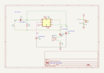

# 555 metal detector

## Description
The 555 will oscillate based on the LCR circuit. When metal comes in contact with the inductor the oscillation will change due to it affecting the
magnetic field around the inductor. The output is the sent to the speaker which will change tone when metallic (Magnetic) objects comes near.

## Goals
- [x] Document schematic in Kicad
- [x] Do a theoretical analyis 
- [x] Implement schematic on breadboard
- [ ] Do a practical analysis
- [ ] Read 555 output frequency on microcontroller
- [ ] Output PWM from microcontroller if freuqncy has changed

## Schematics
Kicad file: schematics/schematics.kicad_sch

## Breadboard
Breadboard setup

## Components
| Reference | Value |
| :------------- | :------------- |
| C1,C3 and C4 | 2.2u |
| C2 | 450p |
| J1 | 5V |
| L1 | 10m |
| R1 | 91k |
| R2 | 12 |
| Speaker | 8 ohm |
| U1 | 7555 https://www.alldatasheet.com/datasheet-pdf/pdf/17796/PHILIPS/ICM7555.html |

## Analytics

### Theoretical
Contains a Kicad analytics file containing a simple theoretical output of the circuit with no metallic object near the inductor.
File: analytics/theoretical/analytics.wbk

### Practical

Power supply settings
| Settings | Value |
| :------------- | :------------- |
| Voltage | 5V |
* Reported current by power supply 4mA.

#### With no metallic object near inductor
Probe 1: Vspeaker
Probe 2: Vl1
Probe 3: Vc4
Probe 4: Vc2

| Measurements | Value | Remark | 
| :------------- | :------------- | :--- |
| Fspkr | 509Hz | |
| Vspkr Pk-Pk | 3.92V | |
| Vspkr Vmax | 3.88V | |
| Vspkr Vmin | -40mV | |
| Spkr -Duty | 10.74% | |
| Spkr +Duty | 89.26% | |
| VL1 Pk-Pk | 8.08V | |
| VL1 Vmax | 4.88V | |
| VL1 Vmin | -3.2V | |
| L1 -Duty | 99.9% | | 
| L1 +Duty | 0.01% |  |

#### With magnetic near inductor
Probe 1: Vspeaker
Probe 2: Vl1
Probe 3: Vc4
Probe 4: Vc2

| Measurements | Value | Remark | 
| :------------- | :------------- | :--- |
| Fspkr | 443Hz | |
| Vspkr Pk-Pk | 3.36V | |
| Vspkr Vmax | 3.92V | |
| Vspkr Vmin | 560mV | |
| Spkr -Duty | 53.75% | |
| Spkr +Duty | 46.25% | |
| VL1 Pk-Pk | 6.84V | |
| VL1 Vmax | 3.56V | |
| VL1 Vmin | -3.28V | |
| L1 -Duty | Unmeasurable | | 
| L1 +Duty | Unmeasurable | |

## Code
To be implemented. The plan is to send the output from the into a microcontroller which only outputs a tone if the frequency in changes.

