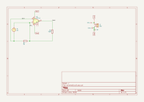

# Inverting amplifier
The goal is to understand an inverting amplifier. 

# Goals
- [x] Document schematic in Kicad
- [x] Do a theoretical analyis 
- [x] Implement schematic on breadboard
- [x] Test circuit and do measurements

# Equipment used
| Equipment | Description |
| :------------- | :------------- |
| Peaktech 6075 | DC power supply |
| RS Pro RSDS 1204X-E | Oscilloscope |
| Uni-T UT161D | Multimeter |

# Components
| Reference | Value | Remarks |
| :------------- | :------------- | :------------- |
| R1 | 5.6k | |
| R2 | 1k | |
| 1x LM741CN | | Operational amplifier | 

# Circuit
> 

The opamp works by trying to make both inputs equal because of the negative feedback. As the input voltage on Vin- increases the Vout decreases. 
The feedback is given by the feedback network with R1 and R2. 
  

# Formulas
Calculated gain
<math xmlns="http://www.w3.org/1998/Math/MathML" display="block">
  <mstyle displaystyle="true" scriptlevel="0">
    <mrow data-mjx-texclass="ORD">
      <mtable rowspacing=".5em" columnspacing="1em" displaystyle="true">
        <mtr>
          <mtd>
            <mi>G</mi>
            <mi>a</mi>
            <mi>i</mi>
            <mi>n</mi>
            <mo>=</mo>
            <mo>&#x2212;</mo>
            <mfrac>
              <mrow>
                <mi>R</mi>
                <mn>1</mn>
              </mrow>
              <mrow>
                <mi>R</mi>
                <mn>2</mn>
              </mrow>
            </mfrac>
          </mtd>
        </mtr>
      </mtable>
    </mrow>
  </mstyle>
</math>

# Calculations
Calculated gain with the resistor values given in the component list.
<math xmlns="http://www.w3.org/1998/Math/MathML" display="block">
  <mstyle displaystyle="true" scriptlevel="0">
    <mrow data-mjx-texclass="ORD">
      <mtable rowspacing=".5em" columnspacing="1em" displaystyle="true">
        <mtr>
          <mtd>
            <mi>G</mi>
            <mi>a</mi>
            <mi>i</mi>
            <mi>n</mi>
            <mo>=</mo>
            <mo>&#x2212;</mo>
            <mfrac>
              <mrow>
                <mi>R</mi>
                <mn>1</mn>
              </mrow>
              <mrow>
                <mi>R</mi>
                <mn>2</mn>
              </mrow>
            </mfrac>
            <mo>=</mo>
            <mo>&#x2212;</mo>
            <mfrac>
              <mrow>
                <mn>5.6</mn>
                <mi>k</mi>
              </mrow>
              <mrow>
                <mn>1</mn>
                <mi>k</mi>
              </mrow>
            </mfrac>
            <mo>=</mo>
            <mo>&#x2212;</mo>
            <mn>5.6</mn>
          </mtd>
        </mtr>
      </mtable>
    </mrow>
  </mstyle>
</math>

# Practical measurements
> Measurements done on oscilloscope with Vin- at 0.6V - 2.3V 
> 
>   
> Measurements done with multimeter 
> 

For all measurements 

| Probe | Measurement |
| :--- | :--- | :--- |
| Yellow | Vin- |
| Purple | Vout- |

Oscilloscope measurements are not accurate as they are done with only 8bit vertical resolution.
  
Measurements

Vsupply | Vin+ | Vin- | Vout |
| :--- | :--- | :--- | :--- |
| 0.6V | 0V | 1.932V | 8.260V | 
| 0.7V | 0V | 1.933V | 8.260V |
| 0.8V | 0V | 1.933V | 8.260V |
| 0.9V | 0V | 1.933V | 7.830V | 
| 1.0V | 0V | 1.933V | 7.240V |
| 1.1V | 0V | 1.933V | 6.700V | 
| 1.2V | 0V | 1.933V | 6.117V | 
| 1.3V | 0V | 1.934V | 5.535V | 
| 1.4V | 0V | 1.934V | 5.001V | 
| 1.5V | 0V | 1.935V | 4.421V | 
| 1.6V | 0V | 1.935V | 3.886V | 
| 1.7V | 0V | 1.936V | 3.302V | 
| 1.8V | 0V | 1.936V | 2.769V | 
| 1.9V | 0V | 1.937V | 2.188V | 
| 2.0V | 0V | 1.938V | 1.608V | 
| 2.1V | 0V | 1.981V | 1.360V | 
| 2.2V | 0V | 2.065V | 1.328V | 
| 2.3V | 0V | 2.146V | 1.330V | 

Measurements done using multimeter.

As we increase the Vsupply voltage the Vout decreases as expected.

# Changelog
| Date | Change |
| :---- | :---- |
| 2025-11-16 | Added both theoretical and practical analysis |
