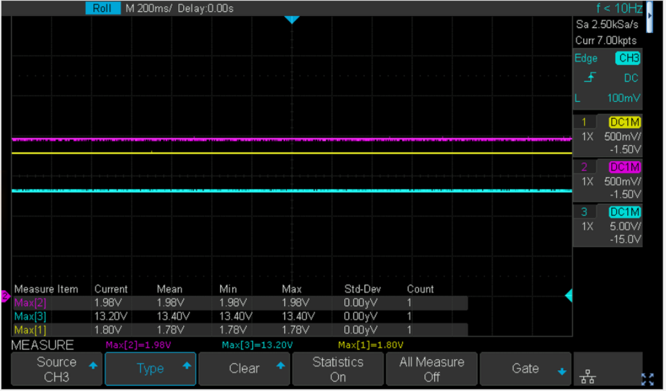
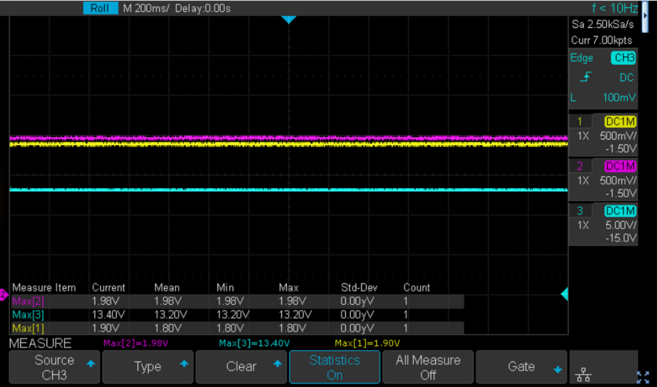

# LM741
The goal is to understand and how to use the LM741. 

# Pins
| Pin | Name | Description |
| :--- | :--- | :--- |
| 1 | Offset null | Offset null pin used to eliminate the offset voltage and balance the input voltages | 
| 2 | Inverting input | Inverting signal input |
| 3 | Noninverting input | Noninverting signal input | 
| 4 | V- | Negative supply voltage |
| 5 | Offset null | Offset null pin used to eliminate the offset voltage and balance the input voltages | 
| 6 | Output | Amplified output |
| 7 | V+ | Positive supply voltage |
| 8 | NC | Should be left floating |

# Non inverting differential amplifier (DC)
## Description
This describes the LM741 as a noninverting differential amplifier.

## Circuit
> 

Schematics generated from KIcad. The schematics can be downloaded from the repository.

<aside class="notice">
    More description will come later.
</aside>

## Formulas
Calculated gain
<math xmlns="http://www.w3.org/1998/Math/MathML" display="block">
  <mstyle displaystyle="true" scriptlevel="0">
    <mrow data-mjx-texclass="ORD">
      <mtable rowspacing=".5em" columnspacing="1em" displaystyle="true">
        <mtr>
          <mtd>
            <mi>G</mi>
            <mi>a</mi>
            <mi>i</mi>
            <mi>n</mi>
            <mo>=</mo>
            <mn>1</mn>
            <mo>+</mo>
            <mfrac>
              <mrow>
                <mi>R</mi>
                <mn>2</mn>
              </mrow>
              <mrow>
                <mi>R</mi>
                <mn>1</mn>
              </mrow>
            </mfrac>
          </mtd>
        </mtr>
      </mtable>
    </mrow>
  </mstyle>
</math>

## Practical measurements
> 
> 
> 
> 
> 

For all measurements 

| Probe | Measurement |
| :--- | :--- | :--- |
| Yellow | Vin+ |
| Purple | Vin- |
| Cyan | Vout |

Oscilloscope measurements are not accurate as they are done with only 8bit vertical resolution.

Measurements

| Vin+ | Vin- | Vout |
| :--- | :--- | :--- |
| 1.80V | 1.98V | 13.20V |
| 1.90V | 1.98V | 13.40V |
| 2.00V | 2.02V | 13.60V |
| 2.10V | 2.12V | 14.20V |
| 2.20V | 2.14V | 14.40V |

Calculated gain
<math xmlns="http://www.w3.org/1998/Math/MathML" display="block">
  <mstyle displaystyle="true" scriptlevel="0">
    <mrow data-mjx-texclass="ORD">
      <mtable rowspacing=".5em" columnspacing="1em" displaystyle="true">
        <mtr>
          <mtd>
            <mi>G</mi>
            <mi>a</mi>
            <mi>i</mi>
            <mi>n</mi>
            <mo>=</mo>
            <mn>1</mn>
            <mo>+</mo>
            <mfrac>
              <mrow>
                <mi>R</mi>
                <mn>2</mn>
              </mrow>
              <mrow>
                <mi>R</mi>
                <mn>1</mn>
              </mrow>
            </mfrac>
            <mo>=</mo>
            <mn>1</mn>
            <mo>+</mo>
            <mfrac>
              <mn>980</mn>
              <mrow>
                <mn>5.556</mn>
                <mi>k</mi>
              </mrow>
            </mfrac>
            <mo>=</mo>
            <mn>1.176</mn>
          </mtd>
        </mtr>
      </mtable>
    </mrow>
  </mstyle>
</math>
*Measurements of resistors done using LCR

# Changelog
| Date | Change |
| :---- | :---- |
| 2025-11-01 | Simulation and practical results added |
