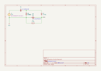

# Single stage Greinacher circuit
The goal is is to understand, simulate and do practical measurements on a Greinacher circuit.

# Goals
- [x] Document schematic in Kicad
- [x] Do a theoretical analyis 
- [ ] Implement schematic on breadboard
- [ ] Test circuit and do measurements

# Equipment used
| Equipment | Description |
| :------------- | :------------- |
| Peaktech 4055 | AC power supply |
| RS Pro RSDS 1204X-E | Oscilloscope |

# Components
| Reference | Value | Remarks |
| :------------- | :------------- | :------------- |
| C1, C2 | 1n, 10n, 100n, 1u | Two of each is required |
| R1 | 1M | To simulate load |
| D1, D2 | 1N4001 | |

# Schematics
> 

Schematics generated from KIcad. The schematics can be downloaded from the repository.

<aside class="notice">
    More description will come later.
</aside>

# Simulation
> Simulation done on 100Hz AC with multiple capacitor values. 
> 
  
> Simulation done on 1kHz AC with multiple capacitor values. 
> 
  
> Simulation done on 10kHz AC with multiple capacitor values. 
> 

All simulations have the following capacitor values.

| Output | Capacitor |
| :--- | :--- |
| Vout1 | 1nF |
| Vout2 | 10nF |
| Vout3 | 100nF |
| Vout4 | 1uF |

<ins>Conclusion</ins> 
This circuit have AC as input, but output ideally is DC voltage higher than the max voltage of the input.
The lower the frequency the higher the capacitance of the capacitors required to get a proper DC 
output. The DC output voltage is about 8.73V for ideal output when input is 5Vpp.

# Practical measurements

# Changelog
| Date | Change |
| :---- | :---- |
| 2025-11-01 | Simulation results added |
