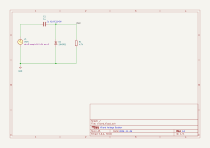

# Single stage Villard circuit
The goal is is to understand, simulate and do practical measurements on a single stage Villard voltage doubler.

# Goals
- [x] Document schematic of single stage in Kicad
- [x] Do a theoretical analyis on single stage 
- [ ] Implement single stage schematic on breadboard
- [ ] Test single stage circuit and do measurements

# Equipment used
| Equipment | Description |
| :------------- | :------------- |
| Peaktech 4055 | AC power supply |
| RS Pro RSDS 1204X-E | Oscilloscope |

# Components
| Reference | Value | Remarks |
| :------------- | :------------- | :------------- |
| C1 | 1n, 10n, 100n, 1u, 10u and 100u | |
| R1 | 1M | To simulate load |
| D1 | 1N4001 | |

# Schematics
> 

Schematics generated from KIcad. The schematics can be downloaded from the repository.

<aside class="notice">
    More description will come later.
</aside>

# Simulation
This is a simulation done on 100Hz.

| V | Simulated value |
| :------------- | :------------- | :------------- | :------------- |
| V1 | With 1nF capacitor gives -14.8mV to 14.8mV |
| V2 | With 10nF capacitor gives -148mV to 148mV |
| V3 | With 100n capacitor gives -611mV to 1.42V (Not quite sine wave at lower voltages) |
| V4 | With 1uF capacitor gives -683mV to 4.81V (Very flat at lowest voltages, not at all sine) |
| V5 | With 10uF capacitor gives -726mV to 8.91V (More sine wave again) |
| V6 | With 100uF capacitor gives -742mV to 9.24V (Pretty sine again) |

This is a simulation done on 1kHz.

| V | Simulated value |
| :------------- | :------------- | :------------- | :------------- |
| V1 | With 1nF capacitor gives -148mV to 148mV |
| V2 | With 10nF capacitor gives -611mV to 1.42V (Flat at lower voltage) |
| V3 | With 100n capacitor gives -683mV to 6.27V (Flat at lower voltages) |
| V4 | With 1uF capacitor gives -715mV to 8.90V |
| V5 | With 10uF capacitor gives -742mV to 9.24V |

<ins>Conclusion</ins> 
The lower the frequency a higher capacitance is required to reach higher voltages. 
The circuit itself does not double the voltage, but moves the offset. So instead 
of -5V to 5V it changes to -0.7V to 9.1V. 

# Practical measurements

# Changelog
| Date | Change |
| :---- | :---- |
| 2025-11-01 | Simulation results added |
