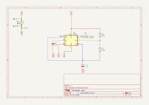
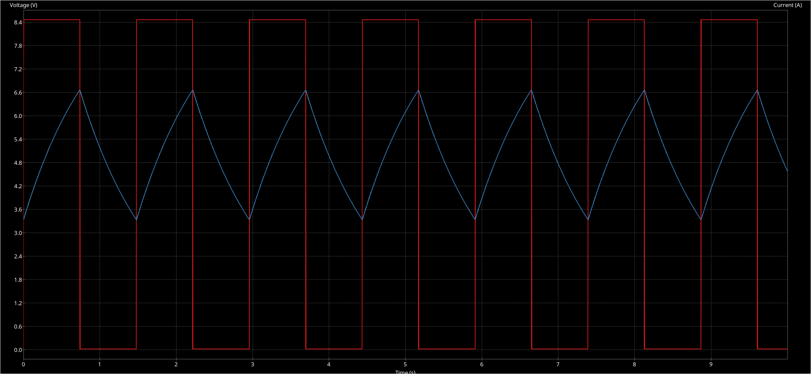

# 555 (And 7555)

## Description
The goal is to understand and how to use the SE/NE555 and 7555. 

## Pins
| Pin | Name | Description |
| :--- | :--- | :--- |
| 1 | Ground | Ground | 
| 2 | Trigger  | When this pin goes to one third of Vcc, the output goes high. |
| 3 | Output | Output high is lower than Vcc, and low is around 0V. | 
| 4 | Reset | The is an inverted input. When it goes low everything resets. In normal  mode this is high. |
| 5 | Control voltage | This pin determines the threshold voltage of the threshold pin. | 
| 6 | Threshold | This pin will trigger high out if pin 2 is high and voltage is 2/3 of Vcc. |
| 7 | Discharge | When output is low the discharge is connected to 0V.  |
| 8 | Vcc | Positive power supply |

## Monostable mode

### Description
This circuit makes a single pulse when triggered. This causes the output to held high for the pulse duration formula then return low.

### Componenets
| Reference | Value | Remarks |
| :------------- | :------------- | :------------- |
| C1 | 2u | Electrolytic capacitor |
| C2 | 10n | |
| R1 | 470k | |
| R2 | 4.7k | Replace this with a smaller resistor and led | 
| U1 | 7555 https://www.alldatasheet.com/datasheet-pdf/pdf/17796/PHILIPS/ICM7555.html | 555 should also work fine |

### Formulas
Pulse duration can be calculated with the formula.
```math
T=1.1\times R1\times C1
```

### Circuit


### Simulation

When the trigger goes low, the output goes high and the capacitor C1 starts to charge. When the purple line goes to 2/3 of Vcc the output goes low.

### Practical measurements

Cyan is the trigger input, purple is the charge on capacitor C1 and yellow is the output voltage. The values are a little of due to components not being exact. 

## Astable mode

### Description
When in astable mode the circuit will self trigger and cause continous pulses out.

### Componenets
| Reference | Value | Remarks |
| :------------- | :------------- | :------------- |
| C1 | 2u | Electrolytic capacitor |
| C2 | 10n | |
| R1, R2 | 470k | |
| R3 | 4.7k | Replace this with a smaller resistor and led | 
| U1 | 7555 https://www.alldatasheet.com/datasheet-pdf/pdf/17796/PHILIPS/ICM7555.html | 555 should also work fine |

### Formulas
The frequency of the output oscillation is given by the formula.
```math
F=\frac{1}{0.693\times(R_1+ 2\times R2)\times C_1}
```
The duty cycle is given by the formula.
```math
Duty\space cycle=\frac{R_1+R_2}{R_1+2\times R_2}
```

### Circuit


### Simulation


### Practical measurements

Measured values are<br>
F=0.466Hz<br>
Duty cycle=0.64<br>
<br>
<br>
Calculated duty cycle is 
```math
Duty\space cycle=\frac{R_1+R_2}{R_1+2\times R_2}=\frac{470k+470k}{470k+2\times 470k}=0.66
```
The value is as close as expected.<br>
<br>
The calculated frequency is
```math
F=\frac{1}{0.693\times(R_1+ 2\times R2)\times C_1}=\frac{1}{0.693\times (470\times 10^3 + 2\times 470\times 10^3)\times 2\times 10^{-6}}=0.511Hz
```
Again the value calculated is as close to the measured value as expected.

## Improved astable mode

### Description
This is an updated version of the astable mode. 

### Componenets
Same components as astable mode, but with the following added components.
| Reference | Value | Remarks |
| :------------- | :------------- | :------------- |
| D1,D2 | 1N4001 | Diodes |

### Formulas
New duty cycle formula.
```math
Duty\space cycle=\frac{R_1}{R_1+R_2}
```
### Circuit
The following change is needed.


### Simulation


### Practical measurements
Had to use 1N4148 diode instead of 1N4001.
<br>


Measured value for duty cycle is<br>
Duty cycle=0.47<br>
<br>
<br>
```math
Duty\space cycle=\frac{R_1}{R_1+R_2}=\frac{470*10^3}{470*10^3+470*10^3}=0.5
```