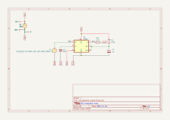
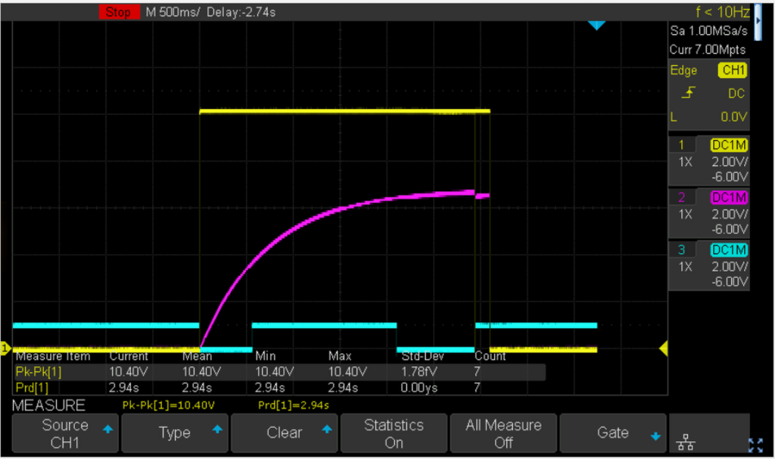

# 555 (And 7555)

## Description
The goal is to understand and how to use the SE/NE555 and 7555. 

## Pins
| Pin | Name | Description |
| :--- | :--- | :--- |
| 1 | Ground | Ground | 
| 2 | Trigger  | When this pin goes to one third of Vcc, the output goes high. |
| 3 | Output | Output high is lower than Vcc, and low is around 0V. | 
| 4 | Reset | The is an inverted input. When it goes low everything resets. In normal  mode this is high. |
| 5 | Control voltage | This pin determines the threshold voltage of the threshold pin. | 
| 6 | Threshold | This pin will trigger high out if pin 2 is high and voltage is 2/3 of Vcc. |
| 7 | Discharge | When output is low the discharge is connected to 0V.  |
| 8 | Vcc | Positive power supply |

# Componenets
| Reference | Value | Remarks |
| :------------- | :------------- | :------------- |
| C1 | 2u | Electrolytic capacitor |
| C2 | 10n | |
| R1 | 470k | |
| R2 | 4.7k | Replace this with a smaller resistor and led | 
| U1 | 7555 https://www.alldatasheet.com/datasheet-pdf/pdf/17796/PHILIPS/ICM7555.html | 555 should also work fine |

## Monostable mode

### Description
This circuit makes a single pulse when triggered. This causes the output to held high for the pulse duration formula then return low.

### Formulas
Pulse duration can be calculated with the formula.
```math
T=1.1\times R1\times C1
```

### Circuit


### Simulation

When the trigger goes low, the output goes high and the capacitor C1 starts to charge. When the purple line goes to 2/3 of Vcc the output goes low.

### Practical measurements

Cyan is the trigger input, purple is the charge on capacitor C1 and yellow is the output voltage. The values are a little of due to components not being exact. 

## Astable mode

### Circuit

### Formulas

### Output
