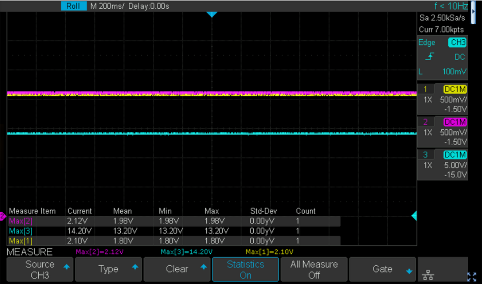

# LM741

## Description
The goal is to understand and how to use the LM741. 

## Pins
| Pin | Name | Description |
| :--- | :--- | :--- |
| 1 | Offset null | Offset null pin used to eliminate the offset voltage and balance the input voltages | 
| 2 | Inverting input | Inverting signal input |
| 3 | Noninverting input | Noninverting signal input | 
| 4 | V- | Negative supply voltage |
| 5 | Offset null | Offset null pin used to eliminate the offset voltage and balance the input voltages | 
| 6 | Output | Amplified output |
| 7 | V+ | Positive supply voltage |
| 8 | NC | Should be left floating |

## Non inverting differential amplifier (DC)

### Description
This describes the LM741 as a noninverting differential amplifier.

### Circuit

This circuit amplifies the input
  
### Formulas
Calculated gain
```math
Gain=1+\frac{R2}{R1}
```

### Practical measurements
For all measurements 
Yellow = Vin+
Purple = Vin-
Cyan = Vout




Oscilloscope measurements are not accurate as they are done with only 8bit vertical resolution.
<br>
Measurements
| Vin+ | Vin- | Vout |
| :--- | :--- | :--- |
| 1.80V | 1.98V | 13.20V |
| 1.90V | 1.98V | 13.40V |
| 2.00V | 2.02V | 13.60V |
| 2.10V | 2.12V | 14.20V |
| 2.20V | 2.14V | 14.40V |

Calculated gain
```math'
Gain=1+\frac{R2}{R1}=1+\frac{980k}{5.556k}=1.176
```
*Measurements of resistors done using LCR
