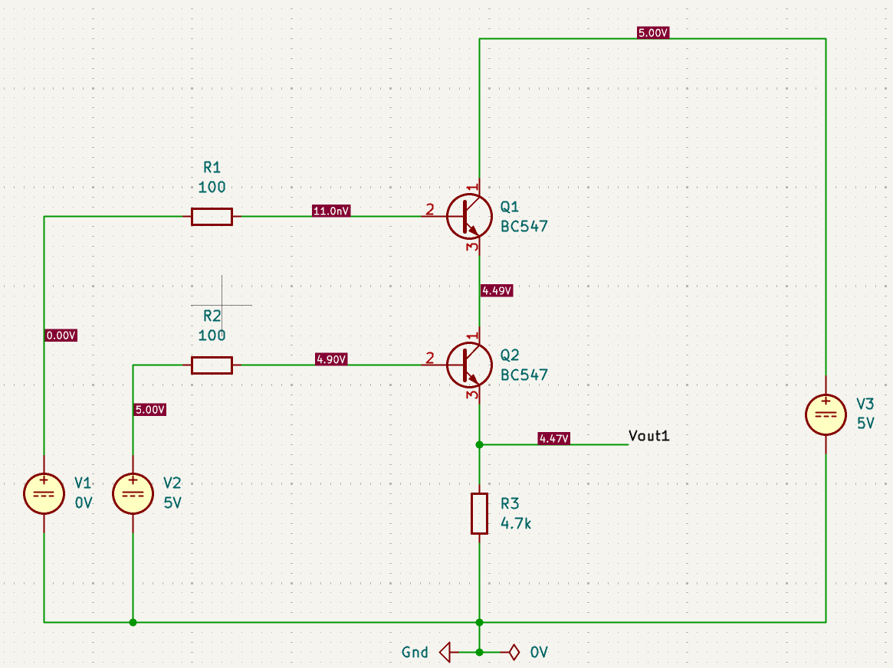

# Logic logic and with transistor

## Description
The goal is to implement a 2 input logic AND circuit with both a bipolar and mosfet transistors.
 
## Goals
- [x] Document schematic in Kicad
- [x] Do a theoretical analyis 
- [ ] Implement schematic on breadboard
- [ ] Test circuit and do measurements

## Equipment used
| Equipment | Description |
| :------------- | :------------- |
| Peaktech 6075 | DC power supply |
| RS Pro RSDS 1204X-E | Oscilloscope |

## Components
| Reference | Value | Remarks |
| :------------- | :------------- | :------------- |
| 2x BC547 | | Any NPN transistor should work |
| R1, R2 | 100 | |
| R3 | 4.7k | |

## With bipolar transistor

### Schematics

### Simulation
|  | 
|  | 
|  | 
|  | 

### Practical measurements

