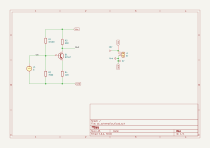
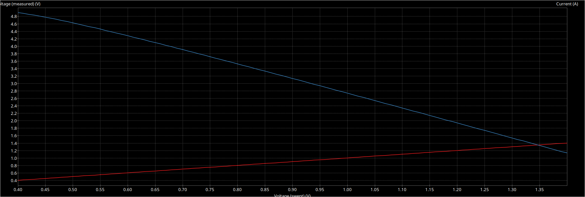
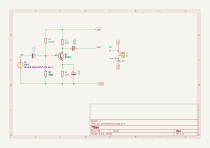
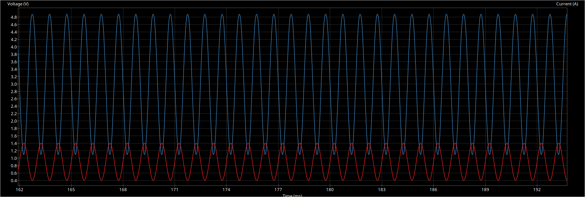
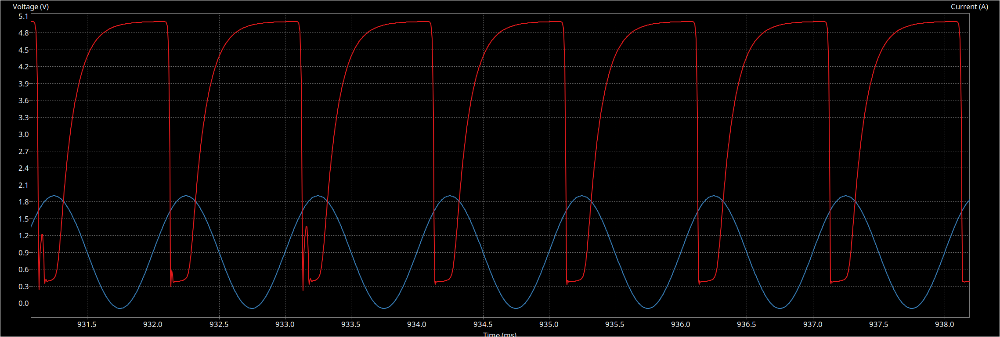

# Unity-gain
The goal is to understand a class A common emitter amplifier.

# Goals
- [x] Document schematic in Kicad
- [x] Do a theoretical analysis with DC
- [x] Do a theoretical analysis with AC
- [ ] Implement schematic on breadboard
- [ ] Test circuit and do measurements with DC
- [ ] Test circuit and do measurements with AC

# Equipment used
| Equipment | Description |
| :------------- | :------------- |
| Peaktech 6075 | DC power supply |
| Peaktech 4055mv | AC power supply |
| RS Pro RSDS 1204X-E | Oscilloscope 

# Components
| Reference | Value | Remarks |
| :------------- | :------------- | :------------- |
| 3x | Capacitors | Calculated for AC |
| 4x | Resistors | Calculated for DC and AC |
| BC547 | Transistor |  |

# DC circuit
## Circuit
> 

The values given in the circuit are calculated in the calculations below. The given values 

## Formulas
Choose a collector current through R3. The formula for R3 becomes. 
<math xmlns="http://www.w3.org/1998/Math/MathML" display="block">
  <mstyle displaystyle="true" scriptlevel="0" style="font-size: 0.7em">
    <mrow data-mjx-texclass="ORD">
      <mtable rowspacing=".5em" columnspacing="1em" displaystyle="true">
        <mtr>
          <mtd>
            <msub>
              <mi>R</mi>
              <mn>3</mn>
            </msub>
            <mo>=</mo>
            <mfrac>
              <mfrac>
                <mrow>
                  <mi>V</mi>
                  <mi>c</mi>
                  <mi>c</mi>
                </mrow>
                <mn>2</mn>
              </mfrac>
              <msub>
                <mi>I</mi>
                <mi>c</mi>
              </msub>
            </mfrac>
          </mtd>
        </mtr>
      </mtable>
    </mrow>
  </mstyle>
</math>
  
The emitter voltage should be around 10%-15% of Vcc. If we assume Ie=Ic the R4 is.
<math xmlns="http://www.w3.org/1998/Math/MathML" display="block">
  <mstyle displaystyle="true" scriptlevel="0" style="font-size: 0.7em">
    <mrow data-mjx-texclass="ORD">
      <mtable rowspacing=".5em" columnspacing="1em" displaystyle="true">
        <mtr>
          <mtd>
            <msub>
              <mi>R</mi>
              <mn>4</mn>
            </msub>
            <mo>=</mo>
            <mfrac>
              <msub>
                <mi>V</mi>
                <mi>e</mi>
              </msub>
              <msub>
                <mi>I</mi>
                <mi>e</mi>
              </msub>
            </mfrac>
          </mtd>
        </mtr>
      </mtable>
    </mrow>
  </mstyle>
</math>
  
Calculating Ib with this formula. The hfe is the gain given by the transistors datasheet. 
<math xmlns="http://www.w3.org/1998/Math/MathML" display="block">
  <mstyle displaystyle="true" scriptlevel="0" style="font-size: 0.7em">
    <mrow data-mjx-texclass="ORD">
      <mtable rowspacing=".5em" columnspacing="1em" displaystyle="true">
        <mtr>
          <mtd>
            <msub>
              <mi>I</mi>
              <mi>b</mi>
            </msub>
            <mo>=</mo>
            <mfrac>
              <msub>
                <mi>I</mi>
                <mi>c</mi>
              </msub>
              <mrow>
                <mi>h</mi>
                <mi>f</mi>
                <mi>e</mi>
              </mrow>
            </mfrac>
          </mtd>
        </mtr>
      </mtable>
    </mrow>
  </mstyle>
</math>
  
Vb should be around 0.7V higher than Ve so that we are on the linear part of the transistor characteristic.
<math xmlns="http://www.w3.org/1998/Math/MathML" display="block">
  <mstyle displaystyle="true" scriptlevel="0" style="font-size: 0.7em">
    <mrow data-mjx-texclass="ORD">
      <mtable rowspacing=".5em" columnspacing="1em" displaystyle="true">
        <mtr>
          <mtd>
            <msub>
              <mi>V</mi>
              <mi>b</mi>
            </msub>
            <mo>=</mo>
            <msub>
              <mi>V</mi>
              <mi>e</mi>
            </msub>
            <mo>+</mo>
            <mn>0.7</mn>
            <mi>V</mi>
          </mtd>
        </mtr>
      </mtable>
    </mrow>
  </mstyle>
</math>
  
Calculating the DC bias network current. The current should be 10 times Ib.
<math xmlns="http://www.w3.org/1998/Math/MathML" display="block">
  <mstyle displaystyle="true" scriptlevel="0" style="font-size: 0.7em">
    <mrow data-mjx-texclass="ORD">
      <mtable rowspacing=".5em" columnspacing="1em" displaystyle="true">
        <mtr>
          <mtd>
            <msub>
              <mi>I</mi>
              <mrow data-mjx-texclass="ORD">
                <mi>r</mi>
                <mn>1</mn>
              </mrow>
            </msub>
            <mo>=</mo>
            <msub>
              <mi>I</mi>
              <mi>b</mi>
            </msub>
            <mo>&#xD7;</mo>
            <mn>10</mn>
          </mtd>
        </mtr>
      </mtable>
    </mrow>
  </mstyle>
</math>
  
Calculating the resistor R1 is the Vcc minus Vb divided by the bias current.
<math xmlns="http://www.w3.org/1998/Math/MathML" display="block">
  <mstyle displaystyle="true" scriptlevel="0" style="font-size: 0.7em">
    <mrow data-mjx-texclass="ORD">
      <mtable rowspacing=".5em" columnspacing="1em" displaystyle="true">
        <mtr>
          <mtd>
            <msub>
              <mi>R</mi>
              <mn>1</mn>
            </msub>
            <mo>=</mo>
            <mfrac>
              <mrow>
                <msub>
                  <mi>V</mi>
                  <mrow data-mjx-texclass="ORD">
                    <mi>c</mi>
                    <mi>c</mi>
                  </mrow>
                </msub>
                <mo>&#x2212;</mo>
                <msub>
                  <mi>V</mi>
                  <mi>b</mi>
                </msub>
              </mrow>
              <msub>
                <mi>I</mi>
                <mrow data-mjx-texclass="ORD">
                  <mi>r</mi>
                  <mn>1</mn>
                  <mi>r</mi>
                  <mn>2</mn>
                </mrow>
              </msub>
            </mfrac>
          </mtd>
        </mtr>
      </mtable>
    </mrow>
  </mstyle>
</math>
  
Calculating the resistor R2 is Vb divided by bias current.
<math xmlns="http://www.w3.org/1998/Math/MathML" display="block">
  <mstyle displaystyle="true" scriptlevel="0" style="font-size: 0.7em">
    <mrow data-mjx-texclass="ORD">
      <mtable rowspacing=".5em" columnspacing="1em" displaystyle="true">
        <mtr>
          <mtd>
            <msub>
              <mi>R</mi>
              <mn>2</mn>
            </msub>
            <mo>=</mo>
            <mfrac>
              <msub>
                <mi>V</mi>
                <mi>b</mi>
              </msub>
              <msub>
                <mi>I</mi>
                <mrow data-mjx-texclass="ORD">
                  <mi>r</mi>
                  <mn>1</mn>
                  <mi>r</mi>
                  <mn>2</mn>
                </mrow>
              </msub>
            </mfrac>
          </mtd>
        </mtr>
      </mtable>
    </mrow>
  </mstyle>
</math>

## Calculations
Ic max for a BC547 is 100mA. We choose the Ic to be 10% of Ic max therefore 10mA. We choose a Vcc of 10V. This makes R3.
<math xmlns="http://www.w3.org/1998/Math/MathML" display="block">
  <mstyle displaystyle="true" scriptlevel="0" style="font-size: 0.7em">
    <mrow data-mjx-texclass="ORD">
      <mtable rowspacing=".5em" columnspacing="1em" displaystyle="true">
        <mtr>
          <mtd>
            <msub>
              <mi>R</mi>
              <mn>3</mn>
            </msub>
            <mo>=</mo>
            <mfrac>
              <mfrac>
                <msub>
                  <mi>V</mi>
                  <mrow data-mjx-texclass="ORD">
                    <mi>c</mi>
                    <mi>c</mi>
                  </mrow>
                </msub>
                <mn>2</mn>
              </mfrac>
              <msub>
                <mi>I</mi>
                <mi>c</mi>
              </msub>
            </mfrac>
            <mo>=</mo>
            <mfrac>
              <mn>5</mn>
              <mrow>
                <mn>10</mn>
                <mo>&#xD7;</mo>
                <msup>
                  <mn>10</mn>
                  <mrow data-mjx-texclass="ORD">
                    <mo>&#x2212;</mo>
                    <mn>3</mn>
                  </mrow>
                </msup>
              </mrow>
            </mfrac>
            <mo>=</mo>
            <mn>500</mn>
          </mtd>
        </mtr>
      </mtable>
    </mrow>
  </mstyle>
</math>
  
The emitter voltage should be around 10%-15% of Vcc. If we assume Ie=Ic the R4 is.
<math xmlns="http://www.w3.org/1998/Math/MathML" display="block">
  <mstyle displaystyle="true" scriptlevel="0" style="font-size: 0.7em">
    <mrow data-mjx-texclass="ORD">
      <mtable rowspacing=".5em" columnspacing="1em" displaystyle="true">
        <mtr>
          <mtd>
            <msub>
              <mi>R</mi>
              <mn>4</mn>
            </msub>
            <mo>=</mo>
            <mfrac>
              <msub>
                <mi>V</mi>
                <mi>e</mi>
              </msub>
              <msub>
                <mi>I</mi>
                <mi>e</mi>
              </msub>
            </mfrac>
            <mo>=</mo>
            <mfrac>
              <mn>1.2</mn>
              <mrow>
                <mn>10</mn>
                <mo>&#xD7;</mo>
                <msup>
                  <mn>10</mn>
                  <mrow data-mjx-texclass="ORD">
                    <mo>&#x2212;</mo>
                    <mn>3</mn>
                  </mrow>
                </msup>
              </mrow>
            </mfrac>
            <mo>=</mo>
            <mn>120</mn>
          </mtd>
        </mtr>
      </mtable>
    </mrow>
  </mstyle>
</math>
  
Calculating Ib we use use a value of 400 for the hfe as the typical value.
<math xmlns="http://www.w3.org/1998/Math/MathML" display="block">
  <mstyle displaystyle="true" scriptlevel="0" style="font-size: 0.7em">
    <mrow data-mjx-texclass="ORD">
      <mtable rowspacing=".5em" columnspacing="1em" displaystyle="true">
        <mtr>
          <mtd>
            <msub>
              <mi>I</mi>
              <mi>b</mi>
            </msub>
            <mo>=</mo>
            <mfrac>
              <msub>
                <mi>I</mi>
                <mi>c</mi>
              </msub>
              <mrow>
                <mi>h</mi>
                <mi>f</mi>
                <mi>e</mi>
              </mrow>
            </mfrac>
            <mo>=</mo>
            <mfrac>
              <mrow>
                <mn>10</mn>
                <mo>&#xD7;</mo>
                <msup>
                  <mn>10</mn>
                  <mrow data-mjx-texclass="ORD">
                    <mo>&#x2212;</mo>
                    <mn>3</mn>
                  </mrow>
                </msup>
              </mrow>
              <mn>400</mn>
            </mfrac>
            <mo>=</mo>
            <mn>25</mn>
            <mo>&#xD7;</mo>
            <msup>
              <mn>10</mn>
              <mrow data-mjx-texclass="ORD">
                <mo>&#x2212;</mo>
                <mn>6</mn>
              </mrow>
            </msup>
          </mtd>
        </mtr>
      </mtable>
    </mrow>
  </mstyle>
</math>
  
Calculating Vb we add 0.7V to the expected Ve.
<math xmlns="http://www.w3.org/1998/Math/MathML" display="block">
  <mstyle displaystyle="true" scriptlevel="0" style="font-size: 0.7em">
    <mrow data-mjx-texclass="ORD">
      <mtable rowspacing=".5em" columnspacing="1em" displaystyle="true">
        <mtr>
          <mtd>
            <msub>
              <mi>V</mi>
              <mi>b</mi>
            </msub>
            <mo>=</mo>
            <msub>
              <mi>V</mi>
              <mi>e</mi>
            </msub>
            <mo>+</mo>
            <mn>0.7</mn>
            <mi>V</mi>
            <mo>=</mo>
            <mo stretchy="false">(</mo>
            <mn>10</mn>
            <mo>&#xD7;</mo>
            <mn>0.12</mn>
            <mo stretchy="false">)</mo>
            <mo>+</mo>
            <mn>0.7</mn>
            <mo>=</mo>
            <mn>1.9</mn>
          </mtd>
        </mtr>
      </mtable>
    </mrow>
  </mstyle>
</math>
  
Calculating current through R1 and R2.
<math xmlns="http://www.w3.org/1998/Math/MathML" display="block">
  <mstyle displaystyle="true" scriptlevel="0"  style="font-size: 0.7em">
    <mrow data-mjx-texclass="ORD">
      <mtable rowspacing=".5em" columnspacing="1em" displaystyle="true">
        <mtr>
          <mtd>
            <msub>
              <mi>I</mi>
              <mrow data-mjx-texclass="ORD">
                <mi>r</mi>
                <mn>1</mn>
                <mi>r</mi>
                <mn>2</mn>
              </mrow>
            </msub>
            <mo>=</mo>
            <msub>
              <mi>I</mi>
              <mi>b</mi>
            </msub>
            <mo>&#xD7;</mo>
            <mn>10</mn>
            <mo>=</mo>
            <mn>250</mn>
            <mo>&#xD7;</mo>
            <msup>
              <mn>10</mn>
              <mrow data-mjx-texclass="ORD">
                <mo>&#x2212;</mo>
                <mn>6</mn>
              </mrow>
            </msup>
          </mtd>
        </mtr>
      </mtable>
    </mrow>
  </mstyle>
</math>
  
Calculating the resistor R1.
<math xmlns="http://www.w3.org/1998/Math/MathML" display="block">
  <mstyle displaystyle="true" scriptlevel="0" style="font-size: 0.7em">
    <mrow data-mjx-texclass="ORD">
      <mtable rowspacing=".5em" columnspacing="1em" displaystyle="true">
        <mtr>
          <mtd>
            <msub>
              <mi>R</mi>
              <mn>1</mn>
            </msub>
            <mo>=</mo>
            <mfrac>
              <mrow>
                <msub>
                  <mi>V</mi>
                  <mrow data-mjx-texclass="ORD">
                    <mi>c</mi>
                    <mi>c</mi>
                  </mrow>
                </msub>
                <mo>&#x2212;</mo>
                <msub>
                  <mi>V</mi>
                  <mi>b</mi>
                </msub>
              </mrow>
              <msub>
                <mi>I</mi>
                <mrow data-mjx-texclass="ORD">
                  <mi>r</mi>
                  <mn>1</mn>
                  <mi>r</mi>
                  <mn>2</mn>
                </mrow>
              </msub>
            </mfrac>
            <mo>=</mo>
            <mfrac>
              <mrow>
                <mn>10</mn>
                <mo>&#x2212;</mo>
                <mn>1.9</mn>
              </mrow>
              <mrow>
                <mn>10</mn>
                <mo>&#xD7;</mo>
                <msup>
                  <mn>10</mn>
                  <mrow data-mjx-texclass="ORD">
                    <mo>&#x2212;</mo>
                    <mn>3</mn>
                  </mrow>
                </msup>
              </mrow>
            </mfrac>
            <mo>=</mo>
            <mn>32400</mn>
          </mtd>
        </mtr>
      </mtable>
    </mrow>
  </mstyle>
</math>
  
Calculating R2.
<math xmlns="http://www.w3.org/1998/Math/MathML" display="block">
  <mstyle displaystyle="true" scriptlevel="0" style="font-size: 0.7em">
    <mrow data-mjx-texclass="ORD">
      <mtable rowspacing=".5em" columnspacing="1em" displaystyle="true">
        <mtr>
          <mtd>
            <msub>
              <mi>R</mi>
              <mn>2</mn>
            </msub>
            <mo>=</mo>
            <mfrac>
              <msub>
                <mi>V</mi>
                <mi>b</mi>
              </msub>
              <msub>
                <mi>I</mi>
                <mrow data-mjx-texclass="ORD">
                  <mi>r</mi>
                  <mn>1</mn>
                  <mi>r</mi>
                  <mn>2</mn>
                </mrow>
              </msub>
            </mfrac>
            <mo>=</mo>
            <mfrac>
              <mn>1.9</mn>
              <mrow>
                <mn>10</mn>
                <mo>&#xD7;</mo>
                <msup>
                  <mn>10</mn>
                  <mrow data-mjx-texclass="ORD">
                    <mo>&#x2212;</mo>
                    <mn>3</mn>
                  </mrow>
                </msup>
              </mrow>
            </mfrac>
            <mo>=</mo>
            <mn>7600</mn>
          </mtd>
        </mtr>
      </mtable>
    </mrow>
  </mstyle>
</math>

## Simulation
> 

The output voltage decreases as the input voltage increases. As the voltage of Vbe increases this causes the resitance over
CE to decrease which causes a greater amount of voltage to be stored on R3. So the output phase is 180 degrees of the input.
  
When the input voltage is 0.4V, the output is 4.9V and at 1.4V the output is 1.14V. This gives a voltage gain of 3.76.

# AC
## Circuit
> 

## Simulation
> 

This simulation uses the values in the circuit and gives a nice sine curve as long as it remains within 
0.4V and 1.4V.

## Too high amplitude
> 

With an amplitude to high this causes the output to have flattened curves on top and bottom. 

# Changelog
| Date | Change |
| :---- | :---- |
| 2025-11-30 | Adds dc circuit and calculations |
| 2025-12-01 | Adds ac circuit and simulations |