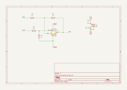
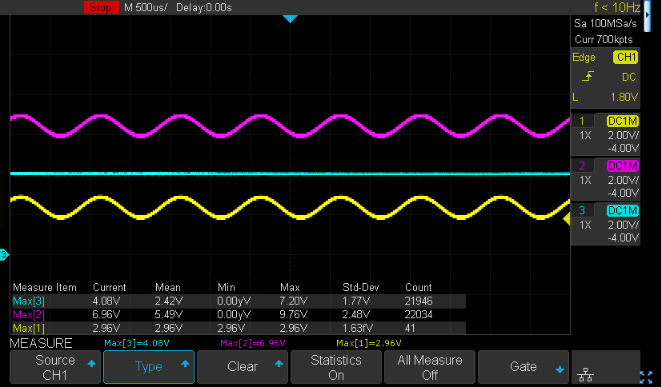

# Differential amplifier
The goal is to understand a differential amplifier.

# Goals
- [x]  Document schematic in Kicad
- [x]  Do a theoretical analyis 
- [x] Implement schematic on breadboard
- [x] Test circuit and do measurements

# Equipment used
| Equipment | Description |
| :------------- | :------------- |
| Peaktech 6075 | DC power supply |
| Peaktech 4055mv | AC power supply |
| RS Pro RSDS 1204X-E | Oscilloscope 

# Components
| Reference | Value | Remarks |
| :------------- | :------------- | :------------- |
| 1x LM741CN | | Operational amplifier | 
| R1,R2,R3,R4 | 1k |  | 

# Circuit
> 

This schematic returns the differential between Vin1 and Vin2. By the formulas the gain is 1 so the result Vin2 minus Vin1.

# Formulas
This calculation calculates the differential between the input voltages. For schematic this assumes that R1=R4 and R2=R3.
<math xmlns="http://www.w3.org/1998/Math/MathML" display="block">
  <mstyle displaystyle="true" scriptlevel="0" style="font-size: 0.7em">
    <mrow data-mjx-texclass="ORD">
      <mtable rowspacing=".5em" columnspacing="1em" displaystyle="true">
        <mtr>
          <mtd>
            <msub>
              <mi>V</mi>
              <mrow data-mjx-texclass="ORD">
                <mi>o</mi>
                <mi>u</mi>
                <mi>t</mi>
              </mrow>
            </msub>
            <mo>=</mo>
            <mfrac>
              <msub>
                <mi>R</mi>
                <mn>2</mn>
              </msub>
              <msub>
                <mi>R</mi>
                <mn>1</mn>
              </msub>
            </mfrac>
            <mo>&#xD7;</mo>
            <mo stretchy="false">(</mo>
            <msub>
              <mi>V</mi>
              <mrow data-mjx-texclass="ORD">
                <mi>i</mi>
                <mi>n</mi>
                <mn>2</mn>
              </mrow>
            </msub>
            <mo>&#x2212;</mo>
            <msub>
              <mi>V</mi>
              <mrow data-mjx-texclass="ORD">
                <mi>i</mi>
                <mi>n</mi>
                <mn>1</mn>
              </mrow>
            </msub>
            <mo stretchy="false">)</mo>
          </mtd>
        </mtr>
      </mtable>
    </mrow>
  </mstyle>
</math>

# Calculations
This calculates the max output voltage. All resistors are 1k. The max input voltage is 8V for Vin2 and max input voltage for Vin1 is 4.88V.
<math xmlns="http://www.w3.org/1998/Math/MathML" display="block">
  <mstyle displaystyle="true" scriptlevel="0" style="font-size: 0.7em">
    <mrow data-mjx-texclass="ORD">
      <mtable rowspacing=".5em" columnspacing="1em" displaystyle="true">
        <mtr>
          <mtd>
            <msub>
              <mi>V</mi>
              <mrow data-mjx-texclass="ORD">
                <mi>o</mi>
                <mi>u</mi>
                <mi>t</mi>
              </mrow>
            </msub>
            <mo>=</mo>
            <mfrac>
              <msub>
                <mi>R</mi>
                <mn>1</mn>
              </msub>
              <msub>
                <mi>R</mi>
                <mn>2</mn>
              </msub>
            </mfrac>
            <mo>&#xD7;</mo>
            <mo stretchy="false">(</mo>
            <msub>
              <mi>V</mi>
              <mrow data-mjx-texclass="ORD">
                <mi>i</mi>
                <mi>n</mi>
                <mn>2</mn>
              </mrow>
            </msub>
            <mo>&#x2212;</mo>
            <msub>
              <mi>V</mi>
              <mrow data-mjx-texclass="ORD">
                <mi>i</mi>
                <mi>n</mi>
                <mn>1</mn>
              </mrow>
            </msub>
            <mo stretchy="false">)</mo>
            <mo>=</mo>
            <mfrac>
              <mrow>
                <mn>1</mn>
                <mi>k</mi>
              </mrow>
              <mrow>
                <mn>1</mn>
                <mi>k</mi>
              </mrow>
            </mfrac>
            <mo>&#xD7;</mo>
            <mo stretchy="false">(</mo>
            <mn>8</mn>
            <mo>&#x2212;</mo>
            <mn>4.88</mn>
            <mo stretchy="false">)</mo>
            <mo>=</mo>
            <mn>3.12</mn>
          </mtd>
        </mtr>
      </mtable>
    </mrow>
  </mstyle>
</math>

# Practical measurements
> 

For this measurement the input for Vin2 is a sine of 1khz, peak to peak voltage of 1V and offset of 6.5V. Vin1 is a dc voltage of 4V. The 
Following measurents were done.

| | Vin2 | Vin1 | Calculated Vout | Measured Vout |
| :--- | :--- | :--- | :--- | :--- |
| Min | 5.84V | 3.92V | 2.00 | 1.92V |
| Max | 6.96V | 4.08V | 3.00 | 2.88V |

  
The measurement is close to the theoretical calculations. The difference is can be explained by inaccurate resistor values and inaccurate equipment.

# Changelog
| Date | Change |
| :---- | :---- |
| 2025-12-16 | Added theory and practical measurements |
