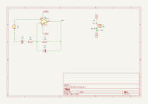
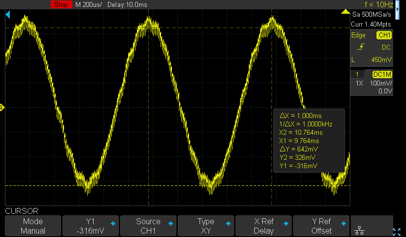
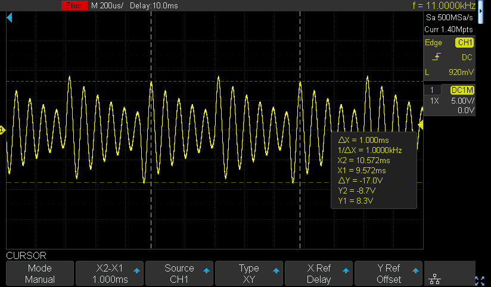
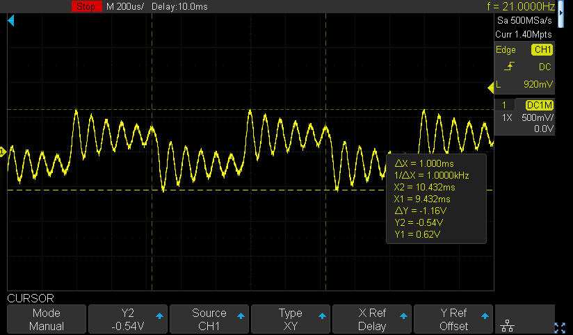
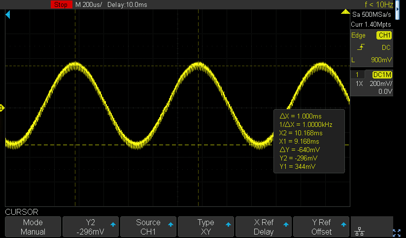
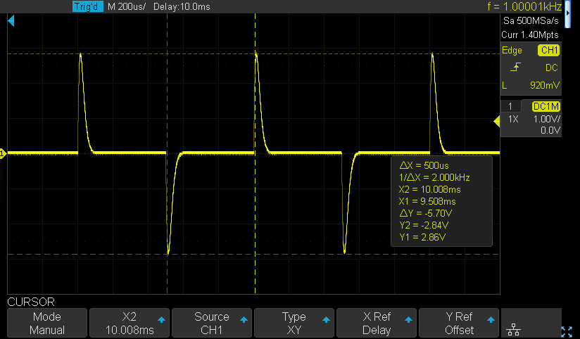
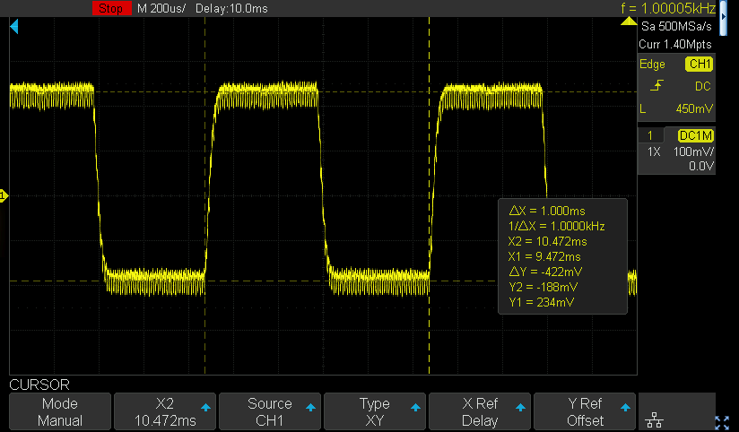

# Differentiator amplifier
The goal is to understand a differentiator amplifier.

# Goals
- [x] Document schematic in Kicad
- [x] Do a theoretical analyis 
- [x] Implement schematic on breadboard
- [x] Test circuit and do measurements

# Equipment used
| Equipment | Description |
| :------------- | :------------- |
| Peaktech 6075 | DC power supply |
| Peaktech 4055mv | AC power supply |
| RS Pro RSDS 1204X-E | Oscilloscope |

# Components
| Reference | Value | Remarks |
| :------------- | :------------- | :------------- |
| 1x LM741CN | | Operational amplifier | 
| R1 | 220 |  | 
| R2 | 470k |  | 
| C1 | 2.2n |  | 
| C2 | 5p |  | 

# Circuit
> 

# Formulas
Calculating the C1 capacitor value. From this site https://www.ti.com/lit/an/sboa276c/sboa276c.pdf?ts=1766042111356 the value should be
set the minimum differentiation frequency at least half a decade below the minimum operating frequency.
<math xmlns="http://www.w3.org/1998/Math/MathML" display="block">
  <mstyle displaystyle="true" scriptlevel="0" style="font-size: 0.7em">
    <mrow data-mjx-texclass="ORD">
      <mtable rowspacing=".5em" columnspacing="1em" displaystyle="true">
        <mtr>
          <mtd>
            <mi>C</mi>
            <mn>1</mn>
            <mo>&#x2265;</mo>
            <mfrac>
              <mn>3.5</mn>
              <mrow>
                <mn>2</mn>
                <mo>&#xD7;</mo>
                <mi>&#x3C0;</mi>
                <mo>&#xD7;</mo>
                <msub>
                  <mi>R</mi>
                  <mn>2</mn>
                </msub>
                <mo>&#xD7;</mo>
                <msub>
                  <mi>f</mi>
                  <mrow data-mjx-texclass="ORD">
                    <mi>m</mi>
                    <mi>i</mi>
                    <mi>n</mi>
                  </mrow>
                </msub>
              </mrow>
            </mfrac>
          </mtd>
        </mtr>
      </mtable>
    </mrow>
  </mstyle>
</math>
Using the same site as above the set the upper cutoff frequency at least half a decade above the maximum operating frequency.
<math xmlns="http://www.w3.org/1998/Math/MathML" display="block">
  <mstyle displaystyle="true" scriptlevel="0" style="font-size: 0.7em">
    <mrow data-mjx-texclass="ORD">
      <mtable rowspacing=".5em" columnspacing="1em" displaystyle="true">
        <mtr>
          <mtd>
            <mi>R</mi>
            <mn>1</mn>
            <mo>&#x2264;</mo>
            <mfrac>
              <mn>1</mn>
              <mrow>
                <mn>3.5</mn>
                <mo>&#xD7;</mo>
                <mn>2</mn>
                <mo>&#xD7;</mo>
                <mi>&#x3C0;</mi>
                <mo>&#xD7;</mo>
                <msub>
                  <mi>C</mi>
                  <mn>1</mn>
                </msub>
                <mo>&#xD7;</mo>
                <msub>
                  <mi>f</mi>
                  <mrow data-mjx-texclass="ORD">
                    <mi>m</mi>
                    <mi>a</mi>
                    <mi>x</mi>
                  </mrow>
                </msub>
              </mrow>
            </mfrac>
          </mtd>
        </mtr>
      </mtable>
    </mrow>
  </mstyle>
</math>
Calculate the bandwidth.
<math xmlns="http://www.w3.org/1998/Math/MathML" display="block">
  <mstyle displaystyle="true" scriptlevel="0" style="font-size: 0.7em">
    <mrow data-mjx-texclass="ORD">
      <mtable rowspacing=".5em" columnspacing="1em" displaystyle="true">
        <mtr>
          <mtd>
            <mi>B</mi>
            <mi>a</mi>
            <mi>n</mi>
            <mi>d</mi>
            <mi>w</mi>
            <mi>i</mi>
            <mi>d</mi>
            <mi>t</mi>
            <mi>h</mi>
            <mo>=</mo>
            <mfrac>
              <mrow>
                <msub>
                  <mi>R</mi>
                  <mn>1</mn>
                </msub>
                <mo>+</mo>
                <msub>
                  <mi>R</mi>
                  <mn>2</mn>
                </msub>
              </mrow>
              <mrow>
                <mn>2</mn>
                <mo>&#xD7;</mo>
                <mi>&#x3C0;</mi>
                <mtext>&#xA0;</mtext>
                <msubsup>
                  <mi>R</mi>
                  <mn>1</mn>
                  <mn>2</mn>
                </msubsup>
                <mo>&#xD7;</mo>
                <msub>
                  <mi>C</mi>
                  <mn>1</mn>
                </msub>
              </mrow>
            </mfrac>
          </mtd>
        </mtr>
      </mtable>
    </mrow>
  </mstyle>
</math>
If C2 is placed in paralell with R2 then calculate cutoff frequency using this formula.
<math xmlns="http://www.w3.org/1998/Math/MathML" display="block">
  <mstyle displaystyle="true" scriptlevel="0" style="font-size: 0.7em">
    <mrow data-mjx-texclass="ORD">
      <mtable rowspacing=".5em" columnspacing="1em" displaystyle="true">
        <mtr>
          <mtd>
            <mi>f</mi>
            <mi>c</mi>
            <mo>=</mo>
            <mfrac>
              <mn>1</mn>
              <mrow>
                <mn>2</mn>
                <mo>&#xD7;</mo>
                <mi>&#x3C0;</mi>
                <mo>&#xD7;</mo>
                <msub>
                  <mi>R</mi>
                  <mn>2</mn>
                </msub>
                <mo>&#xD7;</mo>
                <msub>
                  <mi>C</mi>
                  <mn>2</mn>
                </msub>
              </mrow>
            </mfrac>
          </mtd>
        </mtr>
      </mtable>
    </mrow>
  </mstyle>
</math>

# Calculations
Choose a high resistance value for R2. This is so that we later when calculating C1 the value is manageable. In this case I arbitrarily used a 470k resistor.
<math xmlns="http://www.w3.org/1998/Math/MathML" display="block">
  <mstyle displaystyle="true" scriptlevel="0" style="font-size: 0.7em">
    <mrow data-mjx-texclass="ORD">
      <mtable rowspacing=".5em" columnspacing="1em" displaystyle="true">
        <mtr>
          <mtd>
            <mi>R</mi>
            <mn>2</mn>
            <mo>=</mo>
            <mn>470</mn>
            <mi>k</mi>
          </mtd>
        </mtr>
      </mtable>
    </mrow>
  </mstyle>
</math>
Calculated the C1 capacitor value. Chose the value I had that was closest greater than the calculated value.
<math xmlns="http://www.w3.org/1998/Math/MathML" display="block">
  <mstyle displaystyle="true" scriptlevel="0" style="font-size: 0.7em">
    <mrow data-mjx-texclass="ORD">
      <mtable rowspacing=".5em" columnspacing="1em" displaystyle="true">
        <mtr>
          <mtd>
            <msub>
              <mi>C</mi>
              <mn>1</mn>
            </msub>
            <mo>&#x2265;</mo>
            <mfrac>
              <mn>3.5</mn>
              <mrow>
                <mn>2</mn>
                <mo>&#xD7;</mo>
                <mi>&#x3C0;</mi>
                <mo>&#xD7;</mo>
                <msub>
                  <mi>R</mi>
                  <mn>2</mn>
                </msub>
                <mo>&#xD7;</mo>
                <msub>
                  <mi>f</mi>
                  <mrow data-mjx-texclass="ORD">
                    <mi>m</mi>
                    <mi>i</mi>
                    <mi>n</mi>
                  </mrow>
                </msub>
              </mrow>
            </mfrac>
            <mo>=</mo>
            <mfrac>
              <mn>3.5</mn>
              <mrow>
                <mn>2</mn>
                <mo>&#xD7;</mo>
                <mi>&#x3C0;</mi>
                <mo>&#xD7;</mo>
                <mn>470000</mn>
                <mo>&#xD7;</mo>
                <mn>1000</mn>
              </mrow>
            </mfrac>
            <mo>&#x2265;</mo>
            <mn>1.19</mn>
            <mo>&#xD7;</mo>
            <msup>
              <mn>10</mn>
              <mrow data-mjx-texclass="ORD">
                <mo>&#x2212;</mo>
                <mn>9</mn>
              </mrow>
            </msup>
            <mo>&#x2248;</mo>
            <mn>2.2</mn>
            <mo>&#xD7;</mo>
            <msup>
              <mn>10</mn>
              <mrow data-mjx-texclass="ORD">
                <mo>&#x2212;</mo>
                <mn>9</mn>
              </mrow>
            </msup>
          </mtd>
        </mtr>
      </mtable>
    </mrow>
  </mstyle>
</math>
Calculating the resistor value for R1 for a max frequency of 100khz.
<math xmlns="http://www.w3.org/1998/Math/MathML" display="block">
  <mstyle displaystyle="true" scriptlevel="0" style="font-size: 0.7em">
    <mrow data-mjx-texclass="ORD">
      <mtable rowspacing=".5em" columnspacing="1em" displaystyle="true">
        <mtr>
          <mtd>
            <msub>
              <mi>R</mi>
              <mn>1</mn>
            </msub>
            <mo>&#x2265;</mo>
            <mfrac>
              <mn>1</mn>
              <mrow>
                <mn>3.5</mn>
                <mo>&#xD7;</mo>
                <mn>2</mn>
                <mo>&#xD7;</mo>
                <mi>&#x3C0;</mi>
                <mtext>&#xA0;</mtext>
                <mo>&#xD7;</mo>
                <msub>
                  <mi>C</mi>
                  <mn>1</mn>
                </msub>
                <mo>&#xD7;</mo>
                <msub>
                  <mi>f</mi>
                  <mrow data-mjx-texclass="ORD">
                    <mi>m</mi>
                    <mi>a</mi>
                    <mi>x</mi>
                  </mrow>
                </msub>
              </mrow>
            </mfrac>
            <mo>=</mo>
            <mfrac>
              <mn>1</mn>
              <mrow>
                <mn>3.5</mn>
                <mo>&#xD7;</mo>
                <mn>2</mn>
                <mo>&#xD7;</mo>
                <mi>&#x3C0;</mi>
                <mtext>&#xA0;</mtext>
                <mn>2.2</mn>
                <mo>&#xD7;</mo>
                <msup>
                  <mn>10</mn>
                  <mrow data-mjx-texclass="ORD">
                    <mo>&#x2212;</mo>
                    <mn>9</mn>
                  </mrow>
                </msup>
                <mo>&#xD7;</mo>
                <mn>100</mn>
                <mi>k</mi>
              </mrow>
            </mfrac>
            <mo>&#x2265;</mo>
            <mn>207</mn>
            <mo>&#x2248;</mo>
            <mn>220</mn>
          </mtd>
        </mtr>
      </mtable>
    </mrow>
  </mstyle>
</math>
Calculate C2 0000
<math xmlns="http://www.w3.org/1998/Math/MathML" display="block">
  <mstyle displaystyle="true" scriptlevel="0" style="font-size: 0.7em">
    <mrow data-mjx-texclass="ORD">
      <mtable rowspacing=".5em" columnspacing="1em" displaystyle="true">
        <mtr>
          <mtd>
            <msub>
              <mi>C</mi>
              <mn>2</mn>
            </msub>
            <mo>=</mo>
            <mfrac>
              <mn>1</mn>
              <mrow>
                <mn>2</mn>
                <mo>&#xD7;</mo>
                <mi>&#x3C0;</mi>
                <mo>&#xD7;</mo>
                <msub>
                  <mi>R</mi>
                  <mn>2</mn>
                </msub>
                <mo>&#xD7;</mo>
                <msub>
                  <mi>f</mi>
                  <mrow data-mjx-texclass="ORD">
                    <mi>m</mi>
                    <mi>i</mi>
                    <mi>n</mi>
                  </mrow>
                </msub>
              </mrow>
            </mfrac>
            <mo>=</mo>
            <mfrac>
              <mn>1</mn>
              <mrow>
                <mn>2</mn>
                <mo>&#xD7;</mo>
                <mi>&#x3C0;</mi>
                <mo>&#xD7;</mo>
                <mn>470</mn>
                <mi>k</mi>
                <mo>&#xD7;</mo>
                <mn>100</mn>
                <mi>k</mi>
              </mrow>
            </mfrac>
            <mo>=</mo>
            <mn>3.34</mn>
            <mo>&#xD7;</mo>
            <msup>
              <mn>10</mn>
              <mrow data-mjx-texclass="ORD">
                <mo>&#x2212;</mo>
                <mn>12</mn>
              </mrow>
            </msup>
            <mo>&#x2248;</mo>
            <mn>5</mn>
            <mi>p</mi>
          </mtd>
        </mtr>
      </mtable>
    </mrow>
  </mstyle>
</math>

# Practical measurements without C2
These measurements are used without the C2 capacitor. The output has some noise, these is partly because of a noisy input signal.

## Input sine wave 
> 

Using an input sine wave with a frequency of 1khz and a Vpp of 100mV. The output has increasesed to 642mV peak to peak.

## Input square wave 
> 

Using an input square wave with a frequency of 1khz and a Vpp of 100mV. The output is a fluctuation of a sine wave.

## Input ramp wave 
> 

Using an input ramp wave with a frequency of 1khz and a Vpp of 100mV. The output is the same as the square wave, but with the input forcing the fluctuations either low or high.

# Practical measurements with C2
These measurements are used with the C2 capacitor. The output has some noise, these is partly because of a noisy input signal.

## Input sine wave 
> 

Using an input sine wave with a frequency of 1khz and a Vpp of 100mV. The output is the same as without the C2 capacitor. 

## Input square wave 
> 

With the C2 capacitor the output fluctuations have been removed, but there's a major spike whenever the input goes high or low. 

## Input ramp wave 
> 

The output is now a quite bad square wave. 

# Changelog
| Date | Change |
| :---- | :---- |
| 2025-12-19 | Added theory and practical measurements |
