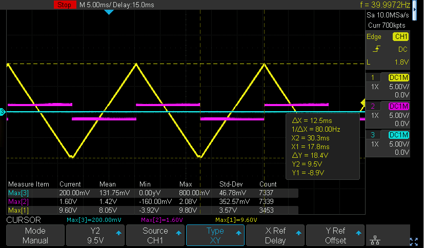

# Integrator
The goal is to understand a integrator amplifier.

# Goals
- [ ] Document schematic in Kicad
- [ ] Do a theoretical analyis 
- [ ] Implement schematic on breadboard
- [ ] Test circuit and do measurements

# Equipment used
| Equipment | Description |
| :------------- | :------------- |
| Peaktech 6075 | DC power supply |
| Peaktech 4055mv | AC power supply |
| RS Pro RSDS 1204X-E | Oscilloscope 

# Components
| Reference | Value | Remarks |
| :------------- | :------------- | :------------- |
| 1x LM741CN | | Operational amplifier | 
| R1 | 1k | | 
| C1 | 22n, 1u | 1u at measurement 1, 2 and 4. 22n at measurement 3. |

# Circuit
> 

# Formulas
This calculates the increase in voltage over time.
<math xmlns="http://www.w3.org/1998/Math/MathML" display="block">
  <mstyle displaystyle="true" scriptlevel="0">
    <mrow data-mjx-texclass="ORD">
      <mtable rowspacing=".5em" columnspacing="1em" displaystyle="true">
        <mtr>
          <mtd>
            <msub>
              <mi>V</mi>
              <mrow data-mjx-texclass="ORD">
                <mi>o</mi>
                <mi>u</mi>
                <mi>t</mi>
              </mrow>
            </msub>
            <mo>=</mo>
            <mo>&#x2212;</mo>
            <mfrac>
              <mn>1</mn>
              <mrow>
                <msub>
                  <mi>R</mi>
                  <mn>1</mn>
                </msub>
                <mo>&#xD7;</mo>
                <mi>C</mi>
                <mn>1</mn>
              </mrow>
            </mfrac>
            <mo>&#xD7;</mo>
            <msubsup>
              <mo data-mjx-texclass="OP">&#x222B;</mo>
              <mrow data-mjx-texclass="ORD">
                <mn>0</mn>
              </mrow>
              <mrow data-mjx-texclass="ORD">
                <mi>t</mi>
              </mrow>
            </msubsup>
            <msub>
              <mi>V</mi>
              <mrow data-mjx-texclass="ORD">
                <mi>i</mi>
                <mi>n</mi>
              </mrow>
            </msub>
            <mi>d</mi>
            <mi>t</mi>
          </mtd>
        </mtr>
      </mtable>
    </mrow>
  </mstyle>
</math>

This calculates the current through the R1 resistor.
<math xmlns="http://www.w3.org/1998/Math/MathML" display="block">
  <mstyle displaystyle="true" scriptlevel="0">
    <mrow data-mjx-texclass="ORD">
      <mtable rowspacing=".5em" columnspacing="1em" displaystyle="true">
        <mtr>
          <mtd>
            <msub>
              <mi>I</mi>
              <mrow data-mjx-texclass="ORD">
                <mi>i</mi>
                <mi>n</mi>
              </mrow>
            </msub>
            <mo>=</mo>
            <mfrac>
              <msub>
                <mi>V</mi>
                <mrow data-mjx-texclass="ORD">
                  <mi>i</mi>
                  <mi>n</mi>
                </mrow>
              </msub>
              <msub>
                <mi>R</mi>
                <mn>1</mn>
              </msub>
            </mfrac>
          </mtd>
        </mtr>
      </mtable>
    </mrow>
  </mstyle>
</math>

# Practical measurements
All measurements were done with a supply voltage of +10V/-10V and the Vin+ input grounded. This is to ensure that the signal can swing without needing to set the bias og the non inverting input. 

## Measurement 1
> 

Yellow here is the output voltage and purple is the input. 
This measurement was done at 40hz, with an amplitude of 1.5V. It gives an almost perfect waveform as output.

| Measured value | Measurement |
| :--- | :--- | Remark | 
| Vpp out | 18.8V | This is just inside the LM741 operating range. Outside this by increasing the input voltage see measurement 2.  |

  
What is interesting about the waveform is that is a straight line rather than a slope as is usual for a RC circuit. The reason it's a straight line is that the input current remains
constant. The cause for this is that the negative feedback keeps the input voltage at the inverting input at 0V, the same as the non inverting input. This again causes the voltage over 
R1 at a constant voltage. Since the voltage is constant the current is constant as well and the capacitor charges and discharges at a constant rate.

## Measurement 2
> 

Yellow here is the output voltage, purple is the input and cyan is the voltage on the Vin-. 
Notice the cyan voltage increase/decrease over Vin-. The cause for this is that we have reached saturation. This causes the virtual ground at Vin- to start to drift away from 0V.

## Measurement 3
> 

This measurement uses a capacitor at 22nF. Getting a perfect saw waveform out at 1.8khz. 

# Measurement 4
> 

This shows that the voltage increase from the bottom of the curve to the top is 18.5V. The time it took was 0.0125 seconds.
Using the caclulation from the formulas the result should be approximately the same.

Calculating the voltage increase over time. 
<math xmlns="http://www.w3.org/1998/Math/MathML" display="block">
  <mstyle displaystyle="true" scriptlevel="0" style="font-size: 0.7em">
    <mrow data-mjx-texclass="ORD">
      <mtable rowspacing=".5em" columnspacing="1em" displaystyle="true">
        <mtr>
          <mtd>
            <msub>
              <mi>V</mi>
              <mrow data-mjx-texclass="ORD">
                <mi>o</mi>
                <mi>u</mi>
                <mi>t</mi>
              </mrow>
            </msub>
            <mo>=</mo>
            <mo>&#x2212;</mo>
            <mfrac>
              <mn>1</mn>
              <mrow>
                <msub>
                  <mi>R</mi>
                  <mn>1</mn>
                </msub>
                <mo>&#xD7;</mo>
                <mi>C</mi>
                <mn>1</mn>
              </mrow>
            </mfrac>
            <mo>&#xD7;</mo>
            <msubsup>
              <mo data-mjx-texclass="OP">&#x222B;</mo>
              <mrow data-mjx-texclass="ORD">
                <mn>0</mn>
              </mrow>
              <mrow data-mjx-texclass="ORD">
                <mi>t</mi>
              </mrow>
            </msubsup>
            <msub>
              <mi>V</mi>
              <mrow data-mjx-texclass="ORD">
                <mi>i</mi>
                <mi>n</mi>
              </mrow>
            </msub>
            <mi>d</mi>
            <mi>t</mi>
            <mo>=</mo>
            <mo>&#x2212;</mo>
            <mfrac>
              <mn>1</mn>
              <mrow>
                <mn>1000</mn>
                <mo>&#xD7;</mo>
                <mn>1</mn>
                <mo>&#xD7;</mo>
                <msup>
                  <mn>10</mn>
                  <mrow data-mjx-texclass="ORD">
                    <mo>&#x2212;</mo>
                    <mn>6</mn>
                  </mrow>
                </msup>
              </mrow>
            </mfrac>
            <mo>&#xD7;</mo>
            <mn>1.5</mn>
            <mo>&#xD7;</mo>
            <mn>0.0125</mn>
            <mo>=</mo>
            <mn>18.75</mn>
          </mtd>
        </mtr>
      </mtable>
    </mrow>
  </mstyle>
</math>
  
The result is almost the same. The difference can be the result of inaccurate equipment, measurements and inaccurate components.
  
Calculating the current.
<math xmlns="http://www.w3.org/1998/Math/MathML" display="block">
  <mstyle displaystyle="true" scriptlevel="0">
    <mrow data-mjx-texclass="ORD">
      <mtable rowspacing=".5em" columnspacing="1em" displaystyle="true">
        <mtr>
          <mtd>
            <msub>
              <mi>I</mi>
              <mrow data-mjx-texclass="ORD">
                <mi>i</mi>
                <mi>n</mi>
              </mrow>
            </msub>
            <mo>=</mo>
            <mfrac>
              <msub>
                <mi>V</mi>
                <mrow data-mjx-texclass="ORD">
                  <mi>i</mi>
                  <mi>n</mi>
                </mrow>
              </msub>
              <msub>
                <mi>R</mi>
                <mn>1</mn>
              </msub>
            </mfrac>
            <mo>=</mo>
            <mfrac>
              <mn>1.5</mn>
              <mn>1000</mn>
            </mfrac>
            <mo>=</mo>
            <mn>1.5</mn>
            <mi>m</mi>
            <mi>A</mi>
          </mtd>
        </mtr>
      </mtable>
    </mrow>
  </mstyle>
</math>
Measuring the the current flowing from Vin to R1, the measurement showed 1.436mA. Quite close.

# Changelog
| Date | Change |
| :---- | :---- |
| 2025-12-16 | Added practical measurements and updated circuit. |