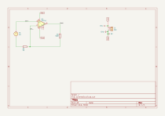

# Non inverting amplifier
The goal is to understand a non inverting amplifier. 

# Goals
- [x] Document schematic in Kicad
- [x] Do a theoretical analyis 
- [x] Implement schematic on breadboard
- [x] Test circuit and do measurements

# Equipment used
| Equipment | Description |
| :------------- | :------------- |
| Peaktech 6075 | DC power supply |
| RS Pro RSDS 1204X-E | Oscilloscope |
| Uni-T UT161D | Multimeter |

# Components
| Reference | Value | Remarks |
| :------------- | :------------- | :------------- |
| R1 | 5.6k | |
| R2 | 1k | |
| 1x LM741CN | | Operational amplifier | 

# Circuit
> 

The opamp works by trying to make both inputs equal. As the input voltage on Vin+ increases the Vout increases. This again increases the voltage on Vin- because a portion of the output voltage feeds back to the negative input.
The feedback is given by the feedback network with R1 and R2. 
  
The output of the signal will have the same polarity as the input voltage on Vin+.

# Formulas
Calculated gain
<math xmlns="http://www.w3.org/1998/Math/MathML" display="block">
  <mstyle displaystyle="true" scriptlevel="0">
    <mrow data-mjx-texclass="ORD">
      <mtable rowspacing=".5em" columnspacing="1em" displaystyle="true">
        <mtr>
          <mtd>
            <mi>G</mi>
            <mi>a</mi>
            <mi>i</mi>
            <mi>n</mi>
            <mo>=</mo>
            <mn>1</mn>
            <mo>+</mo>
            <mfrac>
              <mrow>
                <mi>R</mi>
                <mn>2</mn>
              </mrow>
              <mrow>
                <mi>R</mi>
                <mn>1</mn>
              </mrow>
            </mfrac>
          </mtd>
        </mtr>
      </mtable>
    </mrow>
  </mstyle>
</math>

# Calculations
Calculated gain with the resistor values given in the component list.
<math xmlns="http://www.w3.org/1998/Math/MathML" display="block">
  <mstyle displaystyle="true" scriptlevel="0">
    <mrow data-mjx-texclass="ORD">
      <mtable rowspacing=".5em" columnspacing="1em" displaystyle="true">
        <mtr>
          <mtd>
            <mi>G</mi>
            <mi>a</mi>
            <mi>i</mi>
            <mi>n</mi>
            <mo>=</mo>
            <mn>1</mn>
            <mo>+</mo>
            <mfrac>
              <mrow>
                <mi>R</mi>
                <mn>1</mn>
              </mrow>
              <mrow>
                <mi>R</mi>
                <mn>2</mn>
              </mrow>
            </mfrac>
            <mo>=</mo>
            <mn>1</mn>
            <mo>+</mo>
            <mfrac>
              <mn>5600</mn>
              <mn>1000</mn>
            </mfrac>
            <mo>=</mo>
            <mn>6.6</mn>
          </mtd>
        </mtr>
      </mtable>
    </mrow>
  </mstyle>
</math>

# Practical measurements
> Measurements done on oscilloscope with Vin+ at 1.8V - 2.3V 
> 
>   

For all measurements 

| Probe | Measurement |
| :--- | :--- | :--- |
| Yellow | Vin+ |
| Purple | Vin- |
| Cyan | Vout |

Oscilloscope measurements are not accurate as they are done with only 8bit vertical resolution.
  
Measurements

| Vin+ | Vin- | Vout |
| :--- | :--- | :--- |
| 1.790V | 1.937V | 12.89V |
| 1.894V | 1.942V | 12.95V |
| 1.997V | 2.000V | 13.35V |
| 2.092V | 2.092V | 13.95V |
| 2.196V | 2.116V | 14.11V |

Measurements done using multimeter.

As we increase the Vin+ voltage this slowly also increases the Vin- voltage because of the feedback network. 

# Changelog
| Date | Change |
| :---- | :---- |
| 2025-11-15 | Added theory and calculations |
| 2025-11-16 | Added practical measurements |
