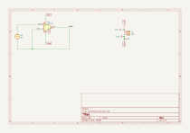
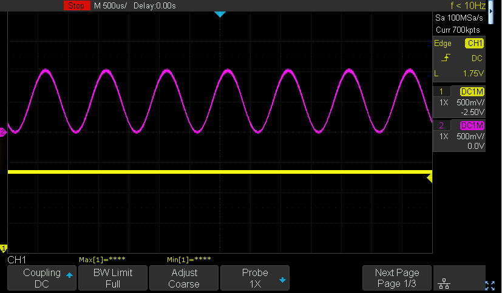
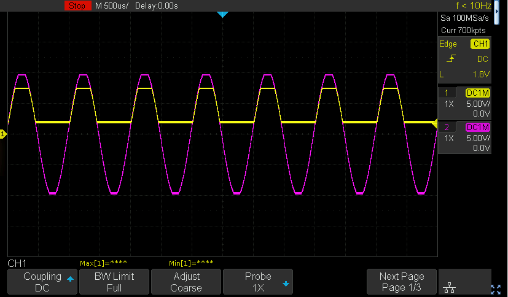

# Unity-gain
The goal is to understand a unity gain amplifier.

# Goals
- [x] Document schematic in Kicad
- [x] Do a theoretical analyis 
- [x] Implement schematic on breadboard
- [x] Test circuit and do measurements

# Equipment used
| Equipment | Description |
| :------------- | :------------- |
| Peaktech 6075 | DC power supply |
| Peaktech 4055mv | AC power supply |
| RS Pro RSDS 1204X-E | Oscilloscope 

# Components
| Reference | Value | Remarks |
| :------------- | :------------- | :------------- |
| 1x LM741CN | | Operational amplifier | 
| R1,R2 | 10k | These are neccesary since this setup is single supply with voltage from 0V to 10V. | 

# Circuit
> 

The opamp forces Vin+ and Vin- to be as close as they can. Since there is no feedback resistor Vout becomes the same as Vin+.

# Formulas
Using rule 4 from the theory that the difference between V- and V+ is 0. This would mean that Vout=V- and Vin=V+.
So the formula becomes.
<math xmlns="http://www.w3.org/1998/Math/MathML" display="block">
  <mstyle displaystyle="true" scriptlevel="0" style="font-size: 0.7em">
    <mrow data-mjx-texclass="ORD">
      <mtable rowspacing=".5em" columnspacing="1em" displaystyle="true">
        <mtr>
          <mtd>
            <mi>A</mi>
            <mo>=</mo>
            <mfrac>
              <msub>
                <mi>V</mi>
                <mrow data-mjx-texclass="ORD">
                  <mi>o</mi>
                  <mi>u</mi>
                  <mi>t</mi>
                </mrow>
              </msub>
              <msub>
                <mi>V</mi>
                <mrow data-mjx-texclass="ORD">
                  <mi>i</mi>
                  <mi>n</mi>
                </mrow>
              </msub>
            </mfrac>
            <mo>=</mo>
            <mn>1</mn>
          </mtd>
        </mtr>
      </mtable>
    </mrow>
  </mstyle>
</math>

# Practical measurements
The measurements were done with a supply voltage of 10V.

> 

With a measurement input signal of 1khz, 1V amplitude and 3.5V offset. The signal out and singal in is almost identical.

> 

With a measurement signal of 1khz, 1V amplitude and 0.5V offset the output signal does not match the input signal. This is beacuse the signal is outisde of the LM741 operating range.

> 

This is an even worse signal as above. The signal is 1khz, 20V amplitude and 0V offset. Since this is far outside the operating range and the supply voltages, the output is being cut both 
at the top and the bottom. Did this just to see what would happen.

# Changelog
| Date | Change |
| :---- | :---- |
| 2025-11-18 | Added theory. |
| 2025-12-15 | Added practical measurements and updated circuit. |