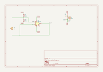

# Unity-gain
The goal is to understand a unity gain amplifier.

# Goals
- [x] Document schematic in Kicad
- [ ] Do a theoretical analyis 
- [ ] Implement schematic on breadboard
- [ ] Test circuit and do measurements

# Equipment used
| Equipment | Description |
| :------------- | :------------- |
| Peaktech 6075 | DC power supply |
| RS Pro RSDS 1204X-E | Oscilloscope |
| Uni-T UT161D | Multimeter |

# Components
| Reference | Value | Remarks |
| :------------- | :------------- | :------------- |
| R1 | 100k | |
| R2 | 1k | |
| 1x LM741CN | | Operational amplifier | 

# Circuit
> 

# Formulas
Using rule 4 from the theory that the difference between V- and V+ is 0. This would mean that Vout=V- and Vin=V+.
So the formula becomes.
<math xmlns="http://www.w3.org/1998/Math/MathML" display="block">
  <mstyle displaystyle="true" scriptlevel="0">
    <mrow data-mjx-texclass="ORD">
      <mtable rowspacing=".5em" columnspacing="1em" displaystyle="true">
        <mtr>
          <mtd>
            <mi>A</mi>
            <mo>=</mo>
            <mfrac>
              <msub>
                <mi>V</mi>
                <mrow data-mjx-texclass="ORD">
                  <mi>o</mi>
                  <mi>u</mi>
                  <mi>t</mi>
                </mrow>
              </msub>
              <msub>
                <mi>V</mi>
                <mrow data-mjx-texclass="ORD">
                  <mi>i</mi>
                  <mi>n</mi>
                </mrow>
              </msub>
            </mfrac>
            <mo>=</mo>
            <mn>1</mn>
          </mtd>
        </mtr>
      </mtable>
    </mrow>
  </mstyle>
</math>

# Practical measurements

# Changelog
| Date | Change |
| :---- | :---- |
| 2025-11-18 | Added theory |