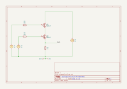
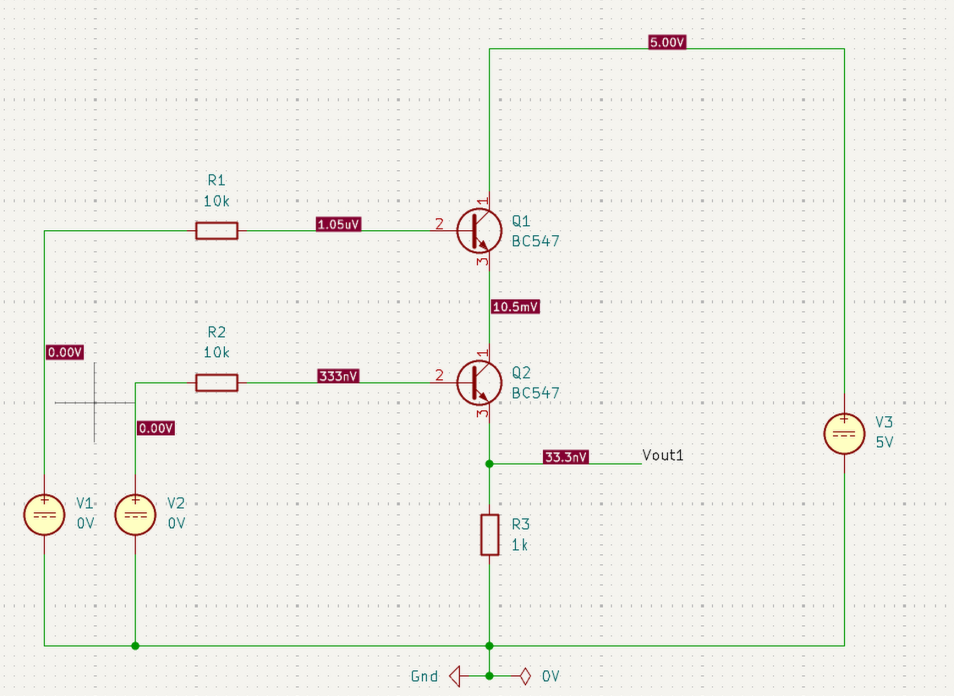
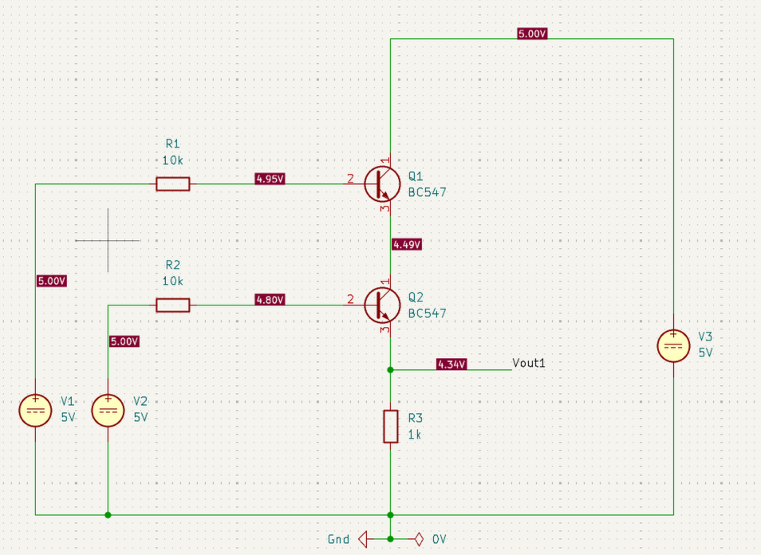

# Logic and with transistor
The goal is to implement a 2 input logic AND circuit with both a bipolar and mosfet transistors.
 
# Goals
- [x] Document schematic in Kicad
- [x] Do a theoretical analyis 
- [ ] Implement schematic on breadboard
- [ ] Test circuit and do measurements

# Equipment used
| Equipment | Description |
| :------------- | :------------- |
| Peaktech 6075 | DC power supply |
| RS Pro RSDS 1204X-E | Oscilloscope |

# Components
| Reference | Value | Remarks |
| :------------- | :------------- | :------------- |
| 2x BC547 | | Any NPN transistor should work |
| R1, R2 | 10k | |
| R3 | 4.7k | |

# With bipolar transistor
## Schematics
> 

Schematics for a very simple 2 input logic and gate.
 
The circuit works that when there's no voltage on input on the transistors the resistance over the collector-emittor is very high. Therefore
no voltage will be on R3 in the circuit. 
 
 
When V1 and V2 outputs 5V the transistor will reduce the resitance over collector-emitter as there's a current flowing on base-emitter.
When the resistance lowers more voltage is on R3. 

## Simulation description
The simulations below were run using kicad.

## Simulation (Input V1=0V V2=0V)
> 

When V1 and V2 have 0V none of the voltage is on R3 as the resistance over collector-emitter on both Q1 and Q2 are very high. So no voltage is on R3.

## Simulation (Input V1=5V and V2=0V)
> 

In this case V1 has 5V so now the resitance is reduced significantly over collector-emitter, but since Q2 still have high resistance over collector-emitter,
there's no voltage on R3.

## Simulation (Input V1=0V and V2=5V)
> 

In this case Q2 have low resistance over collector-emitter, but Q1 have very high so no voltage on R3.

## Simulation (Input V1=5V and V2=5V)
> 
 
Now the input voltage on base-emitter on both Q1 and Q2 is over the saturation voltage so the resistance over collector-emitter is very low for both transistors. The voltage is therefore on R3 instead.

## Practical measurements

## Changelog
| Date | Change |
| :---- | :---- |
| 2025-11-01 | Simulation results added |
| 2025-11-15 | Upgraded simulation results as I initially added the wrong version |