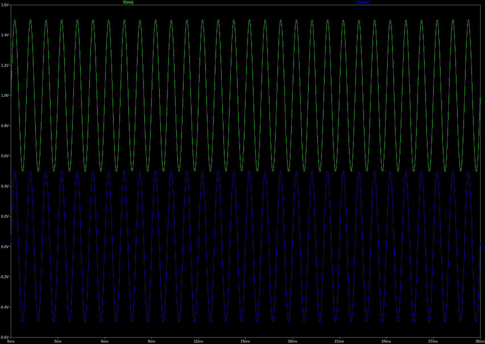
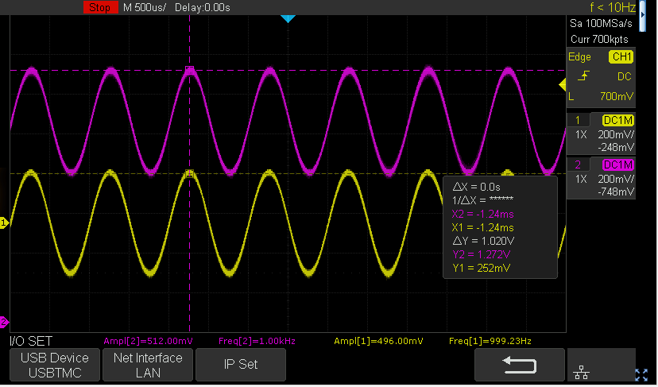
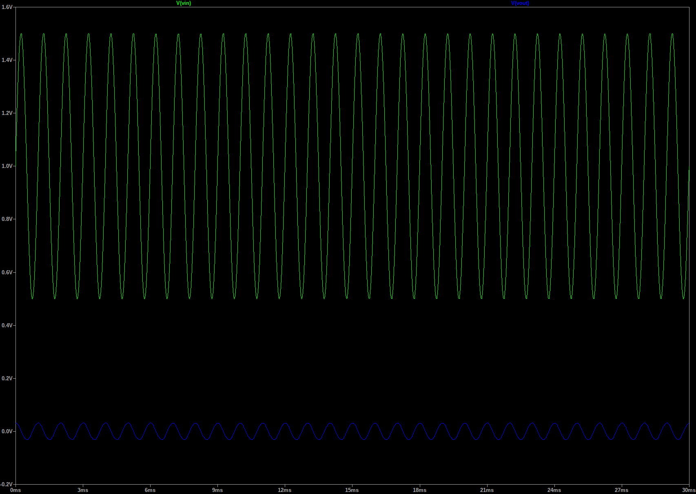
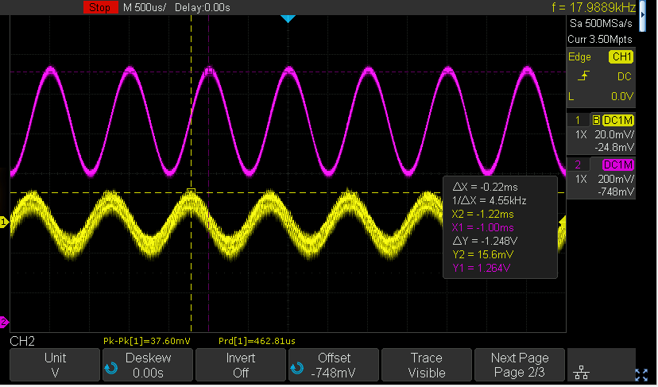
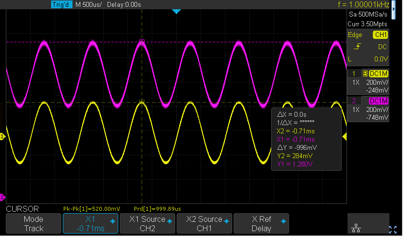
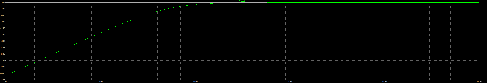
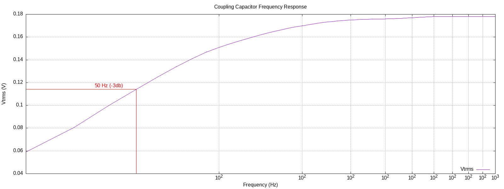

# Coupling Capacitor
The goal is to understand how a coupling capacitor works.

# Goals
- [x] Document schematic in Kicad
- [x] Do a theoretical analyis 
- [x] Implement schematic on breadboard
- [x] Test circuit and do measurements

# Equipment used
| Equipment | Description |
| :------------- | :------------- |
| Peaktech 4055mv | AC power supply |
| RS Pro RSDS 1204X-E | Oscilloscope |
| Brymen 869 | Multimeter |

# Components
| Reference | Value | Remarks |
| :------------- | :------------- | :------------- |
| R3 | 10k | Load resistor |
| C1 | 1n, 318n, 1m | |

# Circuit
> 

The circuit consists of a coupling capacitor (C1) in series with a load resistor (R1). The capacitor blocks DC components while allowing AC signals to pass through to the load resistor, effectively isolating the DC bias from subsequent stages.

# Formulas
This formula calculates the required capacitance (C) given the desired cutoff frequency (fc) at -3dB and the load resistance (RL).
<math xmlns="http://www.w3.org/1998/Math/MathML" display="block">
  <mstyle displaystyle="true" scriptlevel="0">
    <mrow data-mjx-texclass="ORD">
      <mtable rowspacing=".5em" columnspacing="1em" displaystyle="true">
        <mtr>
          <mtd>
            <mi>C</mi>
            <mo>=</mo>
            <mfrac>
              <mn>1</mn>
              <mrow>
                <mn>2</mn>
                <mi>&#x3C0;</mi>
                <msub>
                  <mi>f</mi>
                  <mi>c</mi>
                </msub>
                <msub>
                  <mi>R</mi>
                  <mi>L</mi>
                </msub>
              </mrow>
            </mfrac>
          </mtd>
        </mtr>
      </mtable>
    </mrow>
  </mstyle>
</math>

# Calculations
Calculates the capacitance (C1) for a load of 10k and a cutoff frequency at 50hz.
<math xmlns="http://www.w3.org/1998/Math/MathML" display="block">
  <mstyle displaystyle="true" scriptlevel="0">
    <mrow data-mjx-texclass="ORD">
      <mtable rowspacing=".5em" columnspacing="1em" displaystyle="true">
        <mtr>
          <mtd>
            <mi>C</mi>
            <mo>=</mo>
            <mfrac>
              <mn>1</mn>
              <mrow>
                <mn>2</mn>
                <mi>&#x3C0;</mi>
                <msub>
                  <mi>f</mi>
                  <mi>c</mi>
                </msub>
                <msub>
                  <mi>R</mi>
                  <mi>L</mi>
                </msub>
              </mrow>
            </mfrac>
            <mo>=</mo>
            <mfrac>
              <mn>1</mn>
              <mrow>
                <mn>2</mn>
                <mi>&#x3C0;</mi>
                <mo>&#xD7;</mo>
                <mn>50</mn>
                <mo>&#xD7;</mo>
                <mn>10000</mn>
              </mrow>
            </mfrac>
            <mo>=</mo>
            <mn>318</mn>
            <mo>&#xD7;</mo>
            <msup>
              <mn>10</mn>
              <mrow data-mjx-texclass="ORD">
                <mo>&#x2212;</mo>
                <mn>9</mn>
              </mrow>
            </msup>
          </mtd>
        </mtr>
      </mtable>
    </mrow>
  </mstyle>
</math>

# Simulation information
All simulations are run  with a DC component of 1V and an AC amplitude of 0.5V. The resistor is always 10k.

# Ideal situation
## Simulation
> 

Using the ideal capacitance value of 318nF the the output is between 0V and 1V. The DC component have been removed.
Green is the input voltage and blue is the voltage over the resistor.

## Practical measurements
> 

Using a capcitor of value 330nF, since I did not have one at 318nF. The result is the same as on the simulation. 
Purple is the input voltage and yellow is the output voltage over the resistor.

# Too small capacitor
## Simulation
> 

Using a significantly lower capacitor the output over the resistor becomes very attenuated.
Green is the input voltage and blue is the voltage over the resistor.

## Practical measurements
> 

Using a lower cpacitance the output is now attenuated significantly. Since the voltage is shared between the resistor and capacitor when the reactance is high it means more of the voltage is on the capacitor.
A smaller capacitor also creates a higher cutoff frequency. With a 1nF capacitor the cutoff frequency becomes 16khz.
Purple is the input voltage and yellow is the output voltage over the resistor.

# Too big capacitor
## Simulation
> 

Using a significantly higher capacitor the output does not change compared to the ideal. The only difference is the time it takes 
to initialize the circuit.This capacitor value also changes the cutoff frequency from 50Hz to 0.016hz.
Green is the input voltage and blue is the voltage over the resistor.

## Practical measurements
> 

The measurement using a 1mF capacitor. The purple is the input and yellow is the voltage over the resistor. The DC offset have been removed and is indistinguishable from the ideal.
Purple is the input voltage and yellow is the output voltage over the resistor.

# Different frequencies
## Simulation
> 

This shows the attenuation of the output as over 1hz to 100khz. At 50hz the attenuation is -3db. 

## Practical measurements

Measurements done with multimeter. 

| Frequency | Vtrms |
| :--- | :--- |
| 10 | 031 |
| 20 | 0.059 | 
| 30 | 0.081 | 
| 40 | 0.100 |
| 50 | 0.114 | 
| 60 | 0.125 |
| 70 | 0.134 |
| 80 | 0.141 |
| 90 | 0.147 |
| 100 | 0.151 |
| 200 | 0.170 |
| 300 | 0.175 |
| 400 | 0.176 |
| 500 | 0.177 |
| 600 | 0.178 |
| 700 | 0.178 |
| 800 | 0.178 |
| 1000 | 0.178 |

Gives the following plot
> 

This shows the measured frequency response measured using a multimeter. The calculated attenuation at -3db is close to the measured -3db attenuation. 

# Changelog
| Date | Change |
| :---- | :---- |
| 2025-12-09 | Simulations and practical measurements added |
| 2025-12-10 | Updated a few descriptions and fixed schecmatics image |
