# Logic and with transistor
The goal is to understand how an emitter bypass capacitor works and test a few error situations

# Goals
- [x] Document schematic in Kicad
- [x] Do a theoretical analyis 
- [x] Implement schematic on breadboard
- [x] Test circuit and do measurements

# Equipment used
| Equipment | Description |
| :------------- | :------------- |
| Peaktech 6075 | DC power supply |
| Peaktech 4055mv | AC power supply |
| RS Pro RSDS 1204X-E | Oscilloscope |

# Components
| Reference | Value | Remarks |
| :------------- | :------------- | :------------- |
| 1x BC547 | | Any NPN transistor should work |
| R1 | 2.5k | |
| R2 | 800 | |
| R3 | 10k | Load resistor |
| C1 | 100n ,40u, 1000u | |

# Comment
Some of the tests require low input voltage, but I do not have a great AC power supply and it has significant noise at such levels. The output is therefore never perfect on the practical measurements. This could be improved with a decoupling capacitor, 
but since I wanted this experiment to only be about the bypass capacitor I chose to skip it.

# Circuit
> 

This the test circuit used. The goal in these tests are to check different situations with the bypass capacitor.

# Formulas
Gain calculation
<math xmlns="http://www.w3.org/1998/Math/MathML" display="block">
  <mstyle displaystyle="true" scriptlevel="0" style="font-size: 0.7em">
    <mrow data-mjx-texclass="ORD">
      <mtable rowspacing=".5em" columnspacing="1em" displaystyle="true">
        <mtr>
          <mtd>
            <mi>G</mi>
            <mi>a</mi>
            <mi>i</mi>
            <mi>n</mi>
            <mo>=</mo>
            <mfrac>
              <msub>
                <mi>V</mi>
                <mrow data-mjx-texclass="ORD">
                  <mi>o</mi>
                  <mi>u</mi>
                  <mi>t</mi>
                </mrow>
              </msub>
              <msub>
                <mi>V</mi>
                <mrow data-mjx-texclass="ORD">
                  <mi>i</mi>
                  <mi>n</mi>
                </mrow>
              </msub>
            </mfrac>
          </mtd>
        </mtr>
      </mtable>
    </mrow>
  </mstyle>
</math>
  
C1 can be calculated using this formula. The frequency in this formula should be the lower frequency in a highpass filter.
<math xmlns="http://www.w3.org/1998/Math/MathML" display="block">
  <mstyle displaystyle="true" scriptlevel="0" style="font-size: 0.7em">
    <mrow data-mjx-texclass="ORD">
      <mtable rowspacing=".5em" columnspacing="1em" displaystyle="true">
        <mtr>
          <mtd>
            <msub>
              <mi>C</mi>
              <mn>1</mn>
            </msub>
            <mo>=</mo>
            <mfrac>
              <mn>1</mn>
              <mrow>
                <mn>2</mn>
                <mi>&#x3C0;</mi>
                <mi>f</mi>
                <mfrac>
                  <msub>
                    <mi>R</mi>
                    <mi>2</mi>
                  </msub>
                  <mn>10</mn>
                </mfrac>
              </mrow>
            </mfrac>
          </mtd>
        </mtr>
      </mtable>
    </mrow>
  </mstyle>
</math>
If the lower frequency is 50Hz and using R2 value as 800 ohm. The calculated C1 the becomes.
<math xmlns="http://www.w3.org/1998/Math/MathML" display="block">
  <mstyle displaystyle="true" scriptlevel="0" style="font-size: 0.7em">
    <mrow data-mjx-texclass="ORD">
      <mtable rowspacing=".5em" columnspacing="1em" displaystyle="true">
        <mtr>
          <mtd>
            <msub>
              <mi>C</mi>
              <mn>1</mn>
            </msub>
            <mo>=</mo>
            <mfrac>
              <mn>1</mn>
              <mrow>
                <mn>2</mn>
                <mi>&#x3C0;</mi>
                <mn>50</mn>
                <mfrac>
                  <mn>800</mn>
                  <mn>10</mn>
                </mfrac>
              </mrow>
            </mfrac>
            <mo>=</mo>
            <mn>40</mn>
            <mo>&#xD7;</mo>
            <msup>
              <mn>10</mn>
              <mrow data-mjx-texclass="ORD">
                <mo>&#x2212;</mo>
                <mn>6</mn>
              </mrow>
            </msup>
          </mtd>
        </mtr>
      </mtable>
    </mrow>
  </mstyle>
</math>

# Ideal situation
## Simulation
> 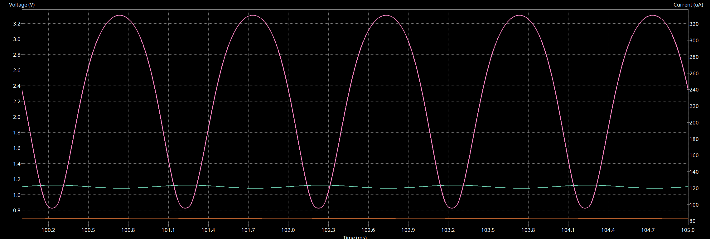

This is the ideal situation simulated with the values given in the schematics. The Vout voltage is a nice sine curve with a slight distortion.
Vr2 is very stable around 0.7V.
  
This circuit gives a very high gain. The sine wave is very good, with only a very slight distortion making the width of the positive part of the curve slightly wider than the negative. The bypass capacitor is very stable, but since this the minimum recommended value, it could be improved slightly by increasing it slightly to make it even more stable. The input is only Vpp of 0.02V with a dc offset of 1.1V. This gives an output Vpp of 3.3V to 0.825mV.

## Calculations
The calculated gain of the ideal circuit is -62.
<math xmlns="http://www.w3.org/1998/Math/MathML" display="block">
  <mstyle displaystyle="true" scriptlevel="0" style="font-size: 0.7em">
    <mrow data-mjx-texclass="ORD">
      <mtable rowspacing=".5em" columnspacing="1em" displaystyle="true">
        <mtr>
          <mtd>
            <mi>G</mi>
            <mi>a</mi>
            <mi>i</mi>
            <mi>n</mi>
            <mo>=</mo>
            <mfrac>
              <msub>
                <mi>V</mi>
                <mrow data-mjx-texclass="ORD">
                  <mi>o</mi>
                  <mi>u</mi>
                  <mi>t</mi>
                </mrow>
              </msub>
              <msub>
                <mi>V</mi>
                <mrow data-mjx-texclass="ORD">
                  <mi>i</mi>
                  <mi>n</mi>
                </mrow>
              </msub>
            </mfrac>
            <mo>=</mo>
            <mfrac>
              <mrow>
                <mo>&#x2212;</mo>
                <mn>2.48</mn>
                <mi>V</mi>
              </mrow>
              <mrow>
                <mn>40</mn>
                <mi>m</mi>
                <mi>V</mi>
              </mrow>
            </mfrac>
            <mo>=</mo>
            <mo>&#x2212;</mo>
            <mn>62</mn>
          </mtd>
        </mtr>
      </mtable>
    </mrow>
  </mstyle>
</math>

## Practical measurements
> 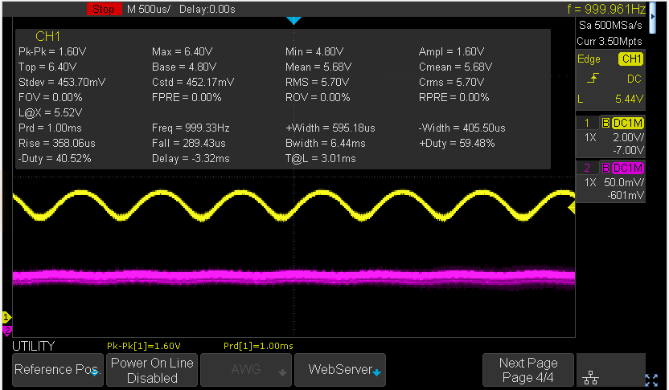

Did not have the exact values for the capacitor or resistors so I used the closest I had. 
R1 is 3.2k, R2 is 800 ohm and the capacitor is 43uF. This gives a Vpp out 1.6V and input is 0.02V which gives a gain of -80. 
Using a variable resistor in series with R2 I got could increase the gain to -110.
  
The measured voltage over the bypass capacitor and R1 is around 0.93V.

## Practical measurements (current)
> 

Adds a Multimeter for measuring AC and DC current to ground.

The DC current was always 0A for all frequencies. This is due to the capacitor being being fully charged and acts as an open circuit. 
  

| Frequency | Current AC |
| :------ | :------ |
| 10 | 42uA |
| 20 | 50uA |
| 30 | 57uA |
| 40 | 61uA |
| 50 | 63uA |
| 60 | 65uA |
| 70 | 66uA |
| 80 | 67uA |
| 90 | 68uA |
| 100 | 68uA |
| 200 | 70uA |
| 300 | 70uA |
| 400 | 70uA |
| 500 | 70uA |
| 1k | 70uA |
| 7k | 70uA |
| 8k | 69uA |
| 9k | 69uA |
| 10k | 69uA |
| 20k | 68uA |
| 30k | 67uA |
| 40k | 67uA |
| 50k | 66uA |
| 60k | 65uA |
| 70k | 64uA |
| 80k | 63uA |
| 90k | 62uA |
| 100k | 61uA |

  
The AC current flows freely due to the low impedance to ground. 

# No bypass capacitor
## Simulation
> 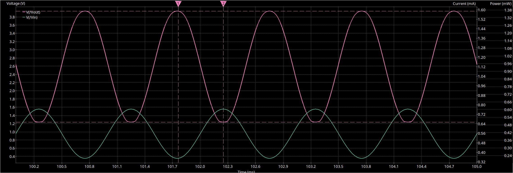

Removed the bypass capacitor and changed the input voltage to 0.6V amplitude and a dc component of 0.95V.
  
The circuit now gives a perfect sine curve out, but the gain has been reduced to just -2.25. 

## Calculations
<math xmlns="http://www.w3.org/1998/Math/MathML" display="block">
  <mstyle displaystyle="true" scriptlevel="0">
    <mrow data-mjx-texclass="ORD">
      <mtable rowspacing=".5em" columnspacing="1em" displaystyle="true">
        <mtr>
          <mtd>
            <mi>G</mi>
            <mi>a</mi>
            <mi>i</mi>
            <mi>n</mi>
            <mo>=</mo>
            <mfrac>
              <msub>
                <mi>V</mi>
                <mrow data-mjx-texclass="ORD">
                  <mi>o</mi>
                  <mi>u</mi>
                  <mi>t</mi>
                </mrow>
              </msub>
              <msub>
                <mi>V</mi>
                <mrow data-mjx-texclass="ORD">
                  <mi>i</mi>
                  <mi>n</mi>
                </mrow>
              </msub>
            </mfrac>
            <mo>=</mo>
            <mfrac>
              <mrow>
                <mo>&#x2212;</mo>
                <mn>2.7</mn>
                <mi>V</mi>
              </mrow>
              <mrow>
                <mn>1.2</mn>
                <mi>V</mi>
              </mrow>
            </mfrac>
            <mo>=</mo>
            <mo>&#x2212;</mo>
            <mn>2.25</mn>
          </mtd>
        </mtr>
      </mtable>
    </mrow>
  </mstyle>
</math>

## Practical measurements
> 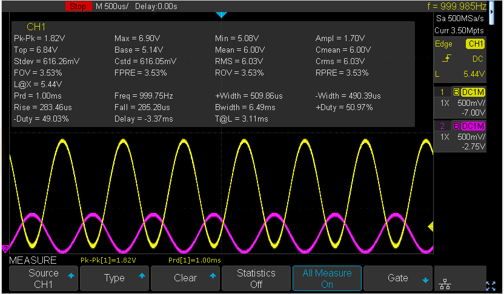

Without the bypass capacitor the output looks like a perfect sine. The Vpp out is 1.82 with an input of 0.6Vpp. This gives a gain of 3 so without the capacitor the has decreased significantly.

# Increasing the bypass capacitance
## Simulation
The diagram shows voltage over the bypass capacitor after 100ms. 
> 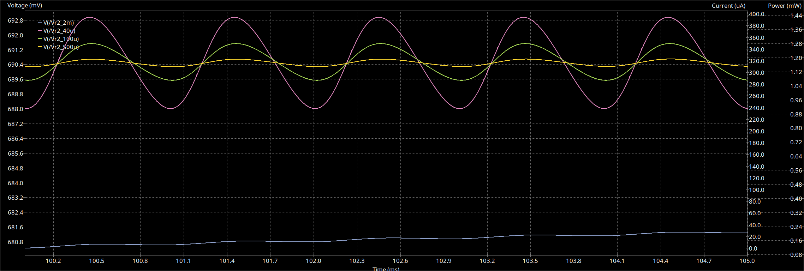
 
The diagram shows how quickly the bypass capacitor initializes for each of the capacitor values 
> 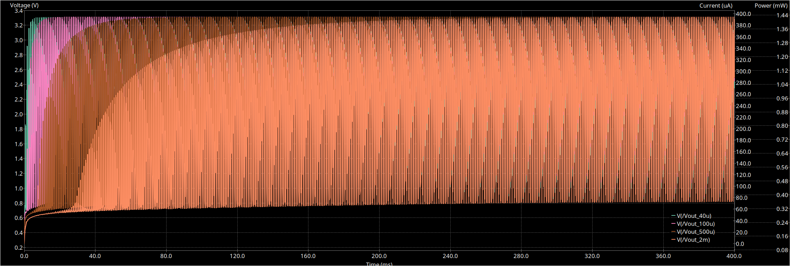
 
This shows the output voltage early.
> 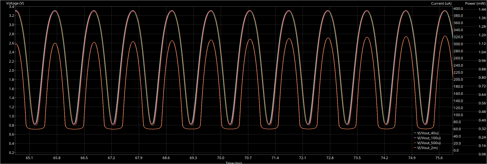

In this test the capacitor values are 40uF, 100uF, 500uF and 2mF.
  
Increasing the bypass capacitor value makes the voltage much more stable, but takes longer to fully initialize. The output voltage does not change very much
for either value.

## Practical measurements
> 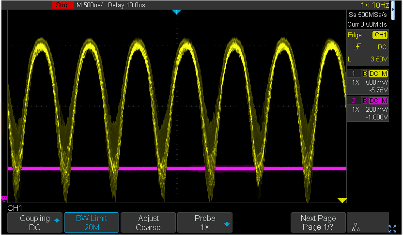
> 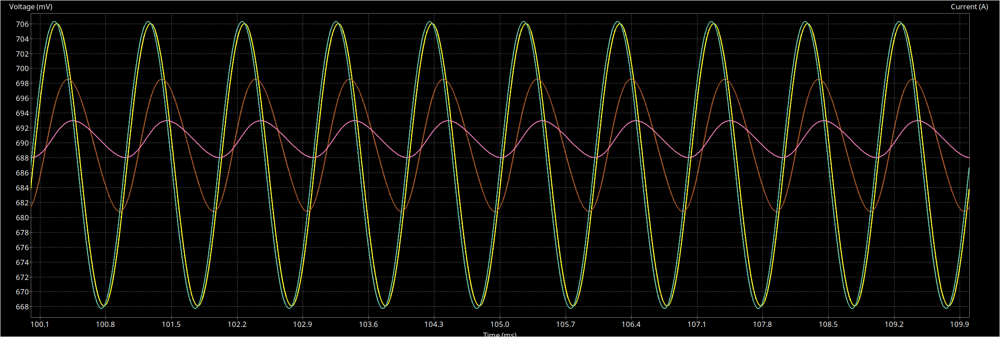

The diagram shows voltage out for each of the capacitor values 
> 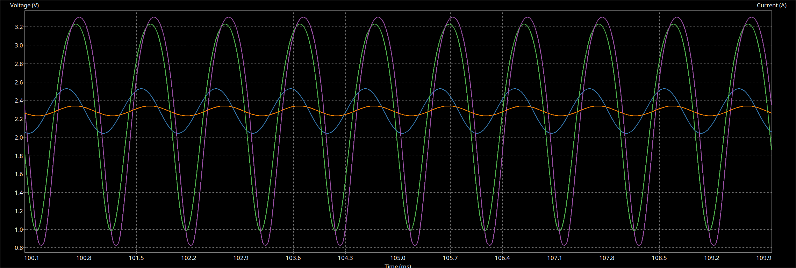

In this test the capacitor values are 40uF, 10uF, 1uF and 100nF.
  
Decreasing the capacitor makes the voltage over R2/C1 more and more unstable. It also decreases the output Vpp out as the capacitor decreases.

## Practical measurements
> 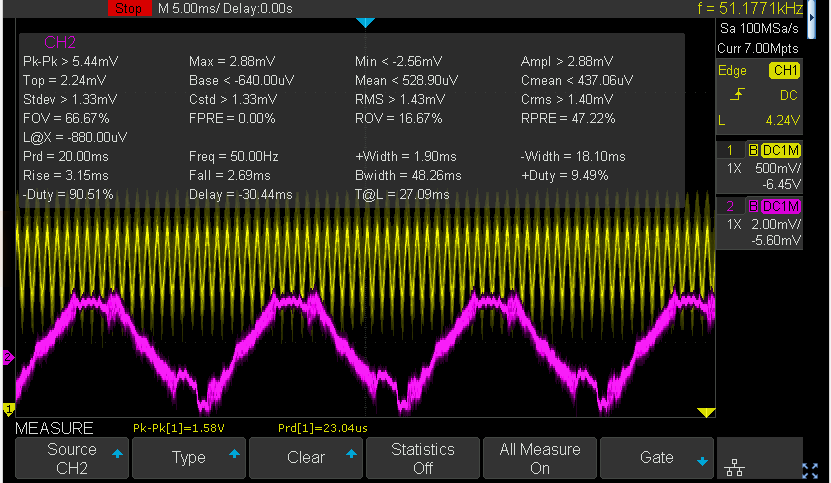

Used a 100nF capacitor for this test. The output still looks like a proper sine, but the voltage over bypass capacitor and R2 is now  significantly less stable.

# High input amplitude
## Simulation
> 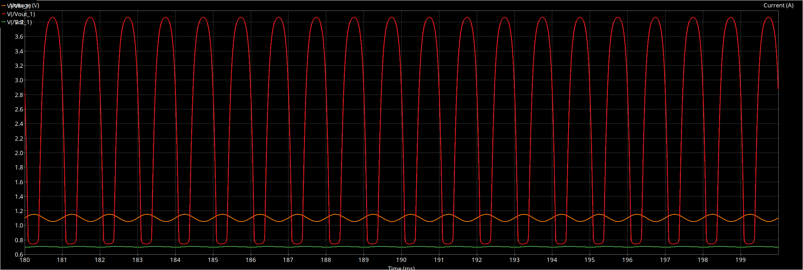

> 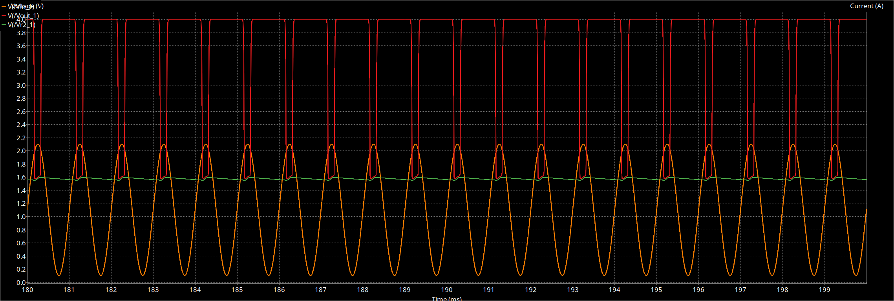

Using the ideal circuit I increased the dc offset of the input. This causes the negative part of the output is now clipped so it's no longer a nice sine wave. Increasing it even further the output eventually starts clippping on the upper part as well.

## Practical measurements
> 

Increasing the amplitude eventually the negative part becomes cut off. 

## Changelog
| Date | Change |
| :---- | :---- |
| 2025-11-03 | Added schematics and future tests |
| 2025-11-06 | Added multiple practical measurements and simulations |
