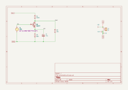

# Logic and with transistor
The goal is to understand how an emitter bypass capacitor works and test a few error situations
# Goals
- [x] Document schematic in Kicad
- [ ] Do a theoretical analyis 
- [ ] Implement schematic on breadboard
- [ ] Test circuit and do measurements

# Equipment used
| Equipment | Description |
| :------------- | :------------- |
| Peaktech 6075 | DC power supply |
| Peaktech 4055mv | AC power supply |
| RS Pro RSDS 1204X-E | Oscilloscope |

# Components
| Reference | Value | Remarks |
| :------------- | :------------- | :------------- |
| 1x BC547 | | Any NPN transistor should work |
| R1 | 2.5k | |
| R2 | 800 | |
| R3 | 10k | Load resistor |
| C1 | 10n, 40u | |

# Circuit
> 

This the test circuit used. The goal in these tests are to check different situations with the bypass capacitor.

# Formulas
Gain calculation
<math xmlns="http://www.w3.org/1998/Math/MathML" display="block">
  <mstyle displaystyle="true" scriptlevel="0">
    <mrow data-mjx-texclass="ORD">
      <mtable rowspacing=".5em" columnspacing="1em" displaystyle="true">
        <mtr>
          <mtd>
            <mi>G</mi>
            <mi>a</mi>
            <mi>i</mi>
            <mi>n</mi>
            <mo>=</mo>
            <mfrac>
              <msub>
                <mi>V</mi>
                <mrow data-mjx-texclass="ORD">
                  <mi>o</mi>
                  <mi>u</mi>
                  <mi>t</mi>
                </mrow>
              </msub>
              <msub>
                <mi>V</mi>
                <mrow data-mjx-texclass="ORD">
                  <mi>i</mi>
                  <mi>n</mi>
                </mrow>
              </msub>
            </mfrac>
          </mtd>
        </mtr>
      </mtable>
    </mrow>
  </mstyle>
</math>
  
C1 can be calculated using this formula. The frequency in this formula should be the lower frequency in a highpass filter.
<math xmlns="http://www.w3.org/1998/Math/MathML" display="block">
  <mstyle displaystyle="true" scriptlevel="0">
    <mrow data-mjx-texclass="ORD">
      <mtable rowspacing=".5em" columnspacing="1em" displaystyle="true">
        <mtr>
          <mtd>
            <msub>
              <mi>C</mi>
              <mn>1</mn>
            </msub>
            <mo>=</mo>
            <mfrac>
              <mn>1</mn>
              <mrow>
                <mn>2</mn>
                <mi>&#x3C0;</mi>
                <mi>f</mi>
                <mfrac>
                  <msub>
                    <mi>R</mi>
                    <mi>2</mi>
                  </msub>
                  <mn>10</mn>
                </mfrac>
              </mrow>
            </mfrac>
          </mtd>
        </mtr>
      </mtable>
    </mrow>
  </mstyle>
</math>
If the lower frequency is 50Hz and using R4 value as 800 ohm. The calculated C1 the becomes.
<math xmlns="http://www.w3.org/1998/Math/MathML" display="block">
  <mstyle displaystyle="true" scriptlevel="0">
    <mrow data-mjx-texclass="ORD">
      <mtable rowspacing=".5em" columnspacing="1em" displaystyle="true">
        <mtr>
          <mtd>
            <msub>
              <mi>C</mi>
              <mn>1</mn>
            </msub>
            <mo>=</mo>
            <mfrac>
              <mn>1</mn>
              <mrow>
                <mn>2</mn>
                <mi>&#x3C0;</mi>
                <mn>50</mn>
                <mfrac>
                  <mn>800</mn>
                  <mn>10</mn>
                </mfrac>
              </mrow>
            </mfrac>
            <mo>=</mo>
            <mn>40</mn>
            <mo>&#xD7;</mo>
            <msup>
              <mn>10</mn>
              <mrow data-mjx-texclass="ORD">
                <mo>&#x2212;</mo>
                <mn>6</mn>
              </mrow>
            </msup>
          </mtd>
        </mtr>
      </mtable>
    </mrow>
  </mstyle>
</math>

# Ideal situation
## Simulation

## Calculations

## Practical measurements

## Behavior

# No bypass capacitor
## Simulation

## Calculations

## Practical measurements'

## Behavior

# Too small bypass capacitor
## Simulation

## Practical measurements

## Behavior

# Too high bypass capacitor
## Simulation

## Practical measurements

## Behavior

# Wrong polarity of the capacitor
## Simulation

## Practical measurements

## Behavior

# High input amplitude
## Simulation

## Practical measurements

## Behavior

## Changelog
| Date | Change |
| :---- | :---- |
| 2025-11-03 | Added schematics and future tests |
