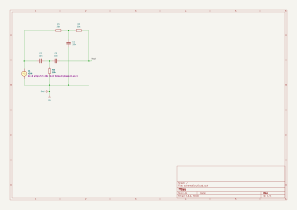
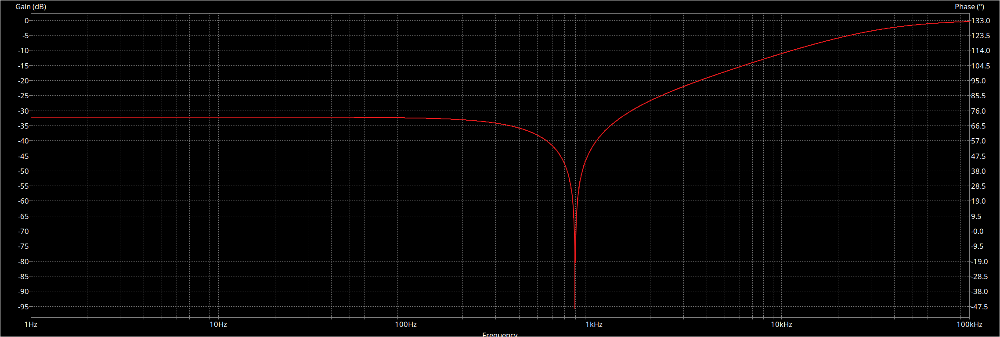
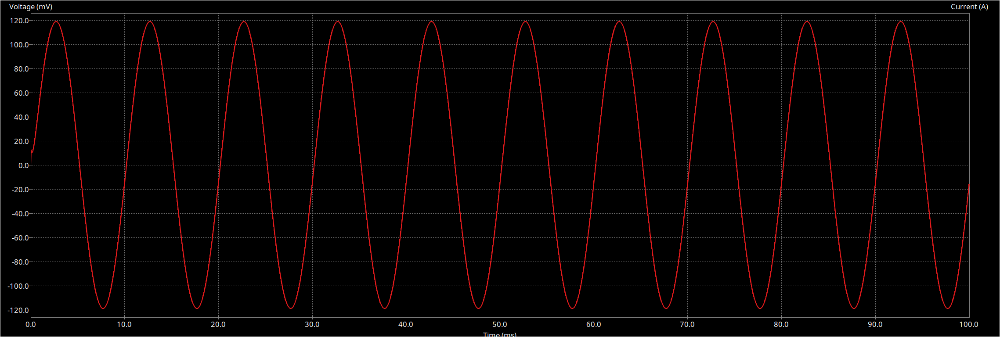
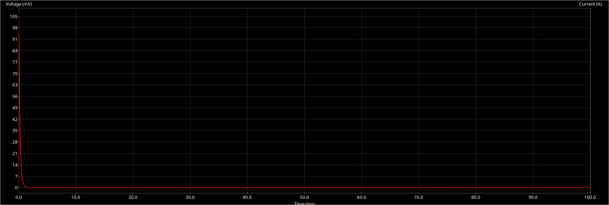
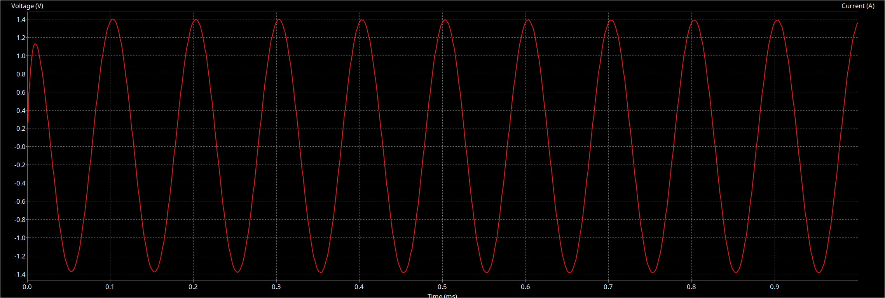

# RC passive bandstop filter
The goal is to understand a passive bandstop filter.

# Goals
- [x] Document schematic in Kicad
- [x] Do a theoretical analyis 
- [ ] Implement schematic on breadboard
- [ ] Test circuit and do measurements

# Equipment used
| Equipment | Description |
| :------------- | :------------- |
| Peaktech 4055 | AC power supply |
| RS Pro RSDS 1204X-E | Oscilloscope |

# Components
| Reference | Value | Remarks |
| :------------- | :------------- | :------------- |
| 2x capacitor | 10n | |
| 1x capacitor | 20n | |
| 2x resistor | 10k | |
| 1x resistor | 20k | |
| J1 | ~5V | |

# Formulas
Formula for stop frequency.
<math xmlns="http://www.w3.org/1998/Math/MathML" display="block">
  <mstyle displaystyle="true" scriptlevel="0">
    <mrow data-mjx-texclass="ORD">
      <mtable rowspacing=".5em" columnspacing="1em" displaystyle="true">
        <mtr>
          <mtd>
            <msub>
              <mi>F</mi>
              <mi>n</mi>
            </msub>
            <mo>=</mo>
            <mfrac>
              <mn>1</mn>
              <mrow>
                <mn>4</mn>
                <mi>&#x3C0;</mi>
                <mi>R</mi>
                <mi>C</mi>
              </mrow>
            </mfrac>
          </mtd>
        </mtr>
      </mtable>
    </mrow>
  </mstyle>
</math>

# Circuits
> 

The circuit works by having one lowpass and one highpass filter. The upper part is the lowpass filter and the lower part is the highpass filter.

# Simulation AC signal analysis
> 

The analyis is done at the circuit at frequencies from 1hz to 100khz. Thoutput at lower frequencies are lower than at higher frequencies.

# Simulation output at 100hz
> 

Simulation is done at 100hz. Vout is 120mVpp.

# Simulation output at 796hz
> 

At 796 hz the output is blocked. Vout is 0V.

# Simulation output at 10khz
> 

Simulation is done at 10khz.  Vout is 1.4Vpp.

# Calculations
Calculation for center bandstop frequency.
<math xmlns="http://www.w3.org/1998/Math/MathML" display="block">
  <mstyle displaystyle="true" scriptlevel="0" style="font-size: 0.7em">
    <mrow data-mjx-texclass="ORD">
      <mtable rowspacing=".5em" columnspacing="1em" displaystyle="true">
        <mtr>
          <mtd>
            <msub>
              <mi>F</mi>
              <mi>n</mi>
            </msub>
            <mo>=</mo>
            <mfrac>
              <mn>1</mn>
              <mrow>
                <mn>4</mn>
                <mi>&#x3C0;</mi>
                <mi>R</mi>
                <mi>C</mi>
              </mrow>
            </mfrac>
            <mo>=</mo>
            <mfrac>
              <mn>1</mn>
              <mrow>
                <mn>4</mn>
                <mi>&#x3C0;</mi>
                <mo>&#xD7;</mo>
                <mn>10</mn>
                <mi>k</mi>
                <mo>&#xD7;</mo>
                <mn>10</mn>
                <mo>&#xD7;</mo>
                <msup>
                  <mn>10</mn>
                  <mrow data-mjx-texclass="ORD">
                    <mo>&#x2212;</mo>
                    <mn>9</mn>
                  </mrow>
                </msup>
              </mrow>
            </mfrac>
            <mo>=</mo>
            <mn>796</mn>
          </mtd>
        </mtr>
      </mtable>
    </mrow>
  </mstyle>
</math>

# Practical measurements

# Changelog
| Date | Change |
| :---- | :---- |
| 2025-11-29 | Simulation added |
