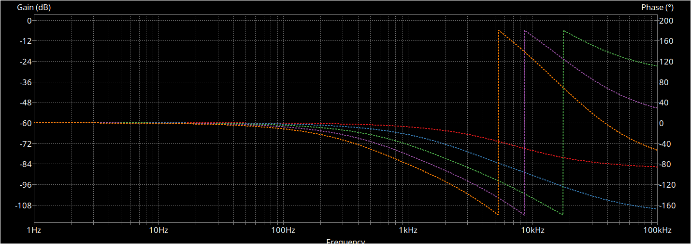

# RC passive lowpass filter
The goal is to implement, analyze and do practical measurements on a RC lowpass filter.

# Goals
- [x] Document schematic in Kicad
- [x] Do a theoretical analyis 
- [x] Calculate 1st order 
- [x] Implement schematic on breadboard
- [x] Test circuit and do measurements
- [ ] Calculate 2nd order 

# Equipment used
| Equipment | Description |
| :------------- | :------------- |
| Peaktech 4055 | AC power supply |
| RS Pro RSDS 1204X-E | Oscilloscope |

# Components
| Reference | Value | Remarks |
| :------------- | :------------- | :------------- |
| 3x capacitor | 22n | |
| 3x resistor | 1k | |
| J1 | ~5V | |

# Formulas
Reactance for the capacitor at frequency.
<math xmlns="http://www.w3.org/1998/Math/MathML" display="block">
  <mstyle displaystyle="true" scriptlevel="0">
    <mrow data-mjx-texclass="ORD">
      <mtable rowspacing=".5em" columnspacing="1em" displaystyle="true">
        <mtr>
          <mtd>
            <msub>
              <mi>X</mi>
              <mi>c</mi>
            </msub>
            <mo>=</mo>
            <mfrac>
              <mn>1</mn>
              <mrow>
                <mn>2</mn>
                <mo>&#x2217;</mo>
                <mi>&#x3C0;</mi>
                <mo>&#x2217;</mo>
                <mi>f</mi>
                <mo>&#x2217;</mo>
                <mi>c</mi>
              </mrow>
            </mfrac>
          </mtd>
        </mtr>
      </mtable>
    </mrow>
  </mstyle>
</math>

Impedance for the circuit.
<math xmlns="http://www.w3.org/1998/Math/MathML" display="block">
  <mstyle displaystyle="true" scriptlevel="0">
    <mrow data-mjx-texclass="ORD">
      <mtable rowspacing=".5em" columnspacing="1em" displaystyle="true">
        <mtr>
          <mtd>
            <mi>Z</mi>
            <mo>=</mo>
            <msqrt>
              <msubsup>
                <mi>X</mi>
                <mi>c</mi>
                <mn>2</mn>
              </msubsup>
              <mo>+</mo>
              <msup>
                <mi>R</mi>
                <mn>2</mn>
              </msup>
            </msqrt>
          </mtd>
        </mtr>
      </mtable>
    </mrow>
  </mstyle>
</math>

Output frequency can be found with this formula.
<math xmlns="http://www.w3.org/1998/Math/MathML" display="block">
  <mstyle displaystyle="true" scriptlevel="0">
    <mrow data-mjx-texclass="ORD">
      <mtable rowspacing=".5em" columnspacing="1em" displaystyle="true">
        <mtr>
          <mtd>
            <msub>
              <mi>V</mi>
              <mrow data-mjx-texclass="ORD">
                <mi>o</mi>
                <mi>u</mi>
                <mi>t</mi>
              </mrow>
            </msub>
            <mo>=</mo>
            <msub>
              <mi>V</mi>
              <mrow data-mjx-texclass="ORD">
                <mi>i</mi>
                <mi>n</mi>
              </mrow>
            </msub>
            <mo>&#x2217;</mo>
            <mfrac>
              <msub>
                <mi>X</mi>
                <mi>c</mi>
              </msub>
              <mi>Z</mi>
            </mfrac>
          </mtd>
        </mtr>
      </mtable>
    </mrow>
  </mstyle>
</math>

Gain is calculated with this formula.
<math xmlns="http://www.w3.org/1998/Math/MathML" display="block">
  <mstyle displaystyle="true" scriptlevel="0">
    <mrow data-mjx-texclass="ORD">
      <mtable rowspacing=".5em" columnspacing="1em" displaystyle="true">
        <mtr>
          <mtd>
            <msub>
              <mi>G</mi>
              <mtext>db</mtext>
            </msub>
            <mo>=</mo>
            <mn>20</mn>
            <mi>log</mi>
            <mo data-mjx-texclass="NONE">&#x2061;</mo>
            <mfrac>
              <msub>
                <mi>V</mi>
                <mtext>out</mtext>
              </msub>
              <msub>
                <mi>V</mi>
                <mtext>in</mtext>
              </msub>
            </mfrac>
          </mtd>
        </mtr>
      </mtable>
    </mrow>
  </mstyle>
</math>

Phase shift formula.
<math xmlns="http://www.w3.org/1998/Math/MathML" display="block">
  <mstyle displaystyle="true" scriptlevel="0">
    <mrow data-mjx-texclass="ORD">
      <mtable rowspacing=".5em" columnspacing="1em" displaystyle="true">
        <mtr>
          <mtd>
            <mi>&#x3D5;</mi>
            <mo>=</mo>
            <mo>&#x2212;</mo>
            <mi>a</mi>
            <mi>r</mi>
            <mi>c</mi>
            <mi>t</mi>
            <mi>a</mi>
            <mi>n</mi>
            <mo stretchy="false">(</mo>
            <mn>2</mn>
            <mi>&#x3C0;</mi>
            <mi>f</mi>
            <mi>r</mi>
            <mi>c</mi>
            <mo stretchy="false">)</mo>
          </mtd>
        </mtr>
      </mtable>
    </mrow>
  </mstyle>
</math>

# Circuits
Circuits for 1st to 5th order.
> 

Schematics generated from KIcad. The schematics can be downloaded from the repository.

<aside class="notice">
    More description will come later.
</aside>

# Simulations
> Gain for 1st to 5th order filter
> 
  
> Phase for 1st to 5th order filter
> 

Simulation values

| Order | -3db | -20db | -40db |
| :------------- | :------------- | :------------- | :------------- |
| 1 | 7.19KHz | 71.9KHz | Not measureable |
| 2 | 2.69KHz | 19.2KHz | 71.2KHz |
| 3 | 1.40KHz | 9.82KHz | 30.2KHz |
| 4 | 852Hz | 6.12KHz | 18.2KHz |
| 5 | 575Hz | 4.10KHz | 12.3KHz |

# Calculations
Assuming input voltage 5V

| Gain | Voltage |
| :------------- | :------------- |
| -3db | 3.53V |
| -10db | 1.58V |
| -20db | 0.5V |
| -40db | 0.25V |

| Frequency | Gain 1st order | Phase 1st order |
| :------------- | :------------- | :------------- |
| 100Hz | -829u | -0.79 |
| 500Hz | -0.02 | -3.95 |
| 1kHz | -0.08 | -7.87 |
| 10kHz | -4.64 | -54.1 |
| 20kHz | -9.36 | -70.1 |

# Practical measurements
> Oscilloscope 1st order 1khz 
> 
  
> Breadboard setup for 3rd order 
> 
Oscilloscope measurements

Since the resistor and capacitor are not perfect values and the oscilloscope/function generator is not calibrated values should be a bit off.

| Frequency | Gain 1st order | Gain 2nd order | Gain 3rd order |
| :------------- | :------------- | :------------- | :------------- |
| 100Hz | 0(5V) |  0(5V) | 0(5V) |
| 500Hz | 0(5V) |  0(5V) | -0.72(4.64V) |
| 1kHz | -0.13(4.96V) |  -0.57(4.72V)| -1.84(4.08V) |
| 10kHz | -4.62(2.96V) | -12.5(1.2V) | -20.24(0.49V) |
| 20kHz | -9.43(1.72V) | -20.24(0.49V) | -30.9(0.14V) |

# Changelog
| Date | Change |
| :---- | :---- |
| 2025-11-01 | Simulation and practical results added |
