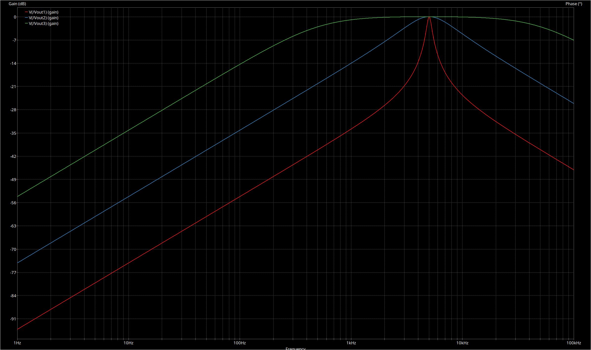
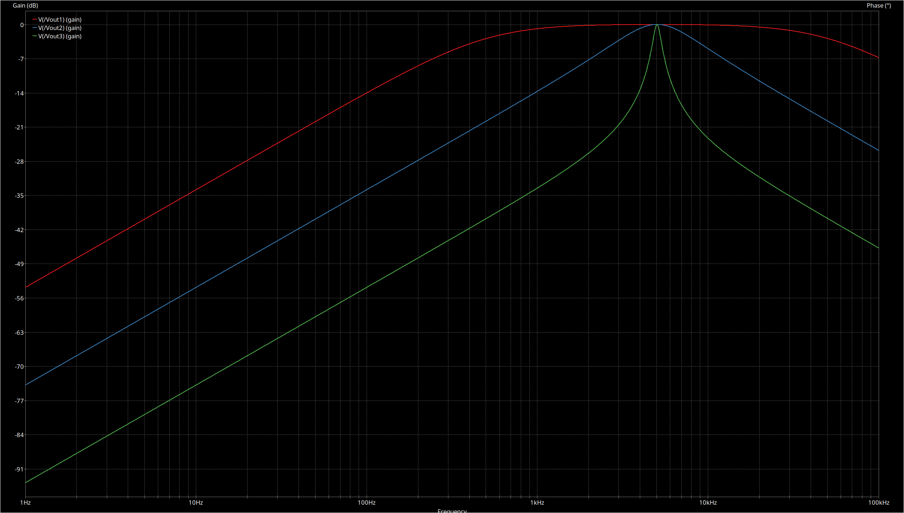

# RLC passive bandpass filter
The goal is to implement, analyze and do practical measurements on a RLC bandpass filter.
 
# Goals
- [x] Document schematic in Kicad
- [x] Do a theoretical analyis 
- [x] Calculate values for a 5kHz serial and paralell bandpass filters
- [ ] Implement schematic on breadboard
- [ ] Test circuit and do measurements

# Equipment used
| Equipment | Description |
| :------------- | :------------- |
| Peaktech 4055 | AC power supply |
| RS Pro RSDS 1204X-E | Oscilloscope |

# Components
| Reference | Value | Remarks |
| :------------- | :------------- | :------------- |
| R1 | 31 | |
| R2 | 310 | |
| R3 | 3100 | |
| Cx | 100n | |
| Lx | 10m | |

# Formulas
The resonant frequency formula is given by  
<math xmlns="http://www.w3.org/1998/Math/MathML" display="block">
  <mstyle displaystyle="true" scriptlevel="0">
    <mrow data-mjx-texclass="ORD">
      <mtable rowspacing=".5em" columnspacing="1em" displaystyle="true">
        <mtr>
          <mtd>
            <msub>
              <mi>f</mi>
              <mi>o</mi>
            </msub>
            <mo>=</mo>
            <mfrac>
              <mn>1</mn>
              <mrow>
                <mn>2</mn>
                <mi>&#x3C0;</mi>
                <msqrt>
                  <mi>L</mi>
                  <mi>C</mi>
                </msqrt>
              </mrow>
            </mfrac>
          </mtd>
        </mtr>
      </mtable>
    </mrow>
  </mstyle>
</math>

Calculate the Q value
<math xmlns="http://www.w3.org/1998/Math/MathML" display="block">
  <mstyle displaystyle="true" scriptlevel="0">
    <mrow data-mjx-texclass="ORD">
      <mtable rowspacing=".5em" columnspacing="1em" displaystyle="true">
        <mtr>
          <mtd>
            <mi>Q</mi>
            <mo>=</mo>
            <mfrac>
              <msub>
                <mi>X</mi>
                <mrow data-mjx-texclass="ORD">
                  <mi>l</mi>
                  <mi>o</mi>
                </mrow>
              </msub>
              <msub>
                <mi>R</mi>
                <mi>t</mi>
              </msub>
            </mfrac>
            <mo>=</mo>
            <mfrac>
              <mrow>
                <mn>2</mn>
                <mi>&#x3C0;</mi>
                <msub>
                  <mi>f</mi>
                  <mi>o</mi>
                </msub>
                <mi>L</mi>
              </mrow>
              <msub>
                <mi>R</mi>
                <mi>t</mi>
              </msub>
            </mfrac>
          </mtd>
        </mtr>
      </mtable>
    </mrow>
  </mstyle>
</math>

Calculate the Q value from required bandwidth
<math xmlns="http://www.w3.org/1998/Math/MathML" display="block">
  <mstyle displaystyle="true" scriptlevel="0">
    <mrow data-mjx-texclass="ORD">
      <mtable rowspacing=".5em" columnspacing="1em" displaystyle="true">
        <mtr>
          <mtd>
            <mi>Q</mi>
            <mo>=</mo>
            <mfrac>
              <msub>
                <mi>f</mi>
                <mi>o</mi>
              </msub>
              <mrow>
                <mi>B</mi>
                <mi>a</mi>
                <mi>n</mi>
                <mi>d</mi>
                <mi>w</mi>
                <mi>i</mi>
                <mi>d</mi>
                <mi>t</mi>
                <mi>h</mi>
              </mrow>
            </mfrac>
          </mtd>
        </mtr>
      </mtable>
    </mrow>
  </mstyle>
</math>

Calculate capacitor value based on frequency and inductor
<math xmlns="http://www.w3.org/1998/Math/MathML" display="block">
  <mstyle displaystyle="true" scriptlevel="0">
    <mrow data-mjx-texclass="ORD">
      <mtable rowspacing=".5em" columnspacing="1em" displaystyle="true">
        <mtr>
          <mtd>
            <mi>C</mi>
            <mo>=</mo>
            <mfrac>
              <mn>1</mn>
              <mrow>
                <msubsup>
                  <mi>f</mi>
                  <mi>o</mi>
                  <mn>2</mn>
                </msubsup>
                <mo>&#xD7;</mo>
                <mn>4</mn>
                <mo>&#xD7;</mo>
                <msup>
                  <mi>&#x3C0;</mi>
                  <mn>2</mn>
                </msup>
                <mo>&#xD7;</mo>
                <mi>L</mi>
              </mrow>
            </mfrac>
          </mtd>
        </mtr>
      </mtable>
    </mrow>
  </mstyle>
</math>

Calculate resistor value for a specific bandwidth.
<math xmlns="http://www.w3.org/1998/Math/MathML" display="block">
  <mstyle displaystyle="true" scriptlevel="0">
    <mrow data-mjx-texclass="ORD">
      <mtable rowspacing=".5em" columnspacing="1em" displaystyle="true">
        <mtr>
          <mtd>
            <mi>R</mi>
            <mo>=</mo>
            <mfrac>
              <msub>
                <mi>f</mi>
                <mi>o</mi>
              </msub>
              <mi>Q</mi>
            </mfrac>
          </mtd>
        </mtr>
      </mtable>
    </mrow>
  </mstyle>
</math>

# Serial circuit
## Schematics
> Circuit for a 1Khz bandpass filter. 
> 

Schematics generated from KIcad. The schematics can be downloaded from the repository.

<aside class="notice">
    More description will come later.
</aside>

## Simulation
> Simulation AC signal analysis with the values in the component list. 
> 
  
> Simulation transient analysis at 1kHz.
> 

<aside class="notice">
    More description will come later.
</aside>

## Practical measurements
| Frequency | Vpp | Oscilloscope image|
| :------------- | :------------- | :------------- | 
| 1Hz | 32mV | |
| 100Hz | 136mV | [here](images/ocilloscope_serial_100hz.png)  |
| 1kHz | 1.10V | [here](images/ocilloscope_serial_1khz.png) |
| 3kHz | 3.28V | |
| 4kHz | 4.00V | |
| 5kHz | 4.24V | [here](images/ocilloscope_serial_5khz.png) |
| 6kHz | 4.10V | |
| 7kHz | 3.76V | |
| 10kHz | 2.84V | [here](images/ocilloscope_serial_10khz.png) |
| 100kHz | 320mV | [here](images/ocilloscope_serial_100khz.png) |

At 1kHz the simulation showed 1.04V and on oscilloscope 1.2V. This cause for the difference can be inaccurate values on the components and uncalibrated oscilloscope. 

# Parallell circuit
## Schematics
> Circuit for a 5Khz bandpass filter. 
> 

<aside class="notice">
    More description will come later.
</aside>

## Simulation
> Simulation AC signal analysis with the values in the component list.
> 
  
> Simulation transient analysis at 1kHz.
> 

<aside class="notice">
    More description will come later.
</aside>

## Practical measurements
| Frequency | Vpp | Oscilloscope image|
| :------------- | :------------- | :------------- | 
| 1Hz | 24mV | |
| 100Hz | 320mV | [here](images/ocilloscope_paralell_100hz.png)  |
| 1kHz | 960mV | [here](images/ocilloscope_paralell_1khz.png) |
| 3kHz | 3.04V | |
| 4kHz | 4.24V | |
| 5kHz | 4.96V | [here](images/ocilloscope_paralell_5khz.png) |
| 6kHz | 4.64V | |
| 7kHz | 4.08V | |
| 10kHz | 2.64V | [here](images/ocilloscope_paralell_10khz.png) |
| 100kHz | 320mV | [here](images/ocilloscope_paralell_100khz.png) |

At 1kHz the simulation showed 1.05V and on oscilloscope 0.96V. This cause for the difference can be inaccurate values of the components and uncalibrated oscilloscope.

# Analysis
With Q value of 1 the theoretical gain is the same for both the serial and paralell circuits.

Using the AC signal analyis to look at the gain.
For the serial circuit the bandwidth increases with higher resistor values.
For the paralell circuit the bandwidth decreases with higher resistor values.

# Changelog
| Date | Change |
| :---- | :---- |
| 2025-11-01 | Simulation and practical results added |

