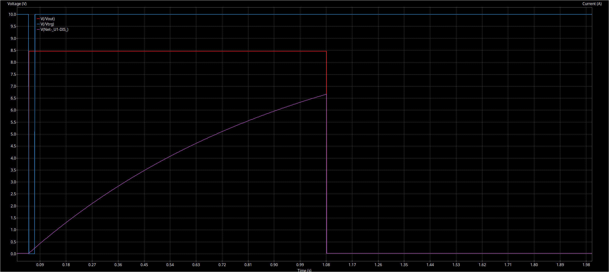

# 555 (And 7555)
The goal is to understand and how to use the SE/NE555 and 7555. 

# Pins
| Pin | Name | Description |
| :--- | :--- | :--- |
| 1 | Ground | Ground | 
| 2 | Trigger  | When this pin goes to one third of Vcc, the output goes high. |
| 3 | Output | Output high is lower than Vcc, and low is around 0V. | 
| 4 | Reset | The is an inverted input. When it goes low everything resets. In normal  mode this is high. |
| 5 | Control voltage | This pin determines the threshold voltage of the threshold pin. | 
| 6 | Threshold | This pin will trigger high out if pin 2 is high and voltage is 2/3 of Vcc. |
| 7 | Discharge | When output is low the discharge is connected to 0V.  |
| 8 | Vcc | Positive power supply |

# Monostable mode
## Description
This circuit makes a single pulse when triggered. This causes the output to held high for the pulse duration formula then return low.

## Componenets
| Reference | Value | Remarks |
| :------------- | :------------- | :------------- |
| C1 | 2u | Electrolytic capacitor |
| C2 | 10n | |
| R1 | 470k | |
| R2 | 4.7k | Replace this with a smaller resistor and led | 
| U1 | 7555 https://www.alldatasheet.com/datasheet-pdf/pdf/17796/PHILIPS/ICM7555.html | 555 should also work fine |

## Formulas
Pulse duration can be calculated with the formula.
<math xmlns="http://www.w3.org/1998/Math/MathML" display="block">
 <mstyle displaystyle="true" scriptlevel="0" >
   <mrow data-mjx-texclass="ORD">
     <mtable rowspacing=".5em" columnspacing="1em" displaystyle="true">
       <mtr>
         <mtd>
           <mi>T</mi>
           <mo>=</mo>
           <mn>1.1</mn>
           <mo>&#xD7;</mo>
           <mi>R</mi>
           <mn>1</mn>
           <mo>&#xD7;</mo>
           <mi>C</mi>
           <mn>1</mn>
         </mtd>
       </mtr>
     </mtable>
   </mrow>
 </mstyle>
</math>

## Circuit
> 

Schematics generated from KIcad. The schematics can be downloaded from the repository.

<aside class="notice">
    More description will come later.
</aside>

## Simulation
> 

When the trigger goes low, the output goes high and the capacitor C1 starts to charge. When the purple line goes to 2/3 of Vcc the output goes low.

## Practical measurements
> 

Cyan is the trigger input, purple is the charge on capacitor C1 and yellow is the output voltage. The values are a little of due to components not being exact. 

# Astable mode
## Description
When in astable mode the circuit will self trigger and cause continous pulses out.

## Componenets
| Reference | Value | Remarks |
| :------------- | :------------- | :------------- |
| C1 | 2u | Electrolytic capacitor |
| C2 | 10n | |
| R1, R2 | 470k | |
| R3 | 4.7k | Replace this with a smaller resistor and led | 
| U1 | 7555 https://www.alldatasheet.com/datasheet-pdf/pdf/17796/PHILIPS/ICM7555.html | 555 should also work fine |

## Formulas
The frequency of the output oscillation is given by the formula.
<math xmlns="http://www.w3.org/1998/Math/MathML" display="block">
  <mstyle displaystyle="true" scriptlevel="0">
    <mrow data-mjx-texclass="ORD">
      <mtable rowspacing=".5em" columnspacing="1em" displaystyle="true">
        <mtr>
          <mtd>
            <mi>F</mi>
            <mo>=</mo>
            <mfrac>
              <mn>1</mn>
              <mrow>
                <mn>0.693</mn>
                <mo>&#xD7;</mo>
                <mo stretchy="false">(</mo>
                <msub>
                  <mi>R</mi>
                  <mn>1</mn>
                </msub>
                <mo>+</mo>
                <mn>2</mn>
                <mo>&#xD7;</mo>
                <mi>R</mi>
                <mn>2</mn>
                <mo stretchy="false">)</mo>
                <mo>&#xD7;</mo>
                <msub>
                  <mi>C</mi>
                  <mn>1</mn>
                </msub>
              </mrow>
            </mfrac>
          </mtd>
        </mtr>
      </mtable>
    </mrow>
  </mstyle>
</math>

The duty cycle is given by the formula.
<math xmlns="http://www.w3.org/1998/Math/MathML" display="block">
  <mstyle displaystyle="true" scriptlevel="0">
    <mrow data-mjx-texclass="ORD">
      <mtable rowspacing=".5em" columnspacing="1em" displaystyle="true">
        <mtr>
          <mtd>
            <mi>D</mi>
            <mi>u</mi>
            <mi>t</mi>
            <mi>y</mi>
            <mtext>&#xA0;</mtext>
            <mi>c</mi>
            <mi>y</mi>
            <mi>c</mi>
            <mi>l</mi>
            <mi>e</mi>
            <mo>=</mo>
            <mfrac>
              <mrow>
                <msub>
                  <mi>R</mi>
                  <mn>1</mn>
                </msub>
                <mo>+</mo>
                <msub>
                  <mi>R</mi>
                  <mn>2</mn>
                </msub>
              </mrow>
              <mrow>
                <msub>
                  <mi>R</mi>
                  <mn>1</mn>
                </msub>
                <mo>+</mo>
                <mn>2</mn>
                <mo>&#xD7;</mo>
                <msub>
                  <mi>R</mi>
                  <mn>2</mn>
                </msub>
              </mrow>
            </mfrac>
          </mtd>
        </mtr>
      </mtable>
    </mrow>
  </mstyle>
</math>

## Circuit
> 

Schematics generated from KIcad. The schematics can be downloaded from the repository.

<aside class="notice">
    More description will come later.
</aside>

## Simulation
> 

## Practical measurements
> 

Measured values are

| Data | Value |
| ------- | ------- |
| Frequency | 0.466Hz |
| Duty cycle | 0.64 |

Calculated duty cycle is 
<math xmlns="http://www.w3.org/1998/Math/MathML" display="block">
  <mstyle displaystyle="true" scriptlevel="0">
    <mrow data-mjx-texclass="ORD">
      <mtable rowspacing=".5em" columnspacing="1em" displaystyle="true">
        <mtr>
          <mtd>
            <mi>D</mi>
            <mi>u</mi>
            <mi>t</mi>
            <mi>y</mi>
            <mtext>&#xA0;</mtext>
            <mi>c</mi>
            <mi>y</mi>
            <mi>c</mi>
            <mi>l</mi>
            <mi>e</mi>
            <mo>=</mo>
            <mfrac>
              <mrow>
                <msub>
                  <mi>R</mi>
                  <mn>1</mn>
                </msub>
                <mo>+</mo>
                <msub>
                  <mi>R</mi>
                  <mn>2</mn>
                </msub>
              </mrow>
              <mrow>
                <msub>
                  <mi>R</mi>
                  <mn>1</mn>
                </msub>
                <mo>+</mo>
                <mn>2</mn>
                <mo>&#xD7;</mo>
                <msub>
                  <mi>R</mi>
                  <mn>2</mn>
                </msub>
              </mrow>
            </mfrac>
            <mo>=</mo>
            <mfrac>
              <mrow>
                <mn>470</mn>
                <mi>k</mi>
                <mo>+</mo>
                <mn>470</mn>
                <mi>k</mi>
              </mrow>
              <mrow>
                <mn>470</mn>
                <mi>k</mi>
                <mo>+</mo>
                <mn>2</mn>
                <mo>&#xD7;</mo>
                <mn>470</mn>
                <mi>k</mi>
              </mrow>
            </mfrac>
            <mo>=</mo>
            <mn>0.66</mn>
          </mtd>
        </mtr>
      </mtable>
    </mrow>
  </mstyle>
</math>

The value is as close as expected.

The calculated frequency is
<math xmlns="http://www.w3.org/1998/Math/MathML" display="block">
  <mstyle displaystyle="true" scriptlevel="0">
    <mrow data-mjx-texclass="ORD">
      <mtable rowspacing=".5em" columnspacing="1em" displaystyle="true">
        <mtr>
          <mtd>
            <mi>F</mi>
            <mo>=</mo>
            <mfrac>
              <mn>1</mn>
              <mrow>
                <mn>0.693</mn>
                <mo>&#xD7;</mo>
                <mo stretchy="false">(</mo>
                <msub>
                  <mi>R</mi>
                  <mn>1</mn>
                </msub>
                <mo>+</mo>
                <mn>2</mn>
                <mo>&#xD7;</mo>
                <mi>R</mi>
                <mn>2</mn>
                <mo stretchy="false">)</mo>
                <mo>&#xD7;</mo>
                <msub>
                  <mi>C</mi>
                  <mn>1</mn>
                </msub>
              </mrow>
            </mfrac>
            <mo>=</mo>
            <mfrac>
              <mn>1</mn>
              <mrow>
                <mn>0.693</mn>
                <mo>&#xD7;</mo>
                <mo stretchy="false">(</mo>
                <mn>470</mn>
                <mo>&#xD7;</mo>
                <msup>
                  <mn>10</mn>
                  <mn>3</mn>
                </msup>
                <mo>+</mo>
                <mn>2</mn>
                <mo>&#xD7;</mo>
                <mn>470</mn>
                <mo>&#xD7;</mo>
                <msup>
                  <mn>10</mn>
                  <mn>3</mn>
                </msup>
                <mo stretchy="false">)</mo>
                <mo>&#xD7;</mo>
                <mn>2</mn>
                <mo>&#xD7;</mo>
                <msup>
                  <mn>10</mn>
                  <mrow data-mjx-texclass="ORD">
                    <mo>&#x2212;</mo>
                    <mn>6</mn>
                  </mrow>
                </msup>
              </mrow>
            </mfrac>
            <mo>=</mo>
            <mn>0.511</mn>
            <mi>H</mi>
            <mi>z</mi>
          </mtd>
        </mtr>
      </mtable>
    </mrow>
  </mstyle>
</math>

Again the value calculated is as close to the measured value as expected.

# Improved astable mode
## Description
This is an updated version of the astable mode. 

## Componenets
Same components as astable mode, but with the following added components.

| Reference | Value | Remarks |
| :------------- | :------------- | :------------- |
| D1,D2 | 1N4001 | Diodes |

## Formulas
Duty cycle formula.
<math xmlns="http://www.w3.org/1998/Math/MathML" display="block">
 <mstyle displaystyle="true" scriptlevel="0">
   <mrow data-mjx-texclass="ORD">
     <mtable rowspacing=".5em" columnspacing="1em" displaystyle="true">
       <mtr>
         <mtd>
           <mi>D</mi>
           <mi>u</mi>
           <mi>t</mi>
           <mi>y</mi>
           <mtext>&#xA0;</mtext>
           <mi>c</mi>
           <mi>y</mi>
           <mi>c</mi>
           <mi>l</mi>
           <mi>e</mi>
           <mo>=</mo>
           <mfrac>
             <msub>
               <mi>R</mi>
               <mn>1</mn>
             </msub>
             <mrow>
               <msub>
                 <mi>R</mi>
                 <mn>1</mn>
               </msub>
               <mo>+</mo>
               <msub>
                 <mi>R</mi>
                 <mn>2</mn>
               </msub>
             </mrow>
           </mfrac>
         </mtd>
       </mtr>
     </mtable>
   </mrow>
 </mstyle>
</math>

## Circuit
The following change is needed.

> 

Schematics generated from KIcad. The schematics can be downloaded from the repository.

<aside class="notice">
    More description will come later.
</aside>

## Simulation
> 

## Practical measurements
> 
> 

Had to use 1N4148 diode instead of 1N4001.

Measured value for duty cycle is

| Data | Value |
| ------- | ------- |
| Duty cycle | 0.47 |

Calculated duty cycle is
<math xmlns="http://www.w3.org/1998/Math/MathML" display="block">
  <mstyle displaystyle="true" scriptlevel="0">
    <mrow data-mjx-texclass="ORD">
      <mtable rowspacing=".5em" columnspacing="1em" displaystyle="true">
        <mtr>
          <mtd>
            <mi>D</mi>
            <mi>u</mi>
            <mi>t</mi>
            <mi>y</mi>
            <mtext>&#xA0;</mtext>
            <mi>c</mi>
            <mi>y</mi>
            <mi>c</mi>
            <mi>l</mi>
            <mi>e</mi>
            <mo>=</mo>
            <mfrac>
              <msub>
                <mi>R</mi>
                <mn>1</mn>
              </msub>
              <mrow>
                <msub>
                  <mi>R</mi>
                  <mn>1</mn>
                </msub>
                <mo>+</mo>
                <msub>
                  <mi>R</mi>
                  <mn>2</mn>
                </msub>
              </mrow>
            </mfrac>
            <mo>=</mo>
            <mfrac>
              <mrow>
                <mn>470</mn>
                <mo>&#x2217;</mo>
                <msup>
                  <mn>10</mn>
                  <mn>3</mn>
                </msup>
              </mrow>
              <mrow>
                <mn>470</mn>
                <mo>&#x2217;</mo>
                <msup>
                  <mn>10</mn>
                  <mn>3</mn>
                </msup>
                <mo>+</mo>
                <mn>470</mn>
                <mo>&#x2217;</mo>
                <msup>
                  <mn>10</mn>
                  <mn>3</mn>
                </msup>
              </mrow>
            </mfrac>
            <mo>=</mo>
            <mn>0.5</mn>
          </mtd>
        </mtr>
      </mtable>
    </mrow>
  </mstyle>
</math>

# Changelog
| Date | Change |
| :---- | :---- |
| 2025-11-01 | Simulation and practical results added |
