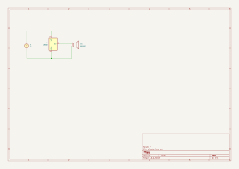

# UM66T
Documentation for the UM66T ic.

# Pins
| Pin | Name | Description |
| :--- | :--- | :--- |
| 1 | Ground |  | 
| 2 | Vcc | Preferably between 1.5V-4V |
| 3 | Out | The output | 

# Types
There are multiple types each playing a song. Some repeat and some don't then Vcc is supplied.

# Circuit
> 

# Sound playing
[Fur Elise](./sounds/fur_elise.m4a)

# Changelog
| Date | Change |
| :---- | :---- |
| 2025-12-13 | Description added |
