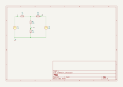

# Network analysis

# Goal
This calculates the current for a star system with two input power supplies and one output. This is a calculation for two unknowns.

# Schematics
> 

The schematics have four resistors although resistors R2 and R3 can be considered as one. Resistor R1 and R4 are connected to 
the power supplies each having voltages of 7V and 9V.

# Calculation 1
Using the following formulas for a two branch solution.
<math xmlns="http://www.w3.org/1998/Math/MathML" display="block">
  <mstyle displaystyle="true" scriptlevel="0" style="font-size: 0.7em">
    <mrow data-mjx-texclass="ORD">
      <mtable rowspacing=".5em" columnspacing="1em" displaystyle="true">
        <mtr>
          <mtd>
            <msub>
              <mi>a</mi>
              <mn>1</mn>
            </msub>
            <mi>x</mi>
            <mo>+</mo>
            <msub>
              <mi>b</mi>
              <mn>1</mn>
            </msub>
            <mi>y</mi>
            <mo>+</mo>
            <msub>
              <mi>c</mi>
              <mn>1</mn>
            </msub>
            <mo>=</mo>
            <mn>0</mn>
          </mtd>
        </mtr>
        <mtr>
          <mtd>
            <msub>
              <mi>a</mi>
              <mn>2</mn>
            </msub>
            <mi>x</mi>
            <mo>+</mo>
            <msub>
              <mi>b</mi>
              <mn>2</mn>
            </msub>
            <mi>y</mi>
            <mo>+</mo>
            <msub>
              <mi>c</mi>
              <mn>2</mn>
            </msub>
            <mo>=</mo>
            <mn>0</mn>
          </mtd>
        </mtr>
      </mtable>
    </mrow>
  </mstyle>
</math>
<br>
Where 
<math xmlns="http://www.w3.org/1998/Math/MathML" display="block">
  <mstyle displaystyle="true" scriptlevel="0" style="font-size: 0.7em">
    <mrow data-mjx-texclass="ORD">
      <mtable rowspacing=".5em" columnspacing="1em" displaystyle="true">
        <mtr>
          <mtd>
            <mfrac>
              <mi>x</mi>
              <msub>
                <mi>D</mi>
                <mi>x</mi>
              </msub>
            </mfrac>
            <mo>=</mo>
            <mfrac>
              <mrow>
                <mo>&#x2212;</mo>
                <mi>y</mi>
              </mrow>
              <mrow>
                <mi>D</mi>
                <mi>y</mi>
              </mrow>
            </mfrac>
            <mo>=</mo>
            <mfrac>
              <mn>1</mn>
              <mi>D</mi>
            </mfrac>
          </mtd>
        </mtr>
        <mtr>
          <mtd>
            <msub>
              <mi>D</mi>
              <mi>x</mi>
            </msub>
            <mo>=</mo>
            <mrow data-mjx-texclass="INNER">
              <mo data-mjx-texclass="OPEN">[</mo>
              <mtable columnspacing="1em" rowspacing="4pt">
                <mtr>
                  <mtd>
                    <msub>
                      <mi>b</mi>
                      <mn>1</mn>
                    </msub>
                  </mtd>
                  <mtd>
                    <msub>
                      <mi>c</mi>
                      <mn>1</mn>
                    </msub>
                  </mtd>
                </mtr>
                <mtr>
                  <mtd>
                    <msub>
                      <mi>b</mi>
                      <mn>2</mn>
                    </msub>
                  </mtd>
                  <mtd>
                    <msub>
                      <mi>c</mi>
                      <mn>2</mn>
                    </msub>
                  </mtd>
                </mtr>
              </mtable>
              <mo data-mjx-texclass="CLOSE">]</mo>
            </mrow>
          </mtd>
        </mtr>
        <mtr>
          <mtd>
            <msub>
              <mi>D</mi>
              <mi>y</mi>
            </msub>
            <mo>=</mo>
            <mrow data-mjx-texclass="INNER">
              <mo data-mjx-texclass="OPEN">[</mo>
              <mtable columnspacing="1em" rowspacing="4pt">
                <mtr>
                  <mtd>
                    <msub>
                      <mi>a</mi>
                      <mn>1</mn>
                    </msub>
                  </mtd>
                  <mtd>
                    <msub>
                      <mi>c</mi>
                      <mn>1</mn>
                    </msub>
                  </mtd>
                </mtr>
                <mtr>
                  <mtd>
                    <msub>
                      <mi>a</mi>
                      <mn>2</mn>
                    </msub>
                  </mtd>
                  <mtd>
                    <msub>
                      <mi>c</mi>
                      <mn>2</mn>
                    </msub>
                  </mtd>
                </mtr>
              </mtable>
              <mo data-mjx-texclass="CLOSE">]</mo>
            </mrow>
          </mtd>
        </mtr>
        <mtr>
          <mtd>
            <mi>D</mi>
            <mo>=</mo>
            <mrow data-mjx-texclass="INNER">
              <mo data-mjx-texclass="OPEN">[</mo>
              <mtable columnspacing="1em" rowspacing="4pt">
                <mtr>
                  <mtd>
                    <msub>
                      <mi>a</mi>
                      <mn>1</mn>
                    </msub>
                  </mtd>
                  <mtd>
                    <msub>
                      <mi>b</mi>
                      <mn>1</mn>
                    </msub>
                  </mtd>
                </mtr>
                <mtr>
                  <mtd>
                    <msub>
                      <mi>a</mi>
                      <mn>2</mn>
                    </msub>
                  </mtd>
                  <mtd>
                    <msub>
                      <mi>b</mi>
                      <mn>2</mn>
                    </msub>
                  </mtd>
                </mtr>
              </mtable>
              <mo data-mjx-texclass="CLOSE">]</mo>
            </mrow>
          </mtd>
        </mtr>
      </mtable>
    </mrow>
  </mstyle>
</math>
<br>
Setting up the formulas for each branch.<br>
Formula for branch 1
<math xmlns="http://www.w3.org/1998/Math/MathML" display="block">
  <mstyle displaystyle="true" scriptlevel="0" style="font-size: 0.7em">
    <mrow data-mjx-texclass="ORD">
      <mtable rowspacing=".5em" columnspacing="1em" displaystyle="true">
        <mtr>
          <mtd>
            <msub>
              <mi>a</mi>
              <mn>1</mn>
            </msub>
            <mi>x</mi>
            <mo>+</mo>
            <msub>
              <mi>b</mi>
              <mn>1</mn>
            </msub>
            <mi>y</mi>
            <mo>+</mo>
            <mi>c</mi>
            <mn>1</mn>
            <mo>=</mo>
            <mn>0</mn>
          </mtd>
        </mtr>
        <mtr>
          <mtd>
            <mn>327</mn>
            <msub>
              <mi>I</mi>
              <mn>1</mn>
            </msub>
            <mo>+</mo>
            <mn>280</mn>
            <msub>
              <mi>I</mi>
              <mn>2</mn>
            </msub>
            <mo>&#x2212;</mo>
            <mn>7</mn>
            <mo>=</mo>
            <mn>0</mn>
          </mtd>
        </mtr>
      </mtable>
    </mrow>
  </mstyle>
</math>
Formula for branch 2
<math xmlns="http://www.w3.org/1998/Math/MathML" display="block">
  <mstyle displaystyle="true" scriptlevel="0" style="font-size: 0.7em">
    <mrow data-mjx-texclass="ORD">
      <mtable rowspacing=".5em" columnspacing="1em" displaystyle="true">
        <mtr>
          <mtd>
            <msub>
              <mi>a</mi>
              <mn>2</mn>
            </msub>
            <mi>x</mi>
            <mo>+</mo>
            <msub>
              <mi>b</mi>
              <mn>2</mn>
            </msub>
            <mi>y</mi>
            <mo>+</mo>
            <mi>c</mi>
            <mn>2</mn>
            <mo>=</mo>
            <mn>0</mn>
          </mtd>
        </mtr>
        <mtr>
          <mtd>
            <mn>280</mn>
            <msub>
              <mi>I</mi>
              <mn>1</mn>
            </msub>
            <mo>+</mo>
            <mn>380</mn>
            <msub>
              <mi>I</mi>
              <mn>2</mn>
            </msub>
            <mo>&#x2212;</mo>
            <mn>9</mn>
            <mo>=</mo>
            <mn>0</mn>
          </mtd>
        </mtr>
      </mtable>
    </mrow>
  </mstyle>
</math>
Solving determinants.
<math xmlns="http://www.w3.org/1998/Math/MathML" display="block">
  <mstyle displaystyle="true" scriptlevel="0" style="font-size: 0.7em">
    <mrow data-mjx-texclass="ORD">
      <mtable rowspacing=".5em" columnspacing="1em" displaystyle="true">
        <mtr>
          <mtd>
            <mi>d</mi>
            <mi>e</mi>
            <mi>t</mi>
            <mtext>&#xA0;</mtext>
            <msub>
              <mi>D</mi>
              <mi>x</mi>
            </msub>
            <mo>=</mo>
            <mrow data-mjx-texclass="INNER">
              <mo data-mjx-texclass="OPEN">[</mo>
              <mtable columnspacing="1em" rowspacing="4pt">
                <mtr>
                  <mtd>
                    <msub>
                      <mi>b</mi>
                      <mn>1</mn>
                    </msub>
                  </mtd>
                  <mtd>
                    <msub>
                      <mi>c</mi>
                      <mn>1</mn>
                    </msub>
                  </mtd>
                </mtr>
                <mtr>
                  <mtd>
                    <msub>
                      <mi>b</mi>
                      <mn>2</mn>
                    </msub>
                  </mtd>
                  <mtd>
                    <msub>
                      <mi>c</mi>
                      <mn>2</mn>
                    </msub>
                  </mtd>
                </mtr>
              </mtable>
              <mo data-mjx-texclass="CLOSE">]</mo>
            </mrow>
            <mo>=</mo>
            <mrow data-mjx-texclass="INNER">
              <mo data-mjx-texclass="OPEN">[</mo>
              <mtable columnspacing="1em" rowspacing="4pt">
                <mtr>
                  <mtd>
                    <mn>280</mn>
                  </mtd>
                  <mtd>
                    <mo>&#x2212;</mo>
                    <mn>7</mn>
                  </mtd>
                </mtr>
                <mtr>
                  <mtd>
                    <mn>380</mn>
                  </mtd>
                  <mtd>
                    <mo>&#x2212;</mo>
                    <mn>9</mn>
                  </mtd>
                </mtr>
              </mtable>
              <mo data-mjx-texclass="CLOSE">]</mo>
            </mrow>
            <mo>=</mo>
            <mn>140</mn>
          </mtd>
        </mtr>
        <mtr>
          <mtd>
            <mi>d</mi>
            <mi>e</mi>
            <mi>t</mi>
            <mtext>&#xA0;</mtext>
            <msub>
              <mi>D</mi>
              <mi>y</mi>
            </msub>
            <mo>=</mo>
            <mrow data-mjx-texclass="INNER">
              <mo data-mjx-texclass="OPEN">[</mo>
              <mtable columnspacing="1em" rowspacing="4pt">
                <mtr>
                  <mtd>
                    <msub>
                      <mi>a</mi>
                      <mn>1</mn>
                    </msub>
                  </mtd>
                  <mtd>
                    <msub>
                      <mi>c</mi>
                      <mn>1</mn>
                    </msub>
                  </mtd>
                </mtr>
                <mtr>
                  <mtd>
                    <msub>
                      <mi>a</mi>
                      <mn>2</mn>
                    </msub>
                  </mtd>
                  <mtd>
                    <msub>
                      <mi>c</mi>
                      <mn>2</mn>
                    </msub>
                  </mtd>
                </mtr>
              </mtable>
              <mo data-mjx-texclass="CLOSE">]</mo>
            </mrow>
            <mo>=</mo>
            <mrow data-mjx-texclass="INNER">
              <mo data-mjx-texclass="OPEN">[</mo>
              <mtable columnspacing="1em" rowspacing="4pt">
                <mtr>
                  <mtd>
                    <mn>327</mn>
                  </mtd>
                  <mtd>
                    <mo>&#x2212;</mo>
                    <mn>7</mn>
                  </mtd>
                </mtr>
                <mtr>
                  <mtd>
                    <mn>280</mn>
                  </mtd>
                  <mtd>
                    <mo>&#x2212;</mo>
                    <mn>9</mn>
                  </mtd>
                </mtr>
              </mtable>
              <mo data-mjx-texclass="CLOSE">]</mo>
            </mrow>
            <mo>=</mo>
            <mn>-983</mn>
          </mtd>
        </mtr>
        <mtr>
          <mtd>
            <mi>d</mi>
            <mi>e</mi>
            <mi>t</mi>
            <mtext>&#xA0;</mtext>
            <mi>D</mi>
            <mo>=</mo>
            <mrow data-mjx-texclass="INNER">
              <mo data-mjx-texclass="OPEN">[</mo>
              <mtable columnspacing="1em" rowspacing="4pt">
                <mtr>
                  <mtd>
                    <msub>
                      <mi>a</mi>
                      <mn>1</mn>
                    </msub>
                  </mtd>
                  <mtd>
                    <msub>
                      <mi>b</mi>
                      <mn>1</mn>
                    </msub>
                  </mtd>
                </mtr>
                <mtr>
                  <mtd>
                    <msub>
                      <mi>a</mi>
                      <mn>2</mn>
                    </msub>
                  </mtd>
                  <mtd>
                    <msub>
                      <mi>b</mi>
                      <mn>2</mn>
                    </msub>
                  </mtd>
                </mtr>
              </mtable>
              <mo data-mjx-texclass="CLOSE">]</mo>
            </mrow>
            <mo>=</mo>
            <mrow data-mjx-texclass="INNER">
              <mo data-mjx-texclass="OPEN">[</mo>
              <mtable columnspacing="1em" rowspacing="4pt">
                <mtr>
                  <mtd>
                    <mn>327</mn>
                  </mtd>
                  <mtd>
                    <mn>280</mn>
                  </mtd>
                </mtr>
                <mtr>
                  <mtd>
                    <mn>280</mn>
                  </mtd>
                  <mtd>
                    <mn>380</mn>
                  </mtd>
                </mtr>
              </mtable>
              <mo data-mjx-texclass="CLOSE">]</mo>
            </mrow>
            <mo>=</mo>
            <mn>45860</mn>
          </mtd>
        </mtr>
      </mtable>
    </mrow>
  </mstyle>
</math>
Calculating the values for I1 and I2.
<math xmlns="http://www.w3.org/1998/Math/MathML" display="block">
  <mstyle displaystyle="true" scriptlevel="0" style="font-size: 0.7em">
    <mrow data-mjx-texclass="ORD">
      <mtable rowspacing=".5em" columnspacing="1em" displaystyle="true">
        <mtr>
          <mtd>
            <msub>
              <mi>I</mi>
              <mn>1</mn>
            </msub>
            <mo>=</mo>
            <mfrac>
              <mn>140</mn>
              <mn>45680</mn>
            </mfrac>
            <mo>=</mo>
            <mn>3</mn>
            <mi>m</mi>
            <mi>A</mi>
          </mtd>
        </mtr>
        <mtr>
          <mtd>
            <msub>
              <mi>I</mi>
              <mn>2</mn>
            </msub>
            <mo>=</mo>
            <mo>&#x2212;</mo>
            <mfrac>
              <mn>-231</mn>
              <mn>45680</mn>
            </mfrac>
            <mo>=</mo>
            <mn>21.4</mn>
            <mi>m</mi>
            <mi>A</mi>
          </mtd>
        </mtr>
      </mtable>
    </mrow>
  </mstyle>
</math>

# Calculation 2
Calculating voltage Vb at junction between R1, R4 and R2.
<math xmlns="http://www.w3.org/1998/Math/MathML" display="block">
  <semantics>
    <mstyle displaystyle="true" scriptlevel="0" style="font-size: 0.7em">
      <mrow data-mjx-texclass="ORD">
        <mtable rowspacing=".5em" columnspacing="1em" displaystyle="true">
          <mtr>
            <mtd>
              <mfrac>
                <msub>
                  <mi>V</mi>
                  <mi>b</mi>
                </msub>
                <mrow>
                  <msub>
                    <mi>R</mi>
                    <mn>2</mn>
                  </msub>
                  <mo>+</mo>
                  <msub>
                    <mi>R</mi>
                    <mn>3</mn>
                  </msub>
                </mrow>
              </mfrac>
              <mo>=</mo>
              <mfrac>
                <mrow>
                  <msub>
                    <mi>V</mi>
                    <mn>1</mn>
                  </msub>
                  <mo>&#x2212;</mo>
                  <msub>
                    <mi>V</mi>
                    <mi>b</mi>
                  </msub>
                </mrow>
                <msub>
                  <mi>R</mi>
                  <mn>1</mn>
                </msub>
              </mfrac>
              <mo>+</mo>
              <mfrac>
                <mrow>
                  <msub>
                    <mi>V</mi>
                    <mn>2</mn>
                  </msub>
                  <mo>&#x2212;</mo>
                  <msub>
                    <mi>V</mi>
                    <mi>b</mi>
                  </msub>
                </mrow>
                <msub>
                  <mi>R</mi>
                  <mn>4</mn>
                </msub>
              </mfrac>
            </mtd>
          </mtr>
          <mtr>
            <mtd>
              <mfrac>
                <msub>
                  <mi>V</mi>
                  <mi>b</mi>
                </msub>
                <mrow>
                  <mn>100</mn>
                  <mo>+</mo>
                  <mn>180</mn>
                </mrow>
              </mfrac>
              <mo>=</mo>
              <mfrac>
                <mrow>
                  <mn>7</mn>
                  <mo>&#x2212;</mo>
                  <msub>
                    <mi>V</mi>
                    <mi>b</mi>
                  </msub>
                </mrow>
                <mn>47</mn>
              </mfrac>
              <mo>+</mo>
              <mfrac>
                <mrow>
                  <mn>9</mn>
                  <mo>&#x2212;</mo>
                  <msub>
                    <mi>V</mi>
                    <mi>b</mi>
                  </msub>
                </mrow>
                <mn>100</mn>
              </mfrac>
            </mtd>
          </mtr>
          <mtr>
            <mtd>
              <msub>
                <mi>V</mi>
                <mi>b</mi>
              </msub>
              <mo>=</mo>
              <mn>41.7</mn>
              <mo>&#x2212;</mo>
              <mn>5.96</mn>
              <mo>&#xD7;</mo>
              <msub>
                <mi>V</mi>
                <mi>b</mi>
              </msub>
              <mo>+</mo>
              <mn>25.2</mn>
              <mo>&#x2212;</mo>
              <mn>2.8</mn>
              <mo>&#xD7;</mo>
              <msub>
                <mi>V</mi>
                <mi>b</mi>
              </msub>
            </mtd>
          </mtr>
          <mtr>
            <mtd>
              <mn>9.76</mn>
              <mo>&#xD7;</mo>
              <msub>
                <mi>V</mi>
                <mi>b</mi>
              </msub>
              <mo>=</mo>
              <mn>66.9</mn>
            </mtd>
          </mtr>
          <mtr>
            <mtd>
              <msub>
                <mi>V</mi>
                <mi>b</mi>
              </msub>
              <mo>=</mo>
              <mn>6.85</mn>
            </mtd>
          </mtr>
        </mtable>
      </mrow>
    </mstyle>
    <annotation encoding="application/x-tex">\displaystyle{\displaylines{\frac{V_b}{R_2+R_3}=\frac{V_1-V_b}{R_1}+\frac{V_2-V_b}{R_4}\newline
\frac{V_b}{100+180}=\frac{7-V_b}{47}+\frac{9-V_b}{100}\newline
V_b=41.7-5.96\times V_b+25.2-2.8\times V_b\newline
9.76\times V_b=66.9\newline
V_b=6.85}}</annotation>
  </semantics>
</math>
<br>
Calculating currents.
<math xmlns="http://www.w3.org/1998/Math/MathML" display="block">
  <semantics>
    <mstyle displaystyle="true" scriptlevel="0" style="font-size: 0.7em">
      <mrow data-mjx-texclass="ORD">
        <mtable rowspacing=".5em" columnspacing="1em" displaystyle="true">
          <mtr>
            <mtd>
              <msub>
                <mi>I</mi>
                <mn>1</mn>
              </msub>
              <mo>=</mo>
              <mfrac>
                <mrow>
                  <msub>
                    <mi>V</mi>
                    <mn>1</mn>
                  </msub>
                  <mo>&#x2212;</mo>
                  <msub>
                    <mi>V</mi>
                    <mi>b</mi>
                  </msub>
                </mrow>
                <mrow>
                  <mi>R</mi>
                  <mn>1</mn>
                </mrow>
              </mfrac>
              <mo>=</mo>
              <mfrac>
                <mrow>
                  <mn>7</mn>
                  <mo>&#x2212;</mo>
                  <mn>6.85</mn>
                </mrow>
                <mn>47</mn>
              </mfrac>
              <mo>=</mo>
              <mn>3.2</mn>
              <mi>m</mi>
              <mi>A</mi>
            </mtd>
          </mtr>
          <mtr>
            <mtd>
              <msub>
                <mi>I</mi>
                <mn>2</mn>
              </msub>
              <mo>=</mo>
              <mfrac>
                <mrow>
                  <msub>
                    <mi>V</mi>
                    <mn>2</mn>
                  </msub>
                  <mo>&#x2212;</mo>
                  <msub>
                    <mi>V</mi>
                    <mi>b</mi>
                  </msub>
                </mrow>
                <mrow>
                  <mi>R</mi>
                  <mn>1</mn>
                </mrow>
              </mfrac>
              <mo>=</mo>
              <mfrac>
                <mrow>
                  <mn>9</mn>
                  <mo>&#x2212;</mo>
                  <mn>6.85</mn>
                </mrow>
                <mn>100</mn>
              </mfrac>
              <mo>=</mo>
              <mn>21.5</mn>
              <mi>m</mi>
              <mi>A</mi>
            </mtd>
          </mtr>
          <mtr>
            <mtd>
              <mi>I</mi>
              <mn>1</mn>
              <mo>+</mo>
              <mi>I</mi>
              <mn>2</mn>
              <mo>=</mo>
              <mn>3.2</mn>
              <mi>m</mi>
              <mi>A</mi>
              <mo>+</mo>
              <mn>21.5</mn>
              <mi>m</mi>
              <mi>A</mi>
              <mo>=</mo>
              <mn>24.7</mn>
              <mi>m</mi>
              <mi>A</mi>
            </mtd>
          </mtr>
        </mtable>
      </mrow>
    </mstyle>
    <annotation encoding="application/x-tex">\displaystyle{\displaylines{I_1=\frac{V_1-V_b}{R1}=\frac{7-6.85}{47}=3.2mA\newline
I_2=\frac{V_2-V_b}{R1}=\frac{9-6.85}{100}=21.5mA\newline
I1+I2=3.2mA + 21.5mA=24.7mA}}</annotation>
  </semantics>
</math>

# Practical measurement

Practical measurements current.

| Current value | Measurement from multimeter | Measurement from power supply | Calculated value |
| :--- | :--- | :--- | :--- | 
| I1 | 2.95mA | 3mA | 3mA |
| I2 | 21.52mA | 23mA | 21.4mA |
| I1+I2 | 24.65mA | - | 24.4mA |

# Code

This code calculates the currents using Rust.

```rust
use clap::Parser;
use ndarray::array;
use ndarray_linalg::Determinant;

/**
 * This calculates the currents in a simple electrical circuit with two unknown currents.
 * The circuit is defined by two equations based on Kirchhoff's laws.
 */
fn main() {
    let args = Args::parse();

    let d_x: ndarray::Array2<f64> = array![
        [args.r1 + args.r3, -args.v1],
        [args.r3, -args.v2]
    ];
    let d_y: ndarray::Array2<f64> = array![
        [args.r3, -args.v1],
        [args.r2 + args.r3, -args.v2]
    ];
    let d: ndarray::Array2<f64> = array![
        [args.r1 + args.r3, args.r3],
        [args.r3, args.r2 + args.r3]
    ];

    println!("D:\n{}", d);
    println!("Dx:\n{}", d_x);
    println!("Dy:\n{}", d_y);

    let determinant_dx = -d_x.det().unwrap();
    let determinant_dy = d_y.det().unwrap();
    let determinant_d = d.det().unwrap();
    
    println!("I1: {}", determinant_dx / determinant_d);
    println!("I2: {}", determinant_dy / determinant_d);
    println!("I3: {}", (determinant_dx + determinant_dy) / determinant_d);
}

#[derive(clap::Parser)]
struct Args {
    // Voltage source 1
    #[arg(long, value_parser = clap::value_parser!(f64))]
    v1: f64,
    // Voltage source 2
    #[arg(long, value_parser = clap::value_parser!(f64))]
    v2: f64,
    // Resistance source 1
    #[arg(long, value_parser = clap::value_parser!(f64))]
    r1: f64,
    // Resistance source 2
    #[arg(long, value_parser = clap::value_parser!(f64))]
    r2: f64,
    // Resistance source 3 to ground
    #[arg(long, value_parser = clap::value_parser!(f64))]
    r3: f64,
}
```

This code uses the clap, narray and ndarray-linalg libraries. 
narray libraries are used for the matrix initialization and determinants calculation.
clap is used for converting the arguments to a data struct.
<br>
This is the argument struct.<br>
V1 is the voltage of power supply 1.<br>
V2 is the voltage of power supply 2.<br>
R1 is the resistance for the current only from power supply 1.<br>
R2 is the resistance for the current only from power supply 2.<br>
R3 is the resistance for the current after combining 1 and two and going towards ground.<br>
<br>
Sets up the matrices.<br>
<math xmlns="http://www.w3.org/1998/Math/MathML" display="block">
  <mstyle displaystyle="true" scriptlevel="0" style="font-size: 0.7em">
    <mrow data-mjx-texclass="ORD">
      <mtable rowspacing=".5em" columnspacing="1em" displaystyle="true">
        <mtr>
          <mtd>
            <mi>d</mi>
            <mi>x</mi>
            <mo>=</mo>
            <mrow data-mjx-texclass="INNER">
              <mo data-mjx-texclass="OPEN">[</mo>
              <mtable columnspacing="1em" rowspacing="4pt">
                <mtr>
                  <mtd>
                    <msub>
                      <mi>R</mi>
                      <mn>1</mn>
                    </msub>
                    <mo>+</mo>
                    <msub>
                      <mi>R</mi>
                      <mn>3</mn>
                    </msub>
                  </mtd>
                  <mtd>
                    <mo>&#x2212;</mo>
                    <mi>V</mi>
                    <mn>1</mn>
                  </mtd>
                </mtr>
                <mtr>
                  <mtd>
                    <msub>
                      <mi>R</mi>
                      <mn>3</mn>
                    </msub>
                  </mtd>
                  <mtd>
                    <mo>&#x2212;</mo>
                    <mi>V</mi>
                    <mn>2</mn>
                  </mtd>
                </mtr>
              </mtable>
              <mo data-mjx-texclass="CLOSE">]</mo>
            </mrow>
          </mtd>
        </mtr>
        <mtr>
          <mtd>
            <mi>d</mi>
            <mi>y</mi>
            <mo>=</mo>
            <mrow data-mjx-texclass="INNER">
              <mo data-mjx-texclass="OPEN">[</mo>
              <mtable columnspacing="1em" rowspacing="4pt">
                <mtr>
                  <mtd>
                    <msub>
                      <mi>R</mi>
                      <mn>3</mn>
                    </msub>
                  </mtd>
                  <mtd>
                    <mo>&#x2212;</mo>
                    <mi>V</mi>
                    <mn>1</mn>
                  </mtd>
                </mtr>
                <mtr>
                  <mtd>
                    <msub>
                      <mi>R</mi>
                      <mn>2</mn>
                    </msub>
                    <mo>+</mo>
                    <msub>
                      <mi>R</mi>
                      <mn>3</mn>
                    </msub>
                  </mtd>
                  <mtd>
                    <mo>&#x2212;</mo>
                    <mi>V</mi>
                    <mn>2</mn>
                  </mtd>
                </mtr>
              </mtable>
              <mo data-mjx-texclass="CLOSE">]</mo>
            </mrow>
          </mtd>
        </mtr>
        <mtr>
          <mtd>
            <mi>d</mi>
            <mo>=</mo>
            <mrow data-mjx-texclass="INNER">
              <mo data-mjx-texclass="OPEN">[</mo>
              <mtable columnspacing="1em" rowspacing="4pt">
                <mtr>
                  <mtd>
                    <msub>
                      <mi>R</mi>
                      <mn>1</mn>
                    </msub>
                    <mo>+</mo>
                    <msub>
                      <mi>R</mi>
                      <mn>3</mn>
                    </msub>
                  </mtd>
                  <mtd>
                    <msub>
                      <mi>R</mi>
                      <mn>3</mn>
                    </msub>
                  </mtd>
                </mtr>
                <mtr>
                  <mtd>
                    <msub>
                      <mi>R</mi>
                      <mn>3</mn>
                    </msub>
                  </mtd>
                  <mtd>
                    <msub>
                      <mi>R</mi>
                      <mn>2</mn>
                    </msub>
                    <mo>+</mo>
                    <msub>
                      <mi>R</mi>
                      <mn>3</mn>
                    </msub>
                  </mtd>
                </mtr>
              </mtable>
              <mo data-mjx-texclass="CLOSE">]</mo>
            </mrow>
          </mtd>
        </mtr>
      </mtable>
    </mrow>
  </mstyle>
</math>
<br>
Calculate the determinants. I have ignored proper error handling, but complete code
should handle any determinant calculation error.
<br>

In the end we calculate the current through each resistor.
<br>
<br>
Full code can be found in the Github repository.
<br>
<br>
With the following input arguments the following is returned. (Args: --v1=7 --v2=9 --r1=47 --r2=100 --r3=280)
The values have been changed toi only have four decimal places.
<br>
I1: 0.0214<br>
I2: 0.0030<br>
I3: 0.0244<br>
<br>
These are the same as the practical measurements and the calculations.

# Changelog
| Date | Change |
| :---- | :---- |
| 2025-12-29 | Added calculations and practical measurements |
| 2025-12-30 | Added code |
