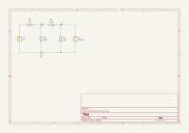

# Network analysis (Branch current method)

# Goal
This calculates the currents through each of the resistors.

# Schematics
> 

# Calculation
Formula for node Vb.
<math xmlns="http://www.w3.org/1998/Math/MathML" display="block">
  <semantics>
    <mstyle displaystyle="true" scriptlevel="0" style="font-size: 0.7em">
      <mrow data-mjx-texclass="ORD">
        <mtable rowspacing=".5em" columnspacing="1em" displaystyle="true">
          <mtr>
            <mtd>
              <msub>
                <mi>I</mi>
                <mrow data-mjx-texclass="ORD">
                  <mi>i</mi>
                  <mn>1</mn>
                </mrow>
              </msub>
              <mo>=</mo>
              <mfrac>
                <mrow>
                  <msub>
                    <mi>V</mi>
                    <mi>b</mi>
                  </msub>
                  <mo>&#x2212;</mo>
                  <msub>
                    <mi>V</mi>
                    <mi>a</mi>
                  </msub>
                </mrow>
                <msub>
                  <mi>R</mi>
                  <mn>4</mn>
                </msub>
              </mfrac>
              <mo>+</mo>
              <mfrac>
                <msub>
                  <mi>V</mi>
                  <mi>b</mi>
                </msub>
                <msub>
                  <mi>R</mi>
                  <mn>3</mn>
                </msub>
              </mfrac>
            </mtd>
          </mtr>
          <mtr>
            <mtd>
              <mn>0.02</mn>
              <mo>=</mo>
              <mfrac>
                <mrow>
                  <msub>
                    <mi>V</mi>
                    <mi>b</mi>
                  </msub>
                  <mo>&#x2212;</mo>
                  <msub>
                    <mi>V</mi>
                    <mi>a</mi>
                  </msub>
                </mrow>
                <mn>100</mn>
              </mfrac>
              <mo>+</mo>
              <mfrac>
                <msub>
                  <mi>V</mi>
                  <mi>b</mi>
                </msub>
                <mn>100</mn>
              </mfrac>
            </mtd>
          </mtr>
          <mtr>
            <mtd>
              <mn>2</mn>
              <mo>=</mo>
              <msub>
                <mi>V</mi>
                <mi>b</mi>
              </msub>
              <mo>&#x2212;</mo>
              <msub>
                <mi>V</mi>
                <mi>a</mi>
              </msub>
              <mo>+</mo>
              <msub>
                <mi>V</mi>
                <mi>b</mi>
              </msub>
            </mtd>
          </mtr>
          <mtr>
            <mtd>
              <msub>
                <mi>V</mi>
                <mi>a</mi>
              </msub>
              <mo>=</mo>
              <mn>2</mn>
              <msub>
                <mi>V</mi>
                <mi>b</mi>
              </msub>
              <mo>&#x2212;</mo>
              <mn>2</mn>
            </mtd>
          </mtr>
        </mtable>
      </mrow>
    </mstyle>
    <annotation encoding="application/x-tex">\displaystyle{\displaylines{I_{i1}=\frac{V_b-V_a}{R_4}+\frac{V_b}{R_3}\newline
0.02=\frac{V_b-V_a}{100}+\frac{V_b}{100}\newline
2=V_b-V_a+V_b\newline
V_a=2V_b-2\newline}}</annotation>
  </semantics>
</math>
 
Formula for node Va.
<math xmlns="http://www.w3.org/1998/Math/MathML" display="block">
  <semantics>
    <mstyle displaystyle="true" scriptlevel="0" style="font-size: 0.7em">
      <mrow data-mjx-texclass="ORD">
        <mtable rowspacing=".5em" columnspacing="1em" displaystyle="true">
          <mtr>
            <mtd>
              <mfrac>
                <mrow>
                  <msub>
                    <mi>V</mi>
                    <mn>1</mn>
                  </msub>
                  <mo>&#x2212;</mo>
                  <msub>
                    <mi>V</mi>
                    <mi>a</mi>
                  </msub>
                </mrow>
                <msub>
                  <mi>R</mi>
                  <mn>1</mn>
                </msub>
              </mfrac>
              <mo>=</mo>
              <mfrac>
                <msub>
                  <mi>V</mi>
                  <mi>a</mi>
                </msub>
                <msub>
                  <mi>R</mi>
                  <mn>2</mn>
                </msub>
              </mfrac>
              <mo>+</mo>
              <mfrac>
                <mrow>
                  <msub>
                    <mi>V</mi>
                    <mi>a</mi>
                  </msub>
                  <mo>&#x2212;</mo>
                  <msub>
                    <mi>V</mi>
                    <mi>b</mi>
                  </msub>
                </mrow>
                <msub>
                  <mi>R</mi>
                  <mn>4</mn>
                </msub>
              </mfrac>
            </mtd>
          </mtr>
          <mtr>
            <mtd>
              <mfrac>
                <mn>5</mn>
                <mn>47</mn>
              </mfrac>
              <mo>&#x2212;</mo>
              <mfrac>
                <msub>
                  <mi>V</mi>
                  <mi>a</mi>
                </msub>
                <mn>47</mn>
              </mfrac>
              <mo>=</mo>
              <mfrac>
                <msub>
                  <mi>V</mi>
                  <mi>a</mi>
                </msub>
                <msub>
                  <mi>R</mi>
                  <mn>2</mn>
                </msub>
              </mfrac>
              <mo>+</mo>
              <mfrac>
                <mrow>
                  <msub>
                    <mi>V</mi>
                    <mi>a</mi>
                  </msub>
                  <mo>&#x2212;</mo>
                  <msub>
                    <mi>V</mi>
                    <mi>b</mi>
                  </msub>
                </mrow>
                <msub>
                  <mi>R</mi>
                  <mn>4</mn>
                </msub>
              </mfrac>
            </mtd>
          </mtr>
          <mtr>
            <mtd>
              <mn>0.1063</mn>
              <mo>&#x2212;</mo>
              <mfrac>
                <msub>
                  <mi>V</mi>
                  <mi>a</mi>
                </msub>
                <mn>47</mn>
              </mfrac>
              <mo>=</mo>
              <mfrac>
                <msub>
                  <mi>V</mi>
                  <mi>a</mi>
                </msub>
                <mn>180</mn>
              </mfrac>
              <mo>+</mo>
              <mfrac>
                <msub>
                  <mi>V</mi>
                  <mi>a</mi>
                </msub>
                <mn>100</mn>
              </mfrac>
              <mo>&#x2212;</mo>
              <mfrac>
                <msub>
                  <mi>V</mi>
                  <mi>b</mi>
                </msub>
                <mn>100</mn>
              </mfrac>
            </mtd>
          </mtr>
          <mtr>
            <mtd>
              <mn>10.63</mn>
              <mo>&#x2212;</mo>
              <mn>2.12</mn>
              <msub>
                <mi>V</mi>
                <mi>a</mi>
              </msub>
              <mo>=</mo>
              <mn>0.556</mn>
              <msub>
                <mi>V</mi>
                <mi>a</mi>
              </msub>
              <mo>+</mo>
              <msub>
                <mi>V</mi>
                <mi>a</mi>
              </msub>
              <mo>&#x2212;</mo>
              <msub>
                <mi>V</mi>
                <mi>b</mi>
              </msub>
            </mtd>
          </mtr>
          <mtr>
            <mtd>
              <msub>
                <mi>V</mi>
                <mi>b</mi>
              </msub>
              <mo>=</mo>
              <mn>0.564</mn>
              <msub>
                <mi>V</mi>
                <mi>a</mi>
              </msub>
              <mo>+</mo>
              <mn>2.12</mn>
              <msub>
                <mi>V</mi>
                <mi>a</mi>
              </msub>
              <mo>+</mo>
              <msub>
                <mi>V</mi>
                <mi>a</mi>
              </msub>
              <mo>&#x2212;</mo>
              <mn>10.63</mn>
            </mtd>
          </mtr>
          <mtr>
            <mtd>
              <msub>
                <mi>V</mi>
                <mi>b</mi>
              </msub>
              <mo>=</mo>
              <mn>3.676</mn>
              <msub>
                <mi>V</mi>
                <mi>a</mi>
              </msub>
              <mo>&#x2212;</mo>
              <mn>10.63</mn>
            </mtd>
          </mtr>
        </mtable>
      </mrow>
    </mstyle>
    <annotation encoding="application/x-tex">\displaystyle{\displaylines{\frac{V_1-V_a}{R_1}=\frac{V_a}{R_2}+\frac{V_a-V_b}{R_4}\newline
\frac{5}{47}-\frac{V_a}{47}=\frac{V_a}{R_2}+\frac{V_a-V_b}{R_4}\newline
0.1063-\frac{V_a}{47}=\frac{V_a}{180}+\frac{V_a}{100}-\frac{V_b}{100}\newline
10.63-2.12V_a=0.556V_a+V_a-V_b\newline
V_b=0.564V_a+2.12V_a+V_a-10.63\newline
V_b=3.676V_a-10.63\newline}}</annotation>
  </semantics>
</math>
 
Calculating Va and Vb.
<math xmlns="http://www.w3.org/1998/Math/MathML" display="block">
  <semantics>
    <mstyle displaystyle="true" scriptlevel="0" style="font-size: 0.7em">
      <mrow data-mjx-texclass="ORD">
        <mtable rowspacing=".5em" columnspacing="1em" displaystyle="true">
          <mtr>
            <mtd>
              <msub>
                <mi>V</mi>
                <mi>b</mi>
              </msub>
              <mo>=</mo>
              <mn>3.676</mn>
              <mo stretchy="false">(</mo>
              <mn>2</mn>
              <msub>
                <mi>V</mi>
                <mi>b</mi>
              </msub>
              <mo>&#x2212;</mo>
              <mn>2</mn>
              <mo stretchy="false">)</mo>
              <mo>&#x2212;</mo>
              <mn>10.63</mn>
            </mtd>
          </mtr>
          <mtr>
            <mtd>
              <msub>
                <mi>V</mi>
                <mi>b</mi>
              </msub>
              <mo>=</mo>
              <mn>7.352</mn>
              <msub>
                <mi>V</mi>
                <mi>b</mi>
              </msub>
              <mo>&#x2212;</mo>
              <mn>7.352</mn>
              <mo>&#x2212;</mo>
              <mn>10.63</mn>
            </mtd>
          </mtr>
          <mtr>
            <mtd>
              <mn>6.352</mn>
              <msub>
                <mi>V</mi>
                <mi>b</mi>
              </msub>
              <mo>=</mo>
              <mn>7.352</mn>
              <mo>+</mo>
              <mn>10.63</mn>
            </mtd>
          </mtr>
          <mtr>
            <mtd>
              <msub>
                <mi>V</mi>
                <mi>b</mi>
              </msub>
              <mo>=</mo>
              <mn>2.83</mn>
            </mtd>
          </mtr>
          <mtr>
            <mtd>
              <msub>
                <mi>V</mi>
                <mi>a</mi>
              </msub>
              <mo>=</mo>
              <mn>2</mn>
              <msub>
                <mi>V</mi>
                <mi>b</mi>
              </msub>
              <mo>&#x2212;</mo>
              <mn>2</mn>
            </mtd>
          </mtr>
          <mtr>
            <mtd>
              <msub>
                <mi>V</mi>
                <mi>a</mi>
              </msub>
              <mo>=</mo>
              <mn>3.66</mn>
            </mtd>
          </mtr>
        </mtable>
      </mrow>
    </mstyle>
    <annotation encoding="application/x-tex">\displaystyle{\displaylines{V_b=3.676(2V_b-2)-10.63\newline
V_b=7.352V_b-7.352-10.63\newline
6.352V_b=7.352+10.63\newline
V_b=2.83\newline
V_a=2V_b-2\newline
V_a=3.66}}</annotation>
  </semantics>
</math>
 
Calculating currents.
<math xmlns="http://www.w3.org/1998/Math/MathML" display="block">
  <semantics>
    <mstyle displaystyle="true" scriptlevel="0" style="font-size: 0.7em">
      <mrow data-mjx-texclass="ORD">
        <mtable rowspacing=".5em" columnspacing="1em" displaystyle="true">
          <mtr>
            <mtd>
              <msub>
                <mi>I</mi>
                <mrow data-mjx-texclass="ORD">
                  <mi>r</mi>
                  <mn>1</mn>
                </mrow>
              </msub>
              <mo>=</mo>
              <mfrac>
                <mrow>
                  <msub>
                    <mi>V</mi>
                    <mn>1</mn>
                  </msub>
                  <mo>&#x2212;</mo>
                  <msub>
                    <mi>V</mi>
                    <mi>a</mi>
                  </msub>
                </mrow>
                <msub>
                  <mi>R</mi>
                  <mn>1</mn>
                </msub>
              </mfrac>
              <mo>=</mo>
              <mn>29</mn>
              <mi>m</mi>
              <mi>A</mi>
            </mtd>
          </mtr>
          <mtr>
            <mtd>
              <msub>
                <mi>I</mi>
                <mrow data-mjx-texclass="ORD">
                  <mi>r</mi>
                  <mn>2</mn>
                </mrow>
              </msub>
              <mo>=</mo>
              <mfrac>
                <msub>
                  <mi>V</mi>
                  <mi>a</mi>
                </msub>
                <msub>
                  <mi>R</mi>
                  <mn>2</mn>
                </msub>
              </mfrac>
              <mo>=</mo>
              <mn>20</mn>
              <mi>m</mi>
              <mi>A</mi>
            </mtd>
          </mtr>
          <mtr>
            <mtd>
              <msub>
                <mi>I</mi>
                <mrow data-mjx-texclass="ORD">
                  <mi>r</mi>
                  <mn>3</mn>
                </mrow>
              </msub>
              <mo>=</mo>
              <mfrac>
                <msub>
                  <mi>V</mi>
                  <mi>b</mi>
                </msub>
                <msub>
                  <mi>R</mi>
                  <mn>3</mn>
                </msub>
              </mfrac>
              <mo>=</mo>
              <mn>28</mn>
              <mi>m</mi>
              <mi>A</mi>
            </mtd>
          </mtr>
          <mtr>
            <mtd>
              <msub>
                <mi>I</mi>
                <mrow data-mjx-texclass="ORD">
                  <mi>r</mi>
                  <mn>4</mn>
                </mrow>
              </msub>
              <mo>=</mo>
              <mfrac>
                <mrow>
                  <msub>
                    <mi>V</mi>
                    <mi>a</mi>
                  </msub>
                  <mo>&#x2212;</mo>
                  <msub>
                    <mi>V</mi>
                    <mi>b</mi>
                  </msub>
                </mrow>
                <msub>
                  <mi>R</mi>
                  <mn>4</mn>
                </msub>
              </mfrac>
              <mo>=</mo>
              <mn>8.3</mn>
              <mi>m</mi>
              <mi>A</mi>
            </mtd>
          </mtr>
        </mtable>
      </mrow>
    </mstyle>
    <annotation encoding="application/x-tex">\displaystyle{\displaylines{I_{r1}=\frac{V_1-V_a}{R_1}=29mA\newline
I_{r2}=\frac{V_a}{R_2}=20mA\newline
I_{r3}=\frac{V_b}{R_3}=28mA\newline
I_{r4}=\frac{V_a-V_b}{R_4}=8.3mA\newline}}</annotation>
  </semantics>
</math>
 

# Simulation
> 
Simulation using LTSpice(File is in the repository) gives the following values.

--- Operating Point ---
V(n001):	 5	 voltage
V(n002):	 2.75	 voltage
V(va):	 3.63495	 voltage
I(R1):	 -0.0290436	 device_current
I(R2):	 0.0201942	 device_current
I(R3):	 0.0275	 device_current
I(R4):	 -0.00884949	 device_current
I(V1):	 -0.0290436	 device_current
I(V2):	 -0.0186505	 device_current

# Practical measurements

| Measurement| Value |
| :--- | :--- |
| Ir1 | 29.3mA |
| Vr1 | 1.35V |
| Ir2 | 20mA |
| Vr2 | 3.6V |
| Ir3 | 27.3mA |
| Vr3 | 2.72V |
| Ir4 | 9.4mA |
| Vr4 | 0.88V |

The practical measurements are approximates of the simulations and calculations.

# Changelog
| Date | Change |
| :---- | :---- |
| 2025-01-01 | Added calculations, simulation and practical measurements. |
