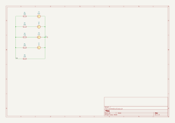

# Node voltage method

# Goal
This calculates the currents using the node voltage method for four unknowns.

# Schematics
> 

# Formula
This the formula for calculating the voltage Vr5.
<math xmlns="http://www.w3.org/1998/Math/MathML" display="block">
  <mstyle displaystyle="true" scriptlevel="0" style="font-size: 0.7em">
    <mrow data-mjx-texclass="ORD">
      <mtable rowspacing=".5em" columnspacing="1em" displaystyle="true">
        <mtr>
          <mtd>
            <mfrac>
              <msub>
                <mi>V</mi>
                <mrow data-mjx-texclass="ORD">
                  <mi>r</mi>
                  <mn>5</mn>
                </mrow>
              </msub>
              <msub>
                <mi>R</mi>
                <mn>5</mn>
              </msub>
            </mfrac>
            <mo>=</mo>
            <mfrac>
              <mrow>
                <msub>
                  <mi>V</mi>
                  <mn>1</mn>
                </msub>
                <mo>&#x2212;</mo>
                <msub>
                  <mi>V</mi>
                  <mrow data-mjx-texclass="ORD">
                    <mi>r</mi>
                    <mn>5</mn>
                  </mrow>
                </msub>
              </mrow>
              <msub>
                <mi>R</mi>
                <mn>1</mn>
              </msub>
            </mfrac>
            <mo>+</mo>
            <mfrac>
              <mrow>
                <msub>
                  <mi>V</mi>
                  <mn>2</mn>
                </msub>
                <mo>&#x2212;</mo>
                <msub>
                  <mi>V</mi>
                  <mrow data-mjx-texclass="ORD">
                    <mi>r</mi>
                    <mn>5</mn>
                  </mrow>
                </msub>
              </mrow>
              <msub>
                <mi>R</mi>
                <mn>2</mn>
              </msub>
            </mfrac>
            <mo>+</mo>
            <mfrac>
              <mrow>
                <msub>
                  <mi>V</mi>
                  <mn>3</mn>
                </msub>
                <mo>&#x2212;</mo>
                <msub>
                  <mi>V</mi>
                  <mrow data-mjx-texclass="ORD">
                    <mi>r</mi>
                    <mn>5</mn>
                  </mrow>
                </msub>
              </mrow>
              <msub>
                <mi>R</mi>
                <mn>3</mn>
              </msub>
            </mfrac>
            <mo>+</mo>
            <mfrac>
              <mrow>
                <msub>
                  <mi>V</mi>
                  <mn>4</mn>
                </msub>
                <mo>&#x2212;</mo>
                <msub>
                  <mi>V</mi>
                  <mrow data-mjx-texclass="ORD">
                    <mi>r</mi>
                    <mn>5</mn>
                  </mrow>
                </msub>
              </mrow>
              <msub>
                <mi>R</mi>
                <mn>4</mn>
              </msub>
            </mfrac>
          </mtd>
        </mtr>
      </mtable>
    </mrow>
  </mstyle>
</math>

# Calculations
Using the schematics gives us the formula. We then calculate Vr5.
<math xmlns="http://www.w3.org/1998/Math/MathML" display="block">
  <mstyle displaystyle="true" scriptlevel="0" style="font-size: 0.7em">
    <mrow data-mjx-texclass="ORD">
      <mtable rowspacing=".5em" columnspacing="1em" displaystyle="true">
        <mtr>
          <mtd>
            <mfrac>
              <msub>
                <mi>V</mi>
                <mrow data-mjx-texclass="ORD">
                  <mi>r</mi>
                  <mn>5</mn>
                </mrow>
              </msub>
              <mn>100</mn>
            </mfrac>
            <mo>=</mo>
            <mfrac>
              <mrow>
                <mn>5.5</mn>
                <mo>&#x2212;</mo>
                <msub>
                  <mi>V</mi>
                  <mrow data-mjx-texclass="ORD">
                    <mi>r</mi>
                    <mn>5</mn>
                  </mrow>
                </msub>
              </mrow>
              <mn>350</mn>
            </mfrac>
            <mo>+</mo>
            <mfrac>
              <mrow>
                <mn>5.0</mn>
                <mo>&#x2212;</mo>
                <msub>
                  <mi>V</mi>
                  <mrow data-mjx-texclass="ORD">
                    <mi>r</mi>
                    <mn>5</mn>
                  </mrow>
                </msub>
              </mrow>
              <mn>550</mn>
            </mfrac>
            <mo>+</mo>
            <mfrac>
              <mrow>
                <mn>4.5</mn>
                <mo>&#x2212;</mo>
                <msub>
                  <mi>V</mi>
                  <mrow data-mjx-texclass="ORD">
                    <mi>r</mi>
                    <mn>5</mn>
                  </mrow>
                </msub>
              </mrow>
              <mn>450</mn>
            </mfrac>
            <mo>+</mo>
            <mfrac>
              <mrow>
                <msub>
                  <mi>V</mi>
                  <mn>4</mn>
                </msub>
                <mo>&#x2212;</mo>
                <msub>
                  <mi>V</mi>
                  <mrow data-mjx-texclass="ORD">
                    <mi>r</mi>
                    <mn>5</mn>
                  </mrow>
                </msub>
              </mrow>
              <mn>500</mn>
            </mfrac>
          </mtd>
        </mtr>
        <mtr>
          <mtd>
            <mfrac>
              <msub>
                <mi>V</mi>
                <mrow data-mjx-texclass="ORD">
                  <mi>r</mi>
                  <mn>5</mn>
                </mrow>
              </msub>
              <mn>100</mn>
            </mfrac>
            <mo>=</mo>
            <mn>0.01571</mn>
            <mo>&#x2212;</mo>
            <mfrac>
              <msub>
                <mi>V</mi>
                <mrow data-mjx-texclass="ORD">
                  <mi>r</mi>
                  <mn>5</mn>
                </mrow>
              </msub>
              <mn>350</mn>
            </mfrac>
            <mo>+</mo>
            <mn>0.00909</mn>
            <mo>&#x2212;</mo>
            <mfrac>
              <msub>
                <mi>V</mi>
                <mrow data-mjx-texclass="ORD">
                  <mi>r</mi>
                  <mn>5</mn>
                </mrow>
              </msub>
              <mn>550</mn>
            </mfrac>
            <mo>+</mo>
            <mn>0.01</mn>
            <mo>&#x2212;</mo>
            <mfrac>
              <msub>
                <mi>V</mi>
                <mrow data-mjx-texclass="ORD">
                  <mi>r</mi>
                  <mn>5</mn>
                </mrow>
              </msub>
              <mn>450</mn>
            </mfrac>
            <mo>+</mo>
            <mn>0.008</mn>
            <mo>&#x2212;</mo>
            <mfrac>
              <msub>
                <mi>V</mi>
                <mrow data-mjx-texclass="ORD">
                  <mi>r</mi>
                  <mn>5</mn>
                </mrow>
              </msub>
              <mn>500</mn>
            </mfrac>
          </mtd>
        </mtr>
        <mtr>
          <mtd>
            <msub>
              <mi>V</mi>
              <mrow data-mjx-texclass="ORD">
                <mi>r</mi>
                <mn>5</mn>
              </mrow>
            </msub>
            <mo>=</mo>
            <mn>1.571</mn>
            <mo>&#x2212;</mo>
            <mn>0.2857</mn>
            <mo>&#xD7;</mo>
            <msub>
              <mi>V</mi>
              <mrow data-mjx-texclass="ORD">
                <mi>r</mi>
                <mn>5</mn>
              </mrow>
            </msub>
            <mo>+</mo>
            <mn>0.909</mn>
            <mo>&#x2212;</mo>
            <mn>0.1818</mn>
            <mo>&#xD7;</mo>
            <msub>
              <mi>V</mi>
              <mrow data-mjx-texclass="ORD">
                <mi>r</mi>
                <mn>5</mn>
              </mrow>
            </msub>
            <mo>+</mo>
            <mn>1</mn>
            <mo>&#x2212;</mo>
            <mn>0.2222</mn>
            <mo>&#xD7;</mo>
            <msub>
              <mi>V</mi>
              <mrow data-mjx-texclass="ORD">
                <mi>r</mi>
                <mn>5</mn>
              </mrow>
            </msub>
            <mo>+</mo>
            <mn>0.8</mn>
            <mo>&#x2212;</mo>
            <mn>0.2</mn>
            <mo>&#xD7;</mo>
            <msub>
              <mi>V</mi>
              <mrow data-mjx-texclass="ORD">
                <mi>r</mi>
                <mn>5</mn>
              </mrow>
            </msub>
          </mtd>
        </mtr>
        <mtr>
          <mtd>
            <msub>
              <mi>V</mi>
              <mrow data-mjx-texclass="ORD">
                <mi>r</mi>
                <mn>5</mn>
              </mrow>
            </msub>
            <mo>=</mo>
            <mn>4.28</mn>
            <mo>&#x2212;</mo>
            <mn>0.8897</mn>
            <mo>&#xD7;</mo>
            <msub>
              <mi>V</mi>
              <mrow data-mjx-texclass="ORD">
                <mi>r</mi>
                <mn>5</mn>
              </mrow>
            </msub>
          </mtd>
        </mtr>
        <mtr>
          <mtd>
            <mn>1.8897</mn>
            <mo>&#xD7;</mo>
            <msub>
              <mi>V</mi>
              <mrow data-mjx-texclass="ORD">
                <mi>r</mi>
                <mn>5</mn>
              </mrow>
            </msub>
            <mo>=</mo>
            <mn>4.28</mn>
          </mtd>
        </mtr>
        <mtr>
          <mtd>
            <msub>
              <mi>V</mi>
              <mrow data-mjx-texclass="ORD">
                <mi>r</mi>
                <mn>5</mn>
              </mrow>
            </msub>
            <mo>=</mo>
            <mn>2.2649</mn>
          </mtd>
        </mtr>
      </mtable>
    </mrow>
  </mstyle>
</math>
We can now calculate the currents through the resistors using ohms law.
<math xmlns="http://www.w3.org/1998/Math/MathML" display="block">
  <mstyle displaystyle="true" scriptlevel="0" style="font-size: 0.7em">
    <mrow data-mjx-texclass="ORD">
      <mtable rowspacing=".5em" columnspacing="1em" displaystyle="true">
        <mtr>
          <mtd>
            <msub>
              <mi>I</mi>
              <mrow data-mjx-texclass="ORD">
                <mi>r</mi>
                <mn>1</mn> style="font-size: 0.7em"
              </mrow>
            </msub>
            <mo>=</mo>
            <mfrac>
              <mrow>
                <msub>
                  <mi>V</mi>
                  <mn>1</mn>
                </msub>
                <mo>&#x2212;</mo>
                <msub>
                  <mi>V</mi>
                  <mrow data-mjx-texclass="ORD">
                    <mi>r</mi>
                    <mn>5</mn>
                  </mrow>
                </msub>
              </mrow>
              <msub>
                <mi>R</mi>
                <mn>1</mn>
              </msub>
            </mfrac>
            <mo>=</mo>
            <mfrac>
              <mrow>
                <mn>5.5</mn>
                <mo>&#x2212;</mo>
                <mn>2.2649</mn>
              </mrow>
              <mn>350</mn>
            </mfrac>
            <mo>=</mo>
            <mn>9</mn>
            <mi>m</mi>
            <mi>A</mi>
          </mtd>
        </mtr>
        <mtr>
          <mtd>
            <msub>
              <mi>I</mi>
              <mrow data-mjx-texclass="ORD">
                <mi>r</mi>
                <mn>2</mn>
              </mrow>
            </msub>
            <mo>=</mo>
            <mfrac>
              <mrow>
                <msub>
                  <mi>V</mi>
                  <mn>2</mn>
                </msub>
                <mo>&#x2212;</mo>
                <msub>
                  <mi>V</mi>
                  <mrow data-mjx-texclass="ORD">
                    <mi>r</mi>
                    <mn>5</mn>
                  </mrow>
                </msub>
              </mrow>
              <msub>
                <mi>R</mi>
                <mn>2</mn>
              </msub>
            </mfrac>
            <mo>=</mo>
            <mfrac>
              <mrow>
                <mn>5.0</mn>
                <mo>&#x2212;</mo>
                <mn>2.2649</mn>
              </mrow>
              <mn>550</mn>
            </mfrac>
            <mo>=</mo>
            <mn>4.98</mn>
            <mi>m</mi>
            <mi>A</mi>
          </mtd>
        </mtr>
        <mtr>
          <mtd>
            <msub>
              <mi>I</mi>
              <mrow data-mjx-texclass="ORD">
                <mi>r</mi>
                <mn>3</mn>
              </mrow>
            </msub>
            <mo>=</mo>
            <mfrac>
              <mrow>
                <msub>
                  <mi>V</mi>
                  <mn>3</mn>
                </msub>
                <mo>&#x2212;</mo>
                <msub>
                  <mi>V</mi>
                  <mrow data-mjx-texclass="ORD">
                    <mi>r</mi>
                    <mn>5</mn>
                  </mrow>
                </msub>
              </mrow>
              <msub>
                <mi>R</mi>
                <mn>3</mn>
              </msub>
            </mfrac>
            <mo>=</mo>
            <mfrac>
              <mrow>
                <mn>4.5</mn>
                <mn>.5</mn>
                <mo>&#x2212;</mo>
                <mn>2.2649</mn>
              </mrow>
              <mn>450</mn>
            </mfrac>
            <mo>=</mo>
            <mn>4.97</mn>
            <mi>m</mi>
            <mi>A</mi>
          </mtd>
        </mtr>
        <mtr>
          <mtd>
            <msub>
              <mi>I</mi>
              <mrow data-mjx-texclass="ORD">
                <mi>r</mi>
                <mn>4</mn>
              </mrow>
            </msub>
            <mo>=</mo>
            <mfrac>
              <mrow>
                <msub>
                  <mi>V</mi>
                  <mn>4</mn>
                </msub>
                <mo>&#x2212;</mo>
                <msub>
                  <mi>V</mi>
                  <mrow data-mjx-texclass="ORD">
                    <mi>r</mi>
                    <mn>5</mn>
                  </mrow>
                </msub>
              </mrow>
              <msub>
                <mi>R</mi>
                <mn>4</mn>
              </msub>
            </mfrac>
            <mo>=</mo>
            <mfrac>
              <mrow>
                <mn>4.0</mn>
                <mo>&#x2212;</mo>
                <mn>2.2649</mn>
              </mrow>
              <mn>500</mn>
            </mfrac>
            <mo>=</mo>
            <mn>3.47</mn>
            <mi>m</mi>
            <mi>A</mi>
          </mtd>
        </mtr>
        <mtr>
          <mtd>
            <msub>
              <mi>I</mi>
              <mrow data-mjx-texclass="ORD">
                <mi>r</mi>
                <mn>5</mn>
              </mrow>
            </msub>
            <mo>=</mo>
            <mfrac>
              <msub>
                <mi>V</mi>
                <mrow data-mjx-texclass="ORD">
                  <mi>r</mi>
                  <mn>5</mn>
                </mrow>
              </msub>
              <msub>
                <mi>R</mi>
                <mn>5</mn>
              </msub>
            </mfrac>
            <mo>=</mo>
            <mfrac>
              <mrow>
                <mn>5.5</mn>
                <mo>&#x2212;</mo>
                <mn>2.2649</mn>
              </mrow>
              <mn>100</mn>
            </mfrac>
            <mo>=</mo>
            <mn>22.6</mn>
            <mi>m</mi>
            <mi>A</mi>
          </mtd>
        </mtr>
      </mtable>
    </mrow>
  </mstyle>
</math>

# Simulation
Simulation using Kicad gives the following values.
> 

Gives the following values.

| Current | Simulation value |
| :--- | :--- |
| Ir1 | 9.24mA |
| Ir2 | 4.97mA |
| Ir3 | 4.97mA |
| Ir4 | 3.47mA |
| Ir5 | 22.7mA |

# Practical measurements

# Code

# Changelog
| Date | Change |
| :---- | :---- |
| 2025-12-31 | Added calculations and simulation |
