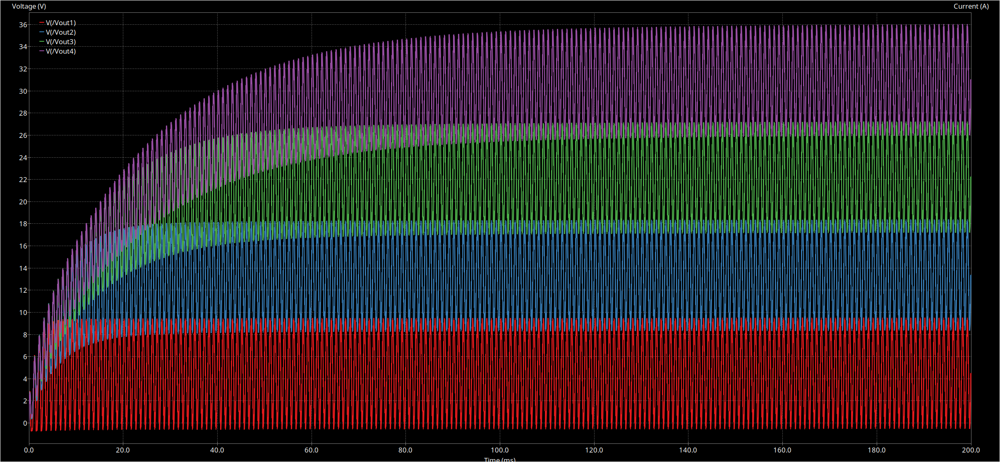

# Multi stage Villard circuit
The goal is is to understand, simulate and do practical measurements on a multi stage Villard circuit.

# Goals
- [x] Document schematic of 1-4 stages in Kicad
- [x] Do a theoretical analyis on stages 1-4
- [ ] Implement multi stages schematic on breadboard
- [ ] Test multi stages circuit and do measurements

# Equipment used
| Equipment | Description |
| :------------- | :------------- |
| Peaktech 4055 | AC power supply |
| RS Pro RSDS 1204X-E | Oscilloscope |

# Components
| Reference | Value | Remaxrks |
| :------------- | :------------- | :------------- |
| Cx | 1u | Only eight needed for 4 stage |
| Rx | 1M | To simulate load |
| Dx | 1N4001 | Only eight needed for 4 stage |

# Schematics
> 

Schematics generated from KIcad. The schematics can be downloaded from the repository.

<aside class="notice">
    More description will come later.
</aside>

# Simulation
> 

This simulates the output from a 1-4 stage Villard circuit where input comes from a 5Vpp AC input.
 

| Stages | V- | V+ | Time to init* |
| :------------- | :------------- | :------------- | :------------- |
| 1 | -0.551V | 9.44V | 4ms |
| 2 | 8.3V | 18.3V | 18ms |
| 3 | 17.1V | 27.1V | 40m |
| 4 | 25.6V | 35.6V | 65ms |

 
* Time to init is the time the V out reaches 95% of Vmax.
 
For each stage the DC component of the output voltage increases about the same amount.

# Practical measurements

# Changelog
| Date | Change |
| :---- | :---- |
| 2025-11-01 | Simulation results added |
