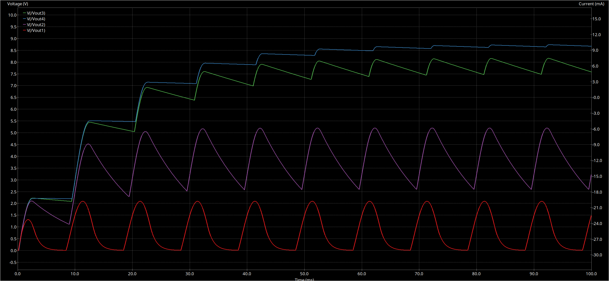
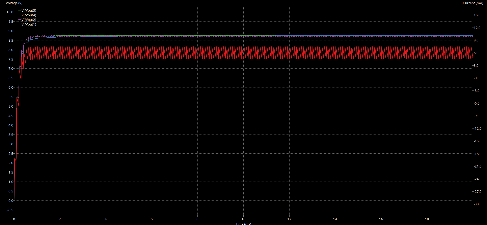
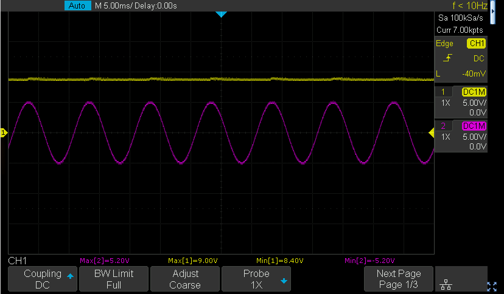
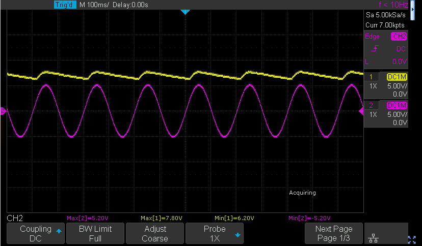
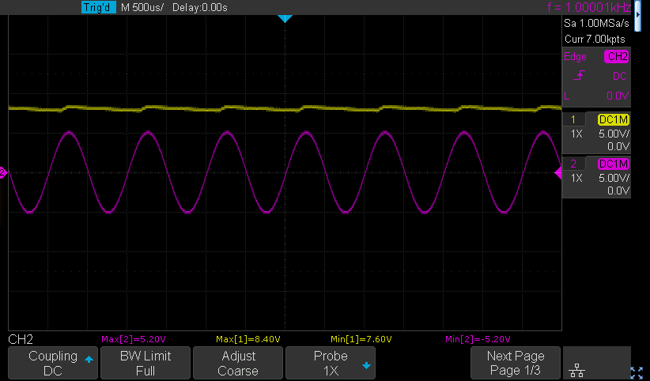

# Single stage Greinacher circuit
The goal is is to understand, simulate and do practical measurements on a Greinacher circuit.

# Goals
- [x] Document schematic in Kicad
- [x] Do a theoretical analyis 
- [x] Implement schematic on breadboard
- [x] Test circuit and do measurements

# Equipment used
| Equipment | Description |
| :------------- | :------------- |
| Peaktech 4055 | AC power supply |
| RS Pro RSDS 1204X-E | Oscilloscope |

# Components
| Reference | Value | Remarks |
| :------------- | :------------- | :------------- |
| C1, C2 | 1n, 10n, 100n, 1u | Two of each is required |
| R1 | 1M | |
| D1, D2 | 1N4001 or 1N4148 | |

# Schematics
> 

Schematics generated from KIcad. The schematics can be downloaded from the repository.
  
In the positive cycle the D1 diode not conducting and D2 is conducting. This causes C2 to charge. The voltage over C1 becomes around 4.5V
In the negative cycle the D1 diode will conduct and D2 will not causing C1 to charge. The voltage over C2 becomes around 9V.
  
The resistor has been added to make the discharge of of the capacitors slower, which reduces the output ripple.

# Simulation
> Simulation done on 100Hz AC with multiple capacitor values. 
> 
  
> Simulation done on 1kHz AC with multiple capacitor values. 
> 
  
> Simulation done on 10kHz AC with multiple capacitor values. 
> 

All simulations have the following capacitor values.

| Output | Capacitor |
| :--- | :--- |
| Vout1 | 1nF |
| Vout2 | 10nF |
| Vout3 | 100nF |
| Vout4 | 1uF |

<ins>Conclusion</ins> 
This circuit have AC as input, but output ideally is DC voltage higher than the max voltage of the input.
The lower the frequency the higher the capacitance of the capacitors required to get a proper DC 
output. The DC output voltage is about 8.73V for ideal output when input is 5Vpp.

# Practical measurements

## Measurements with circuit specified
> 

Measurement done at 100hz with an input of 10Vpp. The output voltage of the circuit ended at around 9.04V. Ran the same 
circuit at 1khz and at 10khz without any noticable difference.

## Measurements without resistor at 5Hz
> 

At low frequency and no resistor the output ripples, but at all times remains at higher voltage than the input.

## Measurements with capacitors at 33nF
> 

The changes the circuit to use 33nF capacitors rather than 1uF capacitors. At 1khz the ripple is still visible because the capacitors discharge to quickly.

# Changelog
| Date | Change |
| :---- | :---- |
| 2025-11-01 | Simulation results added |
| 2025-11-23 | Added practical measurements |