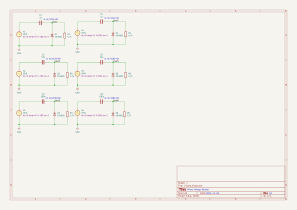
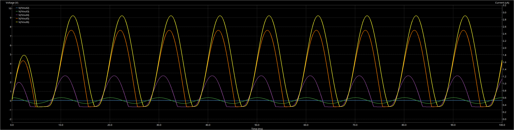
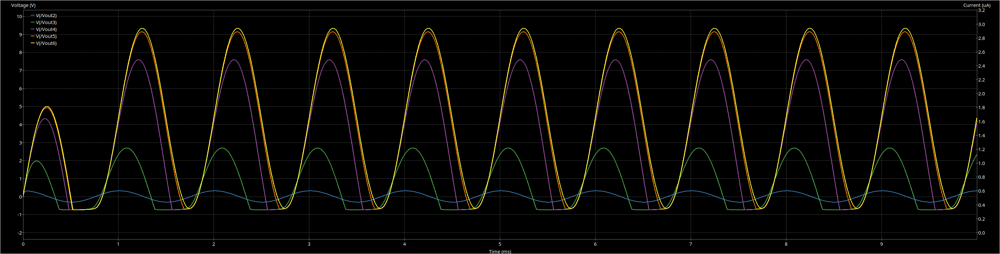
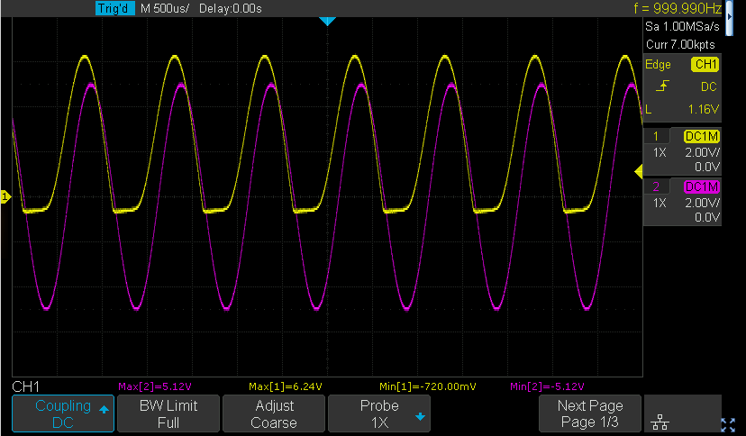
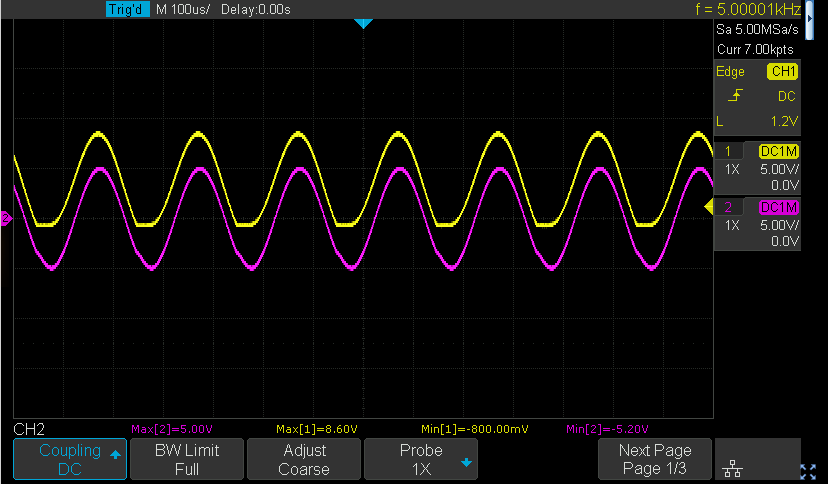

# Single stage Villard circuit
The goal is is to understand, simulate and do practical measurements on a single stage Villard voltage doubler.

# Goals
- [x] Document schematic of single stage in Kicad
- [x] Do a theoretical analyis on single stage 
- [x] Implement single stage schematic on breadboard
- [x] Test single stage circuit and do measurements

# Equipment used
| Equipment | Description |
| :------------- | :------------- |
| Peaktech 4055 | AC power supply |
| RS Pro RSDS 1204X-E | Oscilloscope |

# Components
| Reference | Value | Remarks |
| :------------- | :------------- | :------------- |
| C1 | 1n, 10n, 100n, 1u, 10u and 100u | |
| R1 | 4.7k | To simulate load |
| D1 | 1N4001 or 1N4148 | |

# Schematics
> 

Schematics generated from KIcad. The schematics can be downloaded from the repository.

The circuit works in two phases one when the input is on the positive cycle and one when it's on the negative cycle.
When the output goes positive the diode blocks the current in that direction, but some will be sent through the resistor in this case 
added as a load. This causes the capacitor to hold is charge loosing only what's being sent through the load. This causes the output 
to be shifted upwards. On the negative cycle the diode conducts which causes the capacitor to charge. 

# Simulation changing capacitance
> This is a simulation done on 100Hz.
> 
  
> This is a simulation done on 1kHz.
> 

I used a 4.7k resistor in paralell with the diode to simulate a load. This can be changed to any size and affects the output 
of the circuit significantly. 

Simulated values at 100Hz 

| V | Simulated value |
| :------------- | :------------- | :------------- | :------------- |
| V1 | With 1nF capacitor gives -14.8mV to 14.8mV |
| V2 | With 10nF capacitor gives -148mV to 148mV |
| V3 | With 100n capacitor gives -611mV to 1.42V (Not quite sine wave at lower voltages) |
| V4 | With 1uF capacitor gives -683mV to 4.81V (Very flat at lowest voltages, not at all sine) |
| V5 | With 10uF capacitor gives -726mV to 8.91V (More sine wave again) |
| V6 | With 100uF capacitor gives -742mV to 9.24V (Pretty sine again) |

Simulated values at 1khz

| V | Simulated value |
| :------------- | :------------- | :------------- | :------------- |
| V1 | With 1nF capacitor gives -148mV to 148mV |
| V2 | With 10nF capacitor gives -611mV to 1.42V (Flat at lower voltage) |
| V3 | With 100n capacitor gives -683mV to 6.27V (Flat at lower voltages) |
| V4 | With 1uF capacitor gives -715mV to 8.90V |
| V5 | With 10uF capacitor gives -742mV to 9.24V |
 
The lower the frequency a higher capacitance is required to reach higher voltages. 
The circuit itself does not double the voltage, but moves the offset. So instead 
of -5V to 5V it changes to -0.7V to 9.1V. 

# Simulation changing resitance
> This is a simulation done on 100Hz.
> 
  
> This is a simulation done on 1kHz.
> 

In this simulation we are changing the resistance and seeing the output. 
The values are from 1, 10, 100, 1k, 10k and 100k resistance.

# Practical measurements

## 10Vpp at 1khz
> 

This measurement was done at 1khz at 10Vpp with a 4.7k resistor and 100nF capacitor. The output of for this circuit is from 6.24V to -720mV.

## 10Vpp at 5khz
> 

This measurement was done at 1khz at 10Vpp with a 4.7k resistor and 100nF capacitor. The output of for this circuit is from 8.6V to -800mV.  
I had to change the vertical level for this measurements compared to the previous.

## Additional
Attempted to increase frequency to see how high I could get the output to go in this case with 800khz. This causes th output to cycle between 
9V and -800mV to -1V. The oscilloscope could not get a conclusive reading at this frequency. 

The measurements show that the ouput is pushed upwards and affects the sine curve input. The output on  the low level were falt a t the lower 
frequencies which is supported by the simulations.

# Changelog
| Date | Change |
| :---- | :---- |
| 2025-11-01 | Simulation results added |
| 2025-11-23 | Added a few practical measurements |
