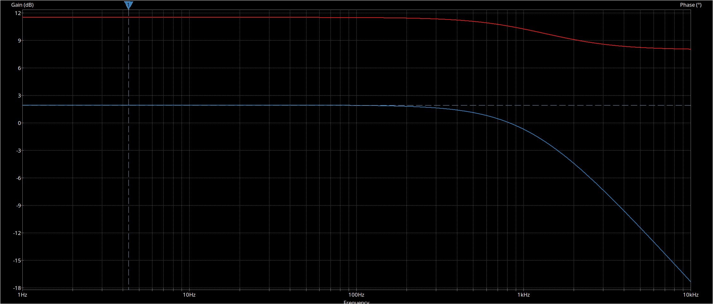

# RC passive lowpass filter

## Description
The goal is to implement, analyze and do practical measurements on an active lowpass filter (butterworth).

## Goals
- [x] Document schematic in Kicad
- [x] Do a theoretical analyis 
- [x] Calculate 2nd,3rd and 5th order 
- [ ] Implement schematic on breadboard
- [ ] Test circuit and do measurements

## Equipment used
| Equipment | Description |
| :------------- | :------------- |
| Peaktech 6075 | DC power supply |
| Peaktech 4055 | AC power supply |
| RS Pro RSDS 1204X-E | Oscilloscope |

## Components
| Reference | Value | Remarks |
| :------------- | :------------- | :------------- |
| 1x capacitor | 3.2n | |
| 1x capacitor | 4.9n | |
| 1x capacitor | 6.7n | |
| 1x capacitor | 11.3n | |
| 1x capacitor | 21.5n | |
| 1x capacitor | 22.1n | |
| 1x capacitor | 22.5n | |
| 1x capacitor | 28n | |
| 1x capacitor | 52n | |
| 1x capacitor | 56.5n | |
| 5x resistor | 10k | |
| 2x LM741 | | Operational amplifier|

## Butterworth filter values
| Order | Sections | C1 | C2 | C3 | C4 | C5 |
| :------------- | :------------- | :------------- | :------------- | :------------- | :------------- | :------------- |
| 2 | 2-pole | 1.414 | 0.7071 | | | |
| 3 | 3-pole | | | 3.546 | 1.392 | 0.2024 | 
| 4 | 2-pole<br>2-pole | 1.082<br>2.613 | 0.9241<br>0.3825 | | | | 
| 5 | 3-pole<br>2-pole | &nbsp;<br>3.235 | &nbsp;<br>0.3090 | 1.753<br>&nbsp; | 1.354<br>&nbsp; | 0.4214<br>&nbsp; | 
| 6 | 2-pole<br>2-pole<br>2-pole | 1.035<br>1.414<br>3.863 | 0.966<br>0.7071<br>0.2588 | | | | 
| 7 | 3-pole<br>2-pole<br>2-pole | <br>1.604<br>4.493 | &nbsp;<br>0.6235<br>0.2225 | 1.531<br>&nbsp;<br>&nbsp; | 1.336<br>&nbsp;<br>&nbsp; | 0.4885<br>&nbsp;<br>&nbsp; | 
| 8 | 2-pole<br>2-pole<br>2-pole<br>2-pole | 1.020<br>1.202<br>2.000<br>5.758 | 0.9809<br>0.8313<br>0.5557<br>0.1950 | | | | 

> Ref (Book: Practical electronics for inventors 3rd edition)

## Formulas
Calculates minimum 60db attenuation at frequency Fs. The attenuation result is the total order number of the circuit.
```math
A_s=\frac{f_s}{f_{3db}}
```

To calculate the resistor values in the circuit. Rxn is the normalized normalized value = 1. 
```math
R_x=Z \times R_{xn}
```

To calculate the capacitor values use the value for the capacitor and calculate the capacitance the capacitors is to use in the circuit.
```math
C_x=\frac{C_{table}}{Z \times 2 \times \pi \times f_{3db}}
```

## Circuits
Circuits for 2nd and 3rd order butterworth filter.


## Simulations
Ran simulation AC circuit analysis from 1Hz to 100kHz.


> [!CAUTION]
> The simulation for 3-pole looks correct, but the 2-pole looks very wrong. Need to figure out why it's incorrect. The values look correct.

## Calculations

### Example 1
With a 2-pole circuit with with attenuation of 3db at 1000Hz and an impedance of 10k gives the following values.
| Component | Value |
| :-------- | :-------- |
| C1 | 22.5n |
| C2 | 11.3n |
| R1 | 10k |
| R2 | 10k |

### Example 2
With a 3-pole circuit with with attenuation of 3db at 1000Hz and an impedance of 10k gives the following values.
| Component | Value |
| :-------- | :-------- |
| C3 | 56.5n |
| C4 | 22.1n |
| C5 | 3.2n |
| R3 | 10k |
| R4 | 10k |
| R5 | 10k |

### Example 3
With a 5th order 3-pole circuit + 2-pole with with attenuation of 3db at 1000Hz and an impedance of 10k gives the following values.
| Component | Value |
| :-------- | :-------- |
| C6 | 28n |
| C7 | 21.5n |
| C8 | 6.7n |
| C9 | 52n |
| C10 | 4.9n |
| R6 | 10k |
| R7 | 10k |
| R8 | 10k |
| R9 | 10k |
| R10 | 10k |

## Practical measurements

> [!NOTE]  
> Waiting for components