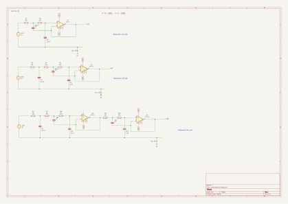

# RC passive lowpass filter

## Description
The goal is to implement, analyze and do practical measurements on an active lowpass filter (butterworth).

## Goals
- [x] Document schematic in Kicad
- [ ] Do a theoretical analyis 
- [ ] Calculate 1st/2nd order 
- [ ] Implement schematic on breadboard
- [ ] Test circuit and do measurements

## Equipment used
| Equipment | Description |
| :------------- | :------------- |
| Peaktech 6075 | DC power supply |
| Peaktech 4055 | AC power supply |
| RS Pro RSDS 1204X-E | Oscilloscope |

## Components
| Reference | Value | Remarks |
| :------------- | :------------- | :------------- |
| 1x capacitor | 3.2n | |
| 1x capacitor | 11.3n | |
| 2x capacitor | 22.5n | |
| 1x capacitor | 56.5n | |
| 5x resistor | 10k | |
| 2x LM741 | | Operational amplifier|

## Butterworth filter values
### 2 pole
| Order | Nr. Sections | Sections | C1 | C2 | C3 | C4 | C5 |
| :------------- | :------------- | :------------- | :------------- | :------------- | :------------- | :------------- | :------------- |
| 2 | 1 | 2-pole | 1.414 | 0.7071 | | | |
| 3 | 1 | 3-pole | | | 3.546 | 1.392 | 0.2024 | 
| 4 | 2 | 2-pole 2-pole | 1.082 2.613 | 0.9241 0.3825 | | | | 
| 5 | 2 | 3-pole 2-pole |  3.235 |  0.3090 | 1.753 | 1.354 | 0.4214 | 

## Formulas

## Circuits
Circuits for 2nd and 3rd order butterworth filter

## Simulations

## Calculations

## Practical measurements
