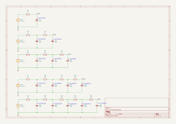
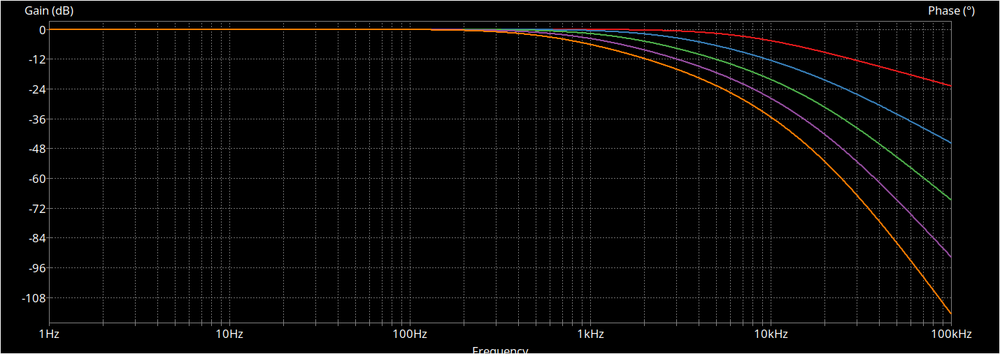
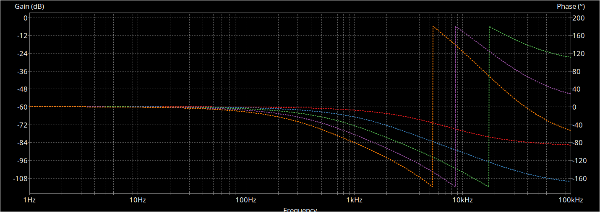
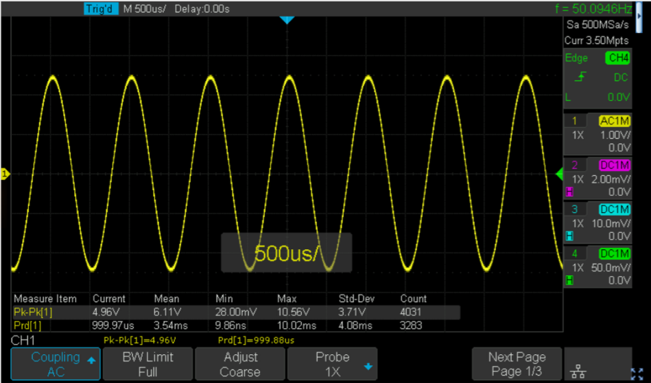
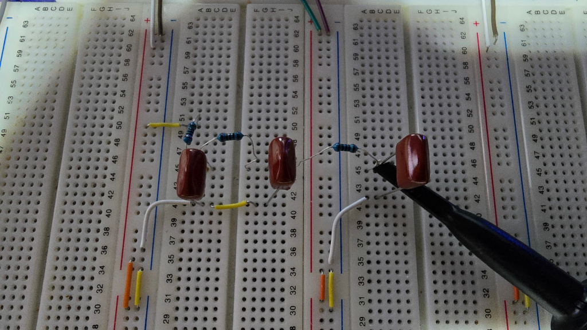

# RC passive lowpass filter

## Description
The goal is to implement, analyze and do practical measurements on a RC lowpass filter.
I am simula

## Goals
- [x] Document schematic in Kicad
- [x] Do a theoretical analyis 
- [x] Calculate 1st order 
- [x] Implement schematic on breadboard
- [x] Test circuit and do measurements
- [ ] Calculate 2nd order 


## Equipment used
| Equipment | Description |
| :------------- | :------------- |
| Peaktech 4055 | AC power supply |
| RS Pro RSDS 1204X-E | Oscilloscope |

## Components
| Reference | Value | Remarks |
| :------------- | :------------- | :------------- |
| 3x capacitor | 22n | |
| 3x resistor | 1k | |
| J1 | ~5V | |

## Formulas
Reactance for the capacitor at frequency.
```math
X_c=\frac{1}{2*\pi*f*c}
```
Impedance for the circuit.
```math
Z=\sqrt{X_c^2+R^2}
```
Output frequency can be found with this formula.
```math
V_{out}=V_{in}*\frac{X_c}{Z}
```
Gain is calculated with this formula.
```math
G_\text{db}=20\log\frac{V_\text{out}}{V_\text{in}}
```
Phase shift formula.
```math
\phi=-arctan(2\pi frc)
```

## Circuits
Circuits for 1st to 5th order.


## Simulations
Gain for 1st to 5th order filter


Phase for 1st to 5th order filter


Simulation values
| Order | -3db | -20db | -40db |
| :------------- | :------------- | :------------- | :------------- |
| 1 | 7.19KHz | 71.9KHz | Not measureable |
| 2 | 2.69KHz | 19.2KHz | 71.2KHz |
| 3 | 1.40KHz | 9.82KHz | 30.2KHz |
| 4 | 852Hz | 6.12KHz | 18.2KHz |
| 5 | 575Hz | 4.10KHz | 12.3KHz |

## Calculations
Assuming input voltage 5V
| Gain | Voltage |
| :------------- | :------------- |
| -3db | 3.53V |
| -10db | 1.58V |
| -20db | 0.5V |
| -40db | 0.25V |

| Frequency | Gain 1st order | Phase 1st order |
| :------------- | :------------- | :------------- |
| 100Hz | -829u | -0.79 |
| 500Hz | -0.02 | -3.95 |
| 1kHz | -0.08 | -7.87 |
| 10kHz | -4.64 | -54.1 |
| 20kHz | -9.36 | -70.1 |

## Practical measurements
Oscilloscope measurement


Since the resistor and capacitor are not perfect values and the oscilloscope/function generator is not calibrated values should be a bit off.
| Frequency | Gain 1st order | Gain 2nd order | Gain 3rd order |
| :------------- | :------------- | :------------- | :------------- |
| 100Hz | 0(5V) |  0(5V) | 0(5V) |
| 500Hz | 0(5V) |  0(5V) | -0.72(4.64V) |
| 1kHz | -0.13(4.96V) |  -0.57(4.72V)| -1.84(4.08V) |
| 10kHz | -4.62(2.96V) | -12.5(1.2V) | -20.24(0.49V) |
| 20kHz | -9.43(1.72V) | -20.24(0.49V) | -30.9(0.14V) |

Breadboard setup for 3rd order



