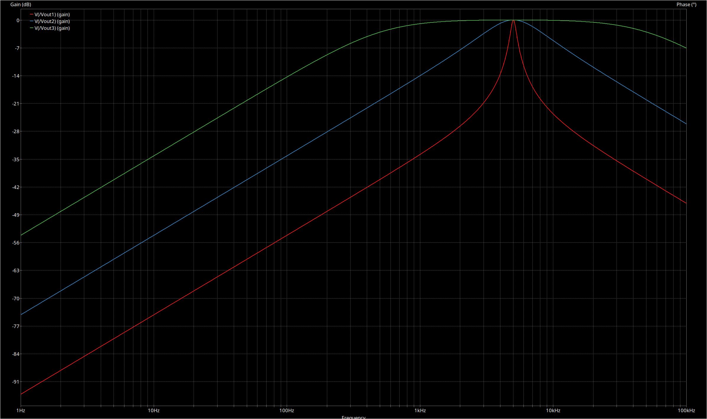
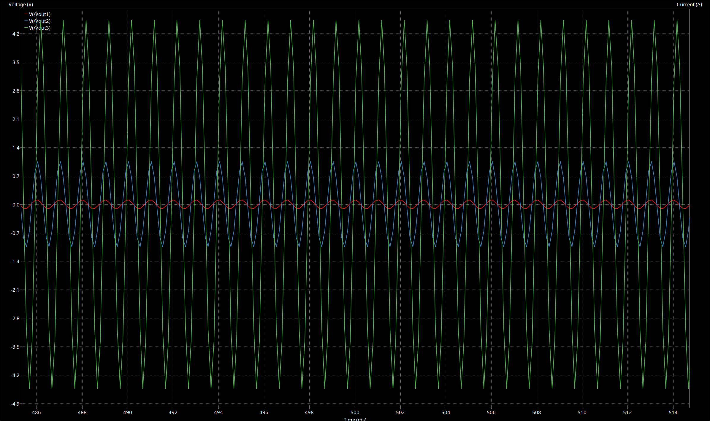
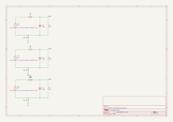
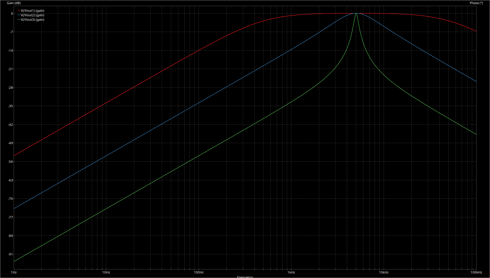
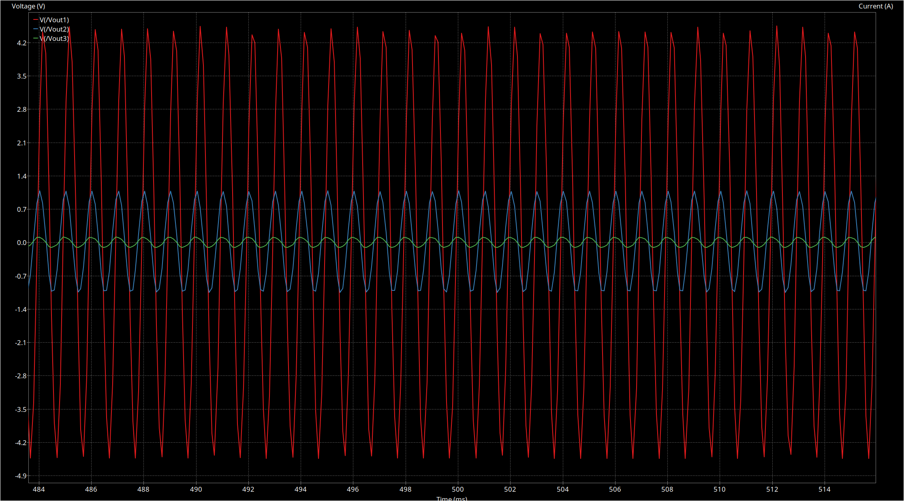

# RLC passive bandpass filter

## Description
The goal is to implement, analyze and do practical measurements on a RLC bandpass filter.
 
## Goals
- [x] Document schematic in Kicad
- [x] Do a theoretical analyis 
- [x] Calculate values for a 5kHz serial and paralell bandpass filters
- [ ] Implement schematic on breadboard
- [ ] Test circuit and do measurements

## Equipment used
| Equipment | Description |
| :------------- | :------------- |
| Peaktech 4055 | AC power supply |
| RS Pro RSDS 1204X-E | Oscilloscope |

## Components
| Reference | Value | Remarks |
| :------------- | :------------- | :------------- |
| R1 | 31 | |
| R2 | 310 | |
| R3 | 3100 | |
| Cx | 100n | |
| Lx | 10m | |

## Formulas
The resonant frequency formula is given by  
```math
f_o=\frac{1}{2\pi \sqrt{LC}}
```
Calculate the Q value
```math
Q=\frac{X_{lo}}{R_t}=\frac{2\pi f_oL}{R_t}
```
Calculate the Q value from required bandwidth
```math
Q=\frac{f_o}{Bandwidth}
```
Calculate capacitor value based on frequency and inductor
```math
C=\frac{1}{f_o^2\times 4\times\pi^2\times L}
```
Calculate resistor value for a specific bandwidth.
```math
R=\frac{f_o}{Q}
```
## Serial circuit

### Schematics
Circuit for a 1Khz bandpass filter.


### Simulation
Simulation AC signal analysis with the values in the component list.


Simulation transient analysis at 1kHz.


### Practical measurements

## Paralell circuit

### Schematics
Circuit for a 5Khz bandpass filter.


### Simulation
Simulation AC signal analysis with the values in the component list.


Simulation transient analysis at 1kHz.


## Analysis
With Q value of 1 the theoretical gain is the same for both the serial and paralell circuits.

Using the AC signal analyis to look at the gain.
For the serial circuit the bandwidth increases with higher resistor values.
For the paralell circuit the bandwidth decreases with higher resistor values.

### Practical measurements
To be done

