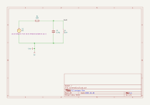

# RLC passive bandpass filter

## Description
The goal is to implement, analyze and do practical measurements on a RLC bandpass filter.
 
## Goals
- [x] Document schematic in Kicad
- [x] Do a theoretical analyis 
- [ ] Calculate values for a 1kHz and 15kHz bandpass filter 
- [ ] Implement schematic on breadboard
- [ ] Test circuit and do measurements

## Equipment used
| Equipment | Description |
| :------------- | :------------- |
| Peaktech 4055 | AC power supply |
| RS Pro RSDS 1204X-E | Oscilloscope |

## Components
| Reference | Value | Remarks |
| :------------- | :------------- | :------------- |
| R1 | 500 | |
| C1 | 2.45u | |
| L1 | 10m | |

## Formulas
```m̀ath
V_{in}=(\jmath \omega L - \frac{1}{\omega C} + R)\times I
```
```m̀ath
V_{out}=R\times I 
```
Transfer function without load.
```m̀ath
H=\frac{V_{out}}{V_{in}}=\frac{R}{R+j(\omega L-\frac{1}{\omega C})}
```
Transfer function with load.
```m̀ath
R_{t}=\frac{R\times R_{load}}{R+R_{load}}
```
```m̀ath
|H|=\frac{|V_{out}|}{|V_{in}|}=\frac{R_t}{\sqrt{R_t^{2}+[\omega L-\frac{1}{\omega -c}]^{2}]}}
```
## Circuit
Circuit for a 1Khz bandpass filter.


## Simulations
Simulation with the values in the component list.


## Calculations

### Calculations for a 1kHz bandpass filter.

### Calculations for a 15kHz bandpass filter.

## Practical measurements
